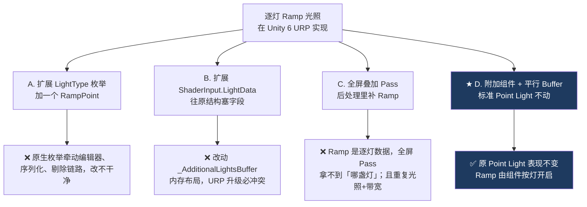

# 00 为什么要自定义 Ramp 灯光

> 承接 [[Unity 24H TA预研]] 的「灯光表现」需求。这一篇不写代码，只回答三个问题：**美术到底要什么** → **引擎为什么给不了** → **在 Unity 6 URP 里有哪几种做法、为什么选这一种**。
> 关注点：**需求翻译** + **架构选型的排除法**。
> 返回 [[Ramp Light 知识地图]]。

---

## 一、需求：美术要的不是「更亮的灯」

原画上的诉求是 **色块、渐变简约、构成感**——欧美复古、印象派、暗黑装饰风。美术在 PS 里的实际动作是**手动画渐变映射**：一个光源打下来，近处不是简单变亮，而是走一条**人为设计的颜色曲线**（比如近处暖橙 → 中段品红 → 边缘冷紫）。

这里有个关键的翻译动作：

| 美术的说法 | 翻译成引擎术语 |
| --- | --- |
| 「这个灯要有渐变感」 | 光照强度不再是物理衰减，而是**查表**（LUT） |
| 「这里要有色块」 | 查表曲线上有**硬转折**，不是平滑插值 |
| 「要能整体控氛围」 | 逐灯可调，且**编辑器里实时可见** |

> [!note] 这就是 Ramp 的本质
> **Ramp = 把「光照的某个标量」当作 UV，去采一张一维颜色表。** 标量可以是距离、可以是 `N·L`，采出来的颜色替代/调制原本的光色。
> 你在 Toon Shading 里见过的 `ramp` 贴图是同一个东西，区别只在于：那里是**逐材质**的，这里要做成**逐灯光**的。

---

## 二、为什么 Unity 原生给不了

Unity 的 `Light` 组件只有 `color`（单色）+ `intensity` + `range`。光照计算里，距离的作用是**衰减**（attenuation，一个 0~1 的标量），它只能让光变暗，不能让光**换颜色**。

```text
Unity 原生：  finalColor = light.color * attenuation(distance)
                           ^^^^^^^^^^^ 固定单色，只被标量缩放

我们要的：    finalColor = SampleRamp(distance01) * intensity
                           ^^^^^^^^^^^^^^^^^^^^^ 颜色随距离查表
```

所以这件事**必须改光照计算的代码**，没有「用现有组件拼一下」的解法。这也是为什么整个项目要把 URP 从 PackageCache 搬成 embedded package（见 [[Ramp Light 知识地图]] 的工程前提）。

---

## 三、选型：四条路，排除三条

参考的是一篇 UE 的实现（改 `PointLightComponent` + `DeferredLightingCommon.ush`），迁到 Unity 6 URP 时有四种候选：



### 最终方案

```text
Unity 标准 Point Light
  + RampLight 附加组件          ← 美术数据（本阶段的成果）
  + 单一共享 Ramp Atlas         ← 运行时自动生成，美术看不见
  + 与 _AdditionalLightsBuffer 同索引顺序的平行 Ramp StructuredBuffer
```

三个设计要点，每个都在回避一类具体的坑：

**1. 附加组件，而不是新灯类型。** 普通 Point Light 必须保持原表现——项目里大部分灯还是普通灯。Ramp 是"按灯启用的增强"，不是"另一种灯"。

**2. 平行 Buffer，而不是塞进原结构。** URP 的 `_AdditionalLightsBuffer` 有固定内存布局和自动生成的 HLSL 结构。**新开一条同索引顺序的 Buffer**，原结构一个字节都不改，URP 升级时冲突面最小。

> [!tip] 「平行数组」是个通用手法
> 想给一批已有对象挂额外数据、又不能改它们的结构时，就开一条**等长、同序**的数组，用同一个 index 去索引两边。ECS、GPU 粒子、骨骼动画里到处都是这个模式。代价是**必须保证两边索引严格对齐**——这也是后续阶段最容易出 bug 的地方。

**3. 改公共入口，而不是只改 Deferred+ 的 Shader。** 直觉上「我用 Deferred+，改 `ClusterDeferred.hlsl` 就够了」——**错**。Forward-only 的不透明物体、透明物体都走另外的路径，只改 Deferred 会让它们和延迟路径**表现不一致**。正确位置是它们共同调用的 `GetAdditionalLight()`。

---

## 四、顺带一提：为什么整个项目选 Deferred+

不是为了 Ramp，是为了这套美术风格的**性能前提**：

- 戏剧化打光意味着**大量人工点光源**。Deferred+（Unity 6 新增，Cluster 化的延迟管线）对批量点光源的开销远优于 Forward。
- 只考虑 N 卡 PC 平台，可以放心吃 Compute Shader 和 GPU Resident Drawer。

Ramp 方案要兼容 Deferred+，但**不依赖**它——因为改的是公共光照函数，Forward+ 下同样成立。

---

## 五、下一步

方案定了，第一步落地的是**美术数据怎么存**。[[01 附加组件与单一数据源]] 讲 `RampLight` 组件本身，以及一个在这个阶段真实发生过的返工：数据放在哪里，一开始就选错了。

## 速记

- Ramp 的本质 = **拿光照的标量（距离 / N·L）当 UV，采一维颜色表**；Toon 的 ramp 是逐材质版，这里是逐灯版。
- Unity 原生做不到：`attenuation` 是标量，只能调暗，不能换色。必须改光照代码。
- 选型排除法：不改 `LightType` 枚举、不改 `LightData` 内存布局、不加全屏 Pass。
- 最终 = **标准 Point Light + 附加组件 + 平行同序 Buffer + 改公共 `GetAdditionalLight()`**。
- 「平行数组」是给已有结构挂数据的通用手法，代价是索引对齐责任。
- 只改 Deferred Shader 会让 Forward-only / 透明路径不一致——要改**公共入口**。

#DCC #Unity #RampLight
