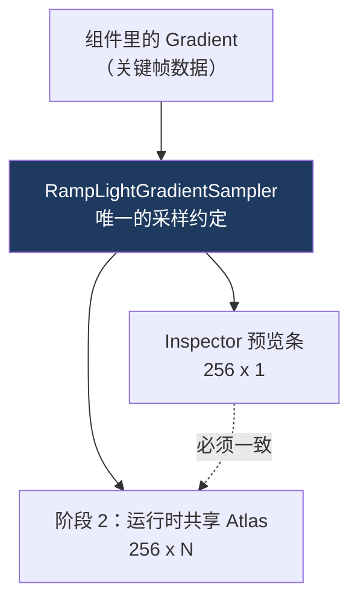

# 02 Gradient 采样与颜色空间

> 承接 [[01 附加组件与单一数据源]]。组件里存的是一条 `Gradient`（一组关键帧），GPU 要的是**纹理像素**。这一篇讲中间那层转换，以及为什么它必须被抽成一个**无状态、单一实现**的采样器。
> 关注点：**端点包含的采样公式** + **HDR / Linear 两个正交概念** + **一次「预览串色」的误判排查**。
> 返回 [[Ramp Light 知识地图]]。

---

## 一、采样器：19 行代码，但位置很重要

```csharp
public static class RampLightGradientSampler
{
    public const int SampleWidth = 256;

    public static void Fill(Gradient gradient, Color[] destination)
    {
        // ... 参数校验（见第四节）

        float denominator = SampleWidth - 1.0f;
        for (int sampleIndex = 0; sampleIndex < SampleWidth; sampleIndex++)
        {
            float samplePosition = sampleIndex / denominator;
            destination[sampleIndex] = gradient.Evaluate(samplePosition);
        }
    }
}
```

它存在的理由不是"代码复用"（只有几行），而是**防止数据来源分叉**：



> [!warning] 「预览和实际不一样」是工具最伤信任的 bug
> 如果预览走一套采样、Shader 走另一套，美术调出来的颜色和渲染结果就会**微妙地不同**。这种 bug 极难被报告清楚（"感觉有点不对"），也极难查。
>
> **把约定收成一份唯一实现**，从结构上排除这类偏差。这是"单一数据源"原则在**算法层**的应用——[[01 附加组件与单一数据源]] 讲的是数据层的同一件事。

---

## 二、`/(N-1)` 还是 `/N`：端点包含

整段代码里唯一需要想一下的是分母：

```csharp
float denominator = SampleWidth - 1.0f;      // 255，不是 256
float samplePosition = sampleIndex / denominator;
```

| 写法 | 采样点 | 结果 |
| --- | --- | --- |
| `i / N` | 0, 1/256, …, 255/256 | **永远取不到 1.0**，Gradient 最后一个关键帧的颜色丢失 |
| `i / (N-1)` | 0, 1/255, …, **1.0** | 首尾关键帧都精确命中 ✅ |

美术在 Gradient 末端摆的那个颜色，是他**明确想要的边缘色**。用 `/N` 会让它永远差一点点采不到。

> [!tip] 这是个跨领域的通用陷阱
> **「N 个采样点覆盖 [0,1] 闭区间」的分母永远是 N-1。** LUT 生成、贝塞尔曲线离散化、颜色梯度、动画采样、`linspace` 全都是这个公式。
> 反过来，**纹理 UV 寻址**用的是 `(i + 0.5) / N`（像素中心）——两者别混。判据：**你要的是"顶点"还是"格子"？** 端点包含用 `N-1`，像素中心用 `+0.5`。

`(i + 0.5) / N` 那个形式会在阶段 4 出现——Shader 采 Atlas 的**纵向**行号时必须用它。

---

## 三、HDR 和 Linear 是两个正交的概念

```csharp
[GradientUsage(true, ColorSpace.Linear)]
//            ^^^^  ^^^^^^^^^^^^^^^^^^
//            HDR   颜色空间
```

初学者最容易把这两个混成"高级颜色设置"。它们解决完全不同的问题：

| 参数 | 管什么 | 设 `true`/`Linear` 的后果 |
| --- | --- | --- |
| `hdr = true` | **数值范围**能否超过 1.0 | Gradient 编辑器出现 Intensity 档位，可以调出亮度 8 的颜色 |
| `ColorSpace.Linear` | 数值的**含义**（是否已做 Gamma 编码） | 值直接是线性光强，不再做 sRGB 解码 |

### 为什么两个都要

**HDR**：戏剧化打光的核心就是**过曝**。灯芯附近亮度冲到 5、10，经 Bloom 和 Tonemapping 后才有"光在发光"的观感。锁在 1.0 以内只能得到平淡的贴纸感。

**Linear**：光照计算必须在线性空间做，`a + b`、`a * b` 才有物理意义。sRGB 空间里 `0.5` 不是"一半的光"，直接相乘会得到错误结果。

```text
sRGB 空间相加：  0.5 + 0.5 = 1.0   ← 但实际光强远不是两倍
Linear 空间相加：0.5 + 0.5 = 1.0   ← 这才是"两份光叠加"
```

> [!note] 项目开了 Linear Color Space，所以这里必须是 Linear
> Unity 的 Linear 工作流下，**贴图和颜色在采样时被解码到线性空间，计算全程线性，最后输出时编码回 sRGB**。Ramp 颜色要参与光照乘法，就必须在乘法发生的那个空间里。
> 声明成 `Gamma` 会多一次错误的解码 —— 表现是**中间调偏暗**，而且因为端点（0 和 1）在两个空间里相同，你会觉得"整体对，就是中段怪"，很难定位。

对应的纹理也必须是 Linear + `RGBAHalf`：

```csharp
_texture = new Texture2D(256, 1, TextureFormat.RGBAHalf, false, true);
//                                                    mipmap^  ^linear = true
```

`RGBAHalf` = 每通道 16-bit 浮点，**能存 > 1.0 的值**。用 `RGBA32`（每通道 8-bit 定点）会把 HDR 值直接截断到 1.0，HDR 就白开了。

> [!tip] HDR 数据链是「一路都不能断」的
> `GradientUsage(hdr: true)` → `RGBAHalf` 纹理 → Linear 采样 → HDR RenderTarget。**任何一环退回 8-bit 或 sRGB，前面所有的 HDR 努力都归零。** 排查"HDR 不生效"时，顺着这条链逐环检查。

---

## 四、参数校验：明确抛异常，而不是静默兜底

```csharp
if (gradient == null)
    throw new ArgumentNullException(nameof(gradient));

if (destination.Length != SampleWidth)
    throw new ArgumentException($"Ramp sample buffer must contain exactly {SampleWidth} colors.", ...);
```

注意它**不**这么写：

```csharp
// ❌ 静默兜底
if (destination.Length != SampleWidth)
    destination = new Color[SampleWidth];   // 悄悄换个数组，调用方的引用还指向旧的
```

> [!warning] 区分「用户错误」和「编程错误」
> - **用户错误**（美术填了个负数、挂到 Spot Light 上）→ 校验 + 友好提示，**要兜底**。见 [[01 附加组件与单一数据源]] 的 `ValidateSerializedData`。
> - **编程错误**（缓冲区长度不对、传 null）→ **立刻抛异常**。这是调用方的 bug，静默修正只会让它藏到更远的地方，最后表现成"颜色偶尔不对"。
>
> 判据很简单：**这个错误美术能不能自己改？** 能 → 兜底；不能 → 抛。

这也是这个阶段代码审查后明确移除"冗余兜底"的原因：兜底代码看起来稳，实际是把 bug 的发现时间从"立刻"推迟到"很久以后"。

---

## 五、案例：预览串色，先别急着怪数据

阶段 1 出现过一个现象——多行 Atlas 预览里，**相邻 Ramp 的颜色渗到彼此边界**。

第一反应是"烘焙代码写错了，把上一行的像素写进了下一行"。**实际不是。**

```text
真实原因：
Atlas 是 256 x N 的纹理，Bilinear 过滤
  → Inspector 把整张纹理拉伸到一个矮条上显示
  → 相邻行的纵向 UV 落在两行之间
  → Bilinear 在纵向上插值 = 两行颜色混合
  → 看起来像「串色」
```

烘焙数据本身是干净的，每行独立写入。**问题在显示环节的纹理过滤，不在数据环节。**

> [!tip] 排查顺序：先分清「数据错」还是「显示错」
> 看到颜色不对，先问：**是存进去的值错了，还是取出来的方式错了？**
> - 验证数据：直接读回像素值（`GetPixel`）和期望值对比。
> - 验证显示：换 `FilterMode.Point`，串色消失就说明是过滤问题。
>
> 这个区分能省掉大量时间。误判成数据错，你会去重写烘焙逻辑，然后发现改完还是串色。

### 两个层面的修法

**预览层（已落地）**：组件内联后每盏灯**只有一行**，预览纹理是 `256 x 1`。只有一行就没有纵向邻居，**串色从结构上不可能发生**。

```csharp
// RampLightPreviewCache —— 单行，纵向无邻居
_texture = new Texture2D(RampLightGradientSampler.SampleWidth, 1, TextureFormat.RGBAHalf, false, true);
```

**Shader 层（阶段 4 的约定）**：运行时共享 Atlas 仍是多行的，所以 Shader 采样必须锁在行中心：

```hlsl
rampV = (atlasIndex + 0.5) * _RampLightAtlas_TexelSize.y;   // 纵向锁行中心
```

保留 Bilinear（横向的平滑插值是想要的），但**纵向永远采在行中心**，就不会碰到邻行。这就是第二节说的 `+0.5` 像素中心公式的用处——**横向要端点包含（`N-1`），纵向要像素中心（`+0.5`）**，同一张纹理上两个方向用不同公式，因为语义不同。

---

## 六、下一步

数据和采样约定都定了。[[03 Editor 扩展与实时预览]] 讲把它包成美术真正能用的界面——以及编辑器代码特有的一类坑：**纹理泄漏和刷新风暴**。

## 速记

- 采样器抽成**唯一实现**，是为了防止预览和 Shader 的数据来源分叉（"单一数据源"在算法层的版本）。
- **端点包含的分母是 `N-1`**，`i/N` 会让 Gradient 最后一个关键帧永远采不到。
- **纹理像素中心是 `(i+0.5)/N`**。判据：要"顶点"用 `N-1`，要"格子"用 `+0.5`。
- `hdr` 和 `ColorSpace` **正交**：前者管数值能否 > 1，后者管数值的含义。戏剧化打光两个都要。
- **HDR 数据链一路不能断**：`GradientUsage(hdr)` → `RGBAHalf` → Linear → HDR RT。任一环退回 8-bit 就全废。
- 校验策略：**用户错误兜底，编程错误抛异常**。判据是"美术能不能自己改"。
- 串色排查：**先分清数据错还是显示错**（读回像素 / 换 Point 过滤），别直接重写烘焙。
- 单行预览让串色**结构上不可能**；多行 Atlas 靠 Shader 纵向锁 `+0.5` 行中心解决。

#DCC #Unity #RampLight
