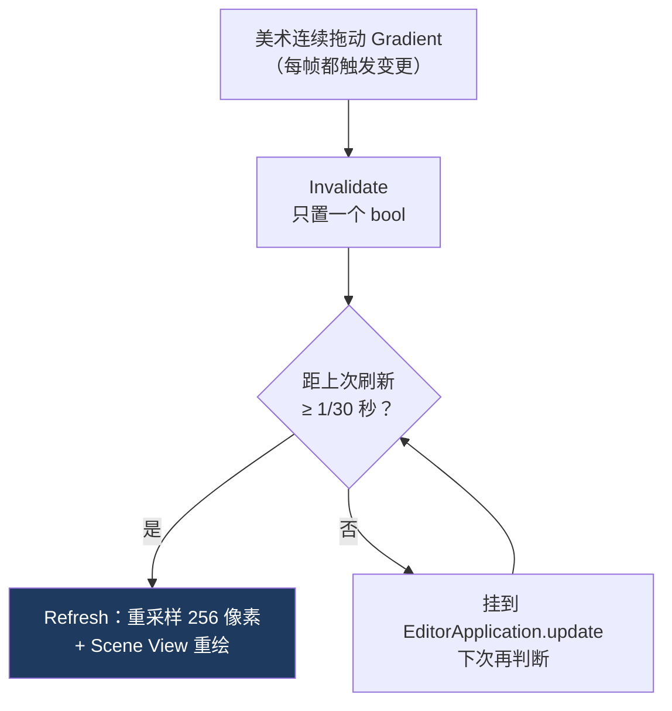

# 03 Editor 扩展与实时预览

> 承接 [[02 Gradient 采样与颜色空间]]。数据和采样都定了，这一篇讲把它包成美术真正能用的界面。
> 关注点：**Editor 纹理的生命周期** + **刷新节流（合并到 30 FPS）** + **MinMax Slider 的不变量维护** + **Scene View Gizmo**。
> 编辑器代码有一类运行时不存在的坑：**它活在一个永不重启的进程里**——泄漏会累积，刷新会风暴。
> 返回 [[Ramp Light 知识地图]]。

---

## 一、编辑器代码为什么特别容易出问题

游戏运行时有个天然的兜底：**进程退出，一切归零**。漏一张纹理、多刷几帧，玩家关掉游戏就没了。

编辑器没有这个兜底。Unity Editor 一开就是一整天，你的 Inspector 代码在这段时间里被**反复创建销毁成百上千次**（每次选中/取消选中物体）。于是：

| 运行时无害 | 在编辑器里的后果 |
| --- | --- |
| 忘了释放一张纹理 | 每次选中泄漏一张，一天后显存里躺着几百张 |
| 每帧刷新一次 | 拖 Gradient 时编辑器明显卡顿 |
| 每帧写一次序列化数据 | **场景被标记 Dirty**，美术莫名被要求保存 |

> [!warning] 最后一条最隐蔽
> Inspector 代码不小心写了一次 `SerializedProperty`，场景就变 Dirty。美术看到的是"我什么都没干，Unity 让我保存"——**他会开始不信任这个工具**。
> 硬性要求：**被动查看 Inspector，绝不产生任何序列化写入。**

---

## 二、预览纹理的生命周期：三个约定

`RampLightPreviewCache` 只有 62 行，但三个细节都是必须的：

```csharp
_texture = new Texture2D(RampLightGradientSampler.SampleWidth, 1, TextureFormat.RGBAHalf, false, true)
{
    name = "Ramp Light Inspector Preview",
    hideFlags = HideFlags.HideAndDontSave,      // ① 不入场景、不入资产
    wrapMode = TextureWrapMode.Clamp,           // ② 端点不回绕
    filterMode = FilterMode.Bilinear,
};
```

**① `HideFlags.HideAndDontSave`**：告诉 Unity 这是临时对象，别序列化进场景、别当资产保存。少了它，一张 Inspector 用的临时纹理可能被写进场景文件。

**② `Clamp` 而不是 `Repeat`**：UV 到 1.0 边界时，`Repeat` 会绕回取到第 0 个像素——**Ramp 末端会突然闪回起始色**。Ramp 天生是**有始有终的一段**，永远用 Clamp。

**③ 显式 `DestroyImmediate`**：

```csharp
public void Dispose()
{
    if (_texture == null) return;
    UnityEngine.Object.DestroyImmediate(_texture);
    _texture = null;
}
```

> [!warning] `Texture2D` 不受 GC 管理
> C# 的 GC 只回收托管堆。`Texture2D` 背后是**原生显存**，GC 不碰。不显式 `DestroyImmediate` 就是真泄漏。
> 编辑器里用 `DestroyImmediate`（`Destroy` 要等帧末，编辑模式下没有可靠的"帧末"）。配 `IDisposable` + 在 `OnDisable` 调用：

```csharp
private void OnDisable()
{
    Undo.undoRedoPerformed -= HandleUndoRedo;      // 事件反注册
    EditorApplication.update -= ProcessPreviewRepaint;
    _previewCache?.Dispose();                      // 纹理释放
    _previewCache = null;
}
```

**`OnEnable` 里注册的，`OnDisable` 里必须全部注销。** 静态事件（`Undo.undoRedoPerformed`、`EditorApplication.update`）会持有你的实例引用，漏一个就是**对象泄漏 + 幽灵回调**（已销毁的 Inspector 还在响应事件，通常表现成 `NullReferenceException`）。

---

## 三、节流：把连续拖动合并到 30 FPS

美术拖 Gradient 时，`OnInspectorGUI` 每帧都在跑。每帧重建 256 像素纹理 + 重绘 Scene View，编辑器会卡。

```csharp
private const double RefreshInterval = 1.0 / 30.0;
```

### 脏标记 + 时间闸门

```csharp
double currentTime = EditorApplication.timeSinceStartup;
if (!_previewCache.HasTexture ||
    (_previewCache.IsDirty && currentTime >= _nextPreviewRefreshTime))
{
    _previewCache.Refresh(gradient);                       // 真正重建
    _nextPreviewRefreshTime = currentTime + RefreshInterval;
}
else if (_previewCache.IsDirty)
{
    RequestPreviewRepaint();                               // 还没到时间，排队等
}
```

三条分支各有分工：**没纹理 → 必须建**（否则画不出来）；**脏了且到时间 → 重建**；**脏了但没到时间 → 排队，等下次**。



> [!tip] `Invalidate` 只置 bool，不做实际工作
> 这是节流的关键。变更通知**极廉价**（一个赋值），真正的开销（重采样、重绘）由时间闸门控制频率。
> 反过来写——`Invalidate` 里直接重建纹理——节流就完全失效了。**「标记脏」和「处理脏」必须分离。**

### 反注册惯用法

```csharp
EditorApplication.update -= ProcessPreviewRepaint;   // 先减
EditorApplication.update += ProcessPreviewRepaint;   // 再加
```

看着像废操作，实际是保证**只注册一次**。C# 事件允许同一方法重复注册，注册 N 次就调用 N 次。对不存在的委托做 `-=` 是安全的空操作，所以"先减再加"是幂等注册的标准写法。

活干完了要摘钩子，否则空转会一直占着编辑器的 update：

```csharp
_previewRepaintPending = false;
EditorApplication.update -= ProcessPreviewRepaint;
Repaint();
```

---

## 四、只在真实变更时才响应

```csharp
bool propertiesChanged = serializedObject.ApplyModifiedProperties();
if (propertiesChanged)
{
    _previewCache.Invalidate();
    RequestPreviewRepaint();
    RequestSceneRepaint();
}
```

`ApplyModifiedProperties()` 的返回值是"**是否真的有属性被改动**"。用它当闸门，被动查看 Inspector 就不会触发刷新，也不会把场景弄 Dirty。

> [!note] 别用 `EditorGUI.BeginChangeCheck` 覆盖整个面板
> `BeginChangeCheck` 检测的是"**GUI 控件是否被交互**"，`ApplyModifiedProperties` 检测的是"**序列化数据是否真的变了**"。后者才是你要的语义——点一下滑条但值没变，不该触发重建。

### Undo/Redo 要单独挂

```csharp
Undo.undoRedoPerformed += HandleUndoRedo;
```

撤销不走 `OnInspectorGUI` 的变更路径——数据在你背后被换掉了。必须单独订阅，否则**撤销后预览还显示旧颜色**。

---

## 五、MinMax Slider：在输入端维护不变量

距离范围要满足 `distanceEnd - distanceStart >= 0.001`。这里有个从"事后修正"到"输入即正确"的改进，值得单独讲。

### 改进前：靠 `OnValidate` 兜

数值框可以随便填，填出倒置的 `start=0.9 / end=0.1` 后，由组件的 `OnValidate` 事后掰正。**能用，但美术看到的是"我填的值自己跳了"**——不可预测。

### 改进后：编辑时就钳制

```csharp
EditorGUI.BeginChangeCheck();
float editedStart = EditorGUILayout.FloatField("起点", distanceStart);
if (EditorGUI.EndChangeCheck())
{
    // 编辑起点 → 以终点为界，起点最多顶到 end - 0.001
    distanceStart = Mathf.Clamp(editedStart, 0.0f, distanceEnd - RampLight.MinimumDistanceInterval);
    rangeChanged = true;
}

EditorGUI.BeginChangeCheck();
float editedEnd = EditorGUILayout.FloatField("终点", distanceEnd);
if (EditorGUI.EndChangeCheck())
{
    // 编辑终点 → 以起点为界
    distanceEnd = Mathf.Clamp(editedEnd, distanceStart + RampLight.MinimumDistanceInterval, 1.0f);
    rangeChanged = true;
}
```

关键在**每个控件单独 `BeginChangeCheck`**，从而知道美术在编辑**哪一端**：

> [!tip] 「谁在动，就固定另一个」
> 编辑起点 → 终点不动，起点最多顶到 `end - interval`。
> 编辑终点 → 起点不动，终点最低降到 `start + interval`。
>
> 这条规则让操作**可预测**：美术改一个值，另一个值绝不会自己动。如果两端一起夹，就会出现"我调起点，终点怎么也跟着变"的困惑。

组件里的 `ValidateSerializedData` 仍然保留——那是**数据层的最后防线**（应对 Prefab、脚本赋值、旧场景数据）。两层不冲突：**Editor 保证输入可预测，Runtime 保证数据永远合法。**

---

## 六、Scene View Gizmo：`OnSceneGUI` 是个隐式约定

```csharp
private void OnSceneGUI()
{
    var rampLight = (RampLight)target;
    Light lightComponent = rampLight.AttachedLight;
    if (!rampLight.enabled || lightComponent == null || lightComponent.type != LightType.Point)
        return;

    Vector3 position = lightComponent.transform.position;
    float startRadius = lightComponent.range * rampLight.DistanceStart;
    float endRadius = lightComponent.range * rampLight.DistanceEnd;

    Color previousColor = Handles.color;
    DrawRangeSphere(position, startRadius, new Color(0.2f, 0.8f, 1.0f, 0.9f));   // 青 = 起点
    DrawRangeSphere(position, endRadius, new Color(1.0f, 0.55f, 0.1f, 0.9f));    // 橙 = 终点
    Handles.color = previousColor;                                               // 恢复全局状态
}
```

> [!note] `OnSceneGUI` 不是 `Editor` 基类的虚方法
> 它是 Unity 用**反射**找的私有方法（`UnityEditor.dll` 里的 `CallOnSceneGUI`）。所以：
> - 没有 `override` 关键字，写错名字**不会有编译错误，只会静默不执行**。
> - Unity 自家的 `NavMeshSurfaceEditor`、`ProbeVolumeEditor` 用的是同一个模式，可以放心用。
>
> 这类"隐式约定 API"在 Unity 里不少。判断依据：**在 Unity 官方包源码里找到同样的用法**，比翻文档可靠。

**`Handles.color` 是全局状态**，用完必须恢复——否则会污染同一帧后续其他 Editor 的绘制。这是所有全局状态 API 的通用纪律（`GUI.color`、`GL` 状态、`Gizmos.color` 同理）。

参数用**归一化的 0~1** 而不是绝对距离，乘上 `Light.range` 得到实际半径。好处是**改灯的 range 时，Ramp 的相对形状不变**——美术调完形状再调范围，不用重新调形状。

---

## 七、一个诚实的边界：预览颜色可能偏暗

预览纹理创建时 `linear: true`，但 `EditorGUI.DrawPreviewTexture` **不做 linear → sRGB 转换**。推测预览条会比实际渲染结果偏暗。

这一条**我没有在 Editor 里实测验证**，标记为待确认。验证方法：

> [!tip] 怎么自己验这件事
> 做一条纯 `0.5` 灰的 Gradient，用取色器量预览条的实际屏幕颜色：
> - 量到 **~128**（sRGB 中灰）→ 转换正确。
> - 量到 **~188** 或明显偏亮/偏暗 → 存在颜色空间偏差，需要在绘制环节补转换。
>
> 这就是 [[学习路径设计方法论]] 里"**改一处、预测结果**"的具体形态：先预测，再测量，对上了才算真懂。

对美术工具来说这件事值得较真——**预览失真等于工具不可信**，见 [[02 Gradient 采样与颜色空间]] 第一节。

---

## 八、下一步

到这里美术已经能在单个灯上完成挂载、调参、预览、看 Gizmo。但**场景光照还没有任何变化**——所有数据都还停在 C# 侧。

后面三个阶段才是真正接管光照：Runtime Bridge 汇总 Atlas（阶段 2）→ 平行 GPU Buffer（阶段 3）→ HLSL 里调制 `light.color`（阶段 4）。规划见 [[Ramp Light 知识地图]]。

## 速记

- 编辑器代码没有"进程退出"兜底：**泄漏会累积，刷新会风暴，误写会让场景 Dirty**。
- `Texture2D` 不受 GC 管理 → `IDisposable` + `DestroyImmediate`，在 `OnDisable` 释放。
- `OnEnable` 注册的事件，`OnDisable` 必须全部注销；`-=` 再 `+=` 是幂等注册惯用法。
- 预览纹理三件套：`HideAndDontSave`、`Clamp`（Ramp 有始有终）、显式释放。
- 节流 = **脏标记（只置 bool）+ 时间闸门（1/30 秒）**；标记脏和处理脏必须分离。
- 用 `ApplyModifiedProperties()` 的返回值当闸门 → 被动查看不写序列化、不弄脏场景。
- Undo/Redo 不走正常变更路径，必须单独订阅 `Undo.undoRedoPerformed`。
- MinMax 不变量：**每个控件单独 `BeginChangeCheck`，谁在动就固定另一个**；Runtime 的 `OnValidate` 作为数据层最后防线。
- `OnSceneGUI` 是反射约定（无 `override`，写错名字静默失效）；`Handles.color` 用完要恢复。
- Gizmo 参数用**归一化值 × `Light.range`**，改范围不破坏已调好的形状。

#DCC #Unity #RampLight
