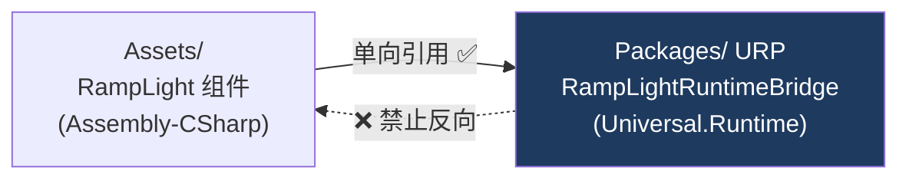

# 04 Runtime Bridge 与共享 Atlas

> 承接 [[03 Editor 扩展与实时预览]]。前三篇的数据都停在 C# 侧的组件里，这一篇让它们跨过**程序集边界**进入 URP 包，并汇总成 GPU 要的那张共享 Atlas。
> 关注点：**窄接口跨程序集** + **行号分配与复用** + **两条把状态改坏的经典失误**（getter 副作用、部分注册状态）。
> 返回 [[Ramp Light 知识地图]]。

---

## 一、要跨过的那道墙：程序集不能反向引用

[[00 为什么要自定义 Ramp 灯光]] 里定的方案是"标准 Point Light + 附加组件"。但组件在 `Assembly-CSharp`（`Assets/` 下的项目代码），光照计算在 `Unity.RenderPipelines.Universal.Runtime`（URP 包）。**包不能引用项目代码**——否则包就不再是可复用的包了。



> [!note] 依赖方向决定了谁必须是"哑"的
> URP 包**不知道** `RampLight` 这个类型存在。它只认识一个纯数据结构 `RampLightRegistrationData`（四个 float）和一个 `Color[]` 采样行。
> 于是分工是：**组件主动推送**（`OnEnable`/`OnValidate`/`OnDisable` 里调 Bridge），**Bridge 被动接收 + 拥有状态**。Bridge 绝不回头去场景里找组件。
>
> 这是"依赖倒置"在 Unity 程序集布局下的具体形态：**下层定义纯数据合同，上层负责把自己的类型翻译成这个合同。**

包内的文件放在 `Runtime/Customization/RampLight/`，没有嵌套 asmdef，所以自动归属 URP Runtime 程序集。`autoReferenced: true` 让 `Assembly-CSharp` 能直接 `using UnityEngine.Rendering.Universal`。

---

## 二、行号分配：终于把 `profileIndex` 的坑填对了

[[01 附加组件与单一数据源]] 里删掉的 `profileIndex` 之所以脆弱，是因为它**序列化到了场景**。现在行号回来了，但换了个活法：

```csharp
private static readonly Dictionary<int, RampLightEntry> Entries = new(16);   // Light InstanceID -> 数据
private static readonly Stack<int> AvailableRows = new(16);                   // 回收的空行
private static int _nextRowIndex;
```

三条规则让它安全：

| 规则 | 作用 |
| --- | --- |
| key 是 `Light.GetInstanceID()` | 不靠名称、Tag、Hierarchy 顺序——这些都会被美术改动 |
| 行号由 Bridge 分配，**不序列化** | 场景文件里没有行号，就不存在"重排后错位" |
| 注销时行号推进 `AvailableRows` 栈 | 下一盏灯复用空位，Atlas 不会无限长高 |

注销时还要把那一行**刷成白色**：

```csharp
if (_atlasTexture != null && entry.RowIndex < _atlasTexture.height)
    UploadRow(entry.RowIndex, WhiteRow);
```

> [!tip] 回收的槽位必须恢复中性值
> 不刷白的话，行里还留着上一盏灯的颜色。万一有代码路径在行号复用前就采到它，就会拿到**已删除灯的 Ramp**。
> 白色 = 乘上去等于不变 = [[01 附加组件与单一数据源]] 说的 Feature-off 等价。**"回收即归零"对所有池化资源都成立**（对象池、GPU buffer、纹理槽）。

Atlas 高度用 `Mathf.NextPowerOfTwo(requiredHeight)`，避免每加一盏灯就重建一次纹理——2 盏灯用高度 2，第 3 盏直接扩到 4，第 5 盏扩到 8。**摊销重建成本**的常规手法（和 `List<T>` 的容量翻倍同理）。

---

## 三、失误一：getter 里藏了重建纹理

这是 Review 抓到的第一个问题，也是这一阶段最值得记的教训。

### 问题代码

```csharp
// ❌ 修正前
internal static Texture2D AtlasTexture
{
    get
    {
        if (Entries.Count == 0)
            EnsureFallbackTexture();      // 可能 new Texture2D
        else
            EnsureAtlasCapacity(_nextRowIndex);   // 可能 new Texture2D + SetPixels 整张图
        return _atlasTexture;
    }
}

internal static Vector4 AtlasTexelSize
{
    get
    {
        Texture2D texture = AtlasTexture;   // 读个尺寸，可能重建整张 atlas
        ...
    }
}
```

阶段 3 要在 `ForwardLights` 里**每相机每帧**读这两个值来绑 GPU 资源。"读一个尺寸把纹理重建了"是**极难定位的卡顿源**——你在 Profiler 里看到 `Texture2D.SetPixels` 出现在渲染路径上，但代码里那一行看起来只是个属性访问。

### 修法：显式的准备阶段

```csharp
// ✅ 修正后
internal static RampLightAtlasResources PrepareAtlasResources()
{
    if (Entries.Count == 0)
        EnsureFallbackTexture();
    else
        EnsureAtlasCapacity(_nextRowIndex);

    return new RampLightAtlasResources(_atlasTexture);   // Texture + TexelSize 一致快照
}
```

两个改进叠在一起：

1. **名字是动词**（`Prepare...`），调用方一眼看出这里有工作发生。
2. **一次返回一致快照**。原来分两个 getter 读，两次读之间理论上纹理可能被换掉，拿到的 `TexelSize` 就对不上 `Texture`。合成一个 struct 就不存在这个窗口。

> [!warning] 属性 getter 应该是"便宜且无副作用"的
> C# 的属性语法让调用方以为自己在读一个字段。在里面分配内存、写 I/O、改状态，都会违背这个预期——尤其当调用方在**每帧的热路径**上。
> 判据：**这个 getter 能不能在调试器里安全地反复求值？** 不能 → 它该是个方法。
> 这条在任何语言里都成立，但在渲染代码里代价最直接：一帧 16.6ms，藏一次全纹理重建就够爆帧。

---

## 四、失误二：容量不足时抛异常 + 留下半个注册

### 问题一：异常抛到了用户面前

```csharp
// ❌ 修正前
if (requiredHeight > SystemInfo.maxTextureSize)
    throw new InvalidOperationException(...);
```

调用链是 `RampLight.OnValidate` → `SynchronizeRuntimeRegistration` → `RegisterOrUpdate` → `EnsureAtlasCapacity`。**异常从 MonoBehaviour 回调里抛出**，美术看到的是 Console 一片红。

但"场景里灯太多了"不是编程错误，是**场景规模问题**——按 [[02 Gradient 采样与颜色空间]] 里的判据（**美术能不能自己改？**），这属于用户错误，该降级不该抛。

### 修法：`Try` 前缀 + 一次性警告

```csharp
// ✅ Package 侧：返回 bool，不抛
public static bool TryRegisterOrUpdate(Light light, RampLightRegistrationData data, Color[] samples)
```

```csharp
// ✅ 组件侧：降级 + 只警告一次
if (!RampLightRuntimeBridge.TryRegisterOrUpdate(lightComponent, registrationData, _gradientSamples))
{
    _registeredLightInstanceId = 0;
    if (!_hasLoggedRegistrationCapacityWarning)
    {
        Debug.LogWarning($"{nameof(RampLight)} on '{name}' could not reserve a runtime atlas row. " +
                         "The Light will keep its original URP lighting.", this);
        _hasLoggedRegistrationCapacityWarning = true;
    }
    return;
}
```

这盏灯**退化成普通 Point Light**，其他灯不受影响。和 [[01 附加组件与单一数据源]] 的"非 Point Light 只警告不改类型"是同一套纪律。

> [!note] 空引用和错误数组长度仍然抛
> `light == null`、`samples.Length != 256`、非 Point Light——这些是**调用方的 bug**，继续 `throw`。
> **同一个方法里两种错误处理策略并存是对的**，判据不是"在哪一层"，而是"谁能修"。

### 问题二：部分注册状态（更隐蔽）

原来的 `RegisterNewEntry` 先 `Pop()` 拿行号、先 `Entries.Add()`，**再**去确保纹理容量。如果容量那一步失败，Registry 里已经多了一条记录，空闲行栈也已经被改——**状态坏了，而且坏得不明显**。

修正后的顺序很讲究：

```csharp
private static bool TryRegisterNewEntry(...)
{
    if (!TryGetCandidateRow(out int rowIndex, out bool reusesAvailableRow))
        return false;                       // ① 先预检，什么都还没改

    EnsureAtlasCapacity(rowIndex + 1);      // ② 先把纹理准备好

    if (reusesAvailableRow)                 // ③ 到这里才真正改状态
        AvailableRows.Pop();
    else
        _nextRowIndex++;

    Entries.Add(lightInstanceId, entry);

    try
    {
        UploadRow(rowIndex, entry.Samples);
    }
    catch                                    // ④ 万一还是失败，回滚干净
    {
        Entries.Remove(lightInstanceId);
        if (reusesAvailableRow) AvailableRows.Push(rowIndex);
        else _nextRowIndex--;
        throw;
    }

    _registryVersion++;
    return true;
}
```

> [!tip] `Peek` 而不是 `Pop`：延迟到确定成功再改状态
> `TryGetCandidateRow` 用 `AvailableRows.Peek()` 取候选行**但不弹出**。这样预检失败时栈还是原样。
> 这是**事务性思维**：先做所有可能失败的检查（不改状态），再一次性提交（改状态），失败则回滚。
> 反模式是"边改边检查"——一旦中途失败，你得记住已经改了什么，通常记不全。

对应的测试断言了这一点——容量不足时 `RegisteredLightCount`、`RegistryVersion`、`AtlasVersion` **全都不变**，也就是"拒绝"和"没发生过"不可区分。

---

## 五、双版本号：为增量上传留的钩子

```csharp
internal RampLightRegistrationData RegistrationData { get; set; }
internal uint DataVersion { get; set; }       // 四个 float 参数变了
internal uint ContentVersion { get; set; }    // 256 个采样颜色变了
```

`RegisterOrUpdate` 会分别比对：

```csharp
if (!entry.RegistrationData.Equals(registrationData))   // 参数变化：只需重传 GPU Buffer
{ entry.RegistrationData = registrationData; entry.DataVersion++; _registryVersion++; }

if (!SamplesEqual(entry.Samples, rampSamples))          // 内容变化：需要重传 Atlas 那一行
{ Array.Copy(...); entry.ContentVersion++; EnsureAtlasAndUploadRow(...); }
```

> [!note] 拆两个版本号，是因为两种变化的代价差一个量级
> 拖动 `rampIntensity` 滑条 → 只是一个 float，改 GPU Buffer 里 4 字节。
> 改 Gradient → 要重新上传 256 像素的一整行纹理。
> 合成一个版本号就没法区分，每次调滑条都会白白重传纹理。**让"脏"带上类型信息**，阶段 3 才能做精确的增量上传。

`RampLightRegistrationData` 做成 `readonly struct` + `IEquatable<T>`，就是为了让 `Equals` 比对**又便宜又不装箱**。手写 `Equals`/`GetHashCode` 而不依赖默认实现，也是为了避开值类型默认相等比较的反射开销。

---

## 六、生命周期：静态状态 + 域重载

Bridge 是 `static` 类，状态活在静态字段里。这在 Unity 里有个专属陷阱：**静态状态跨 Play Mode 存活**。

```csharp
[RuntimeInitializeOnLoadMethod(RuntimeInitializeLoadType.SubsystemRegistration)]
private static void ResetRuntimeState() => ResetState();
```

> [!warning] 静态状态是 Unity 的经典 bug 源
> 退出 Play Mode 时，Unity 默认**不重置静态字段**（除非开了 Domain Reload，而它常因为影响迭代速度被关掉）。于是上一次运行的注册残留会带到下一次，表现成"第二次进 Play Mode 就不对了"。
> `RuntimeInitializeOnLoadMethod` + `SubsystemRegistration` 是在运行开始前的最早时机清空状态。**任何持有静态缓存的 Unity 系统都该有这样一个复位钩子。**

纹理释放要分环境：

```csharp
if (Application.isPlaying)
    UnityEngine.Object.Destroy(texture);
else
    UnityEngine.Object.DestroyImmediate(texture);
```

编辑模式下没有可靠的"帧末"，必须 `DestroyImmediate`；运行时用 `Destroy` 更安全（等当前帧用完）。这是 [[03 Editor 扩展与实时预览]] 那条"`Texture2D` 不受 GC 管理"的延续，只是这里要同时伺候两种环境。

---

## 七、一个没解决的问题：测试跑不起来

三个单元测试写得挺完整（行号复用、双版本号独立递增、容量拒绝不留状态、白色后备），但**项目 `Packages/manifest.json` 没有 `testables` 条目**：

```json
"testables": ["com.unity.render-pipelines.universal"]
```

没有这一行，嵌入包里的测试程序集不会被 Test Runner 发现。项目记录里这一轮是"通过临时 Editor 入口同步执行"跑出 `3/3 passed` 的——**那个入口是临时的，没进版本库**。

> [!warning] 「测试通过过一次」和「测试能被重跑」是两件事
> 不能一条命令重跑的测试，等于没有回归网。下次改 Bridge 时，你不会为了验证去重建那个临时入口——你会跳过验证。
> **让测试可复现，优先于让测试通过。**

另外 `SetMaximumAtlasRowsForTests` 这个 test-only 注入点值得学：它让"超出纹理上限"这条路径**不需要真的造 16384 盏灯**就能测。`ResetState()` 里记得清 `_maximumAtlasRowsOverride = -1`，避免 override 泄漏到别的用例。

---

## 八、下一步

数据现在住在 Bridge 里，共享 Atlas 也建好了，但**GPU 还看不到它**——没有任何管线代码调用 `PrepareAtlasResources()`。阶段 3 要在 `ForwardLights` 里绑定平行 Buffer，阶段 4 才在 HLSL 里真正调制 `light.color`。到那时才会有第一张画面变化。

## 速记

- 包不能反向引用项目代码 → **下层定义纯数据合同，上层翻译自己的类型**；组件主动推送，Bridge 被动持有状态。
- 行号安全的三条：key 用 `GetInstanceID()`、**不序列化**、注销入栈复用。回收的槽位要**刷回中性值**。
- Atlas 高度用 `NextPowerOfTwo` 摊销重建成本。
- **属性 getter 必须便宜且无副作用**。判据：能不能在调试器里反复求值？不能就该是方法（`Prepare...`）。
- 相关的多个值**合成一个快照 struct** 返回，消掉两次读之间的不一致窗口。
- 错误处理按"**谁能修**"分流：场景规模问题 → `Try` + 返回 false + 降级；调用方 bug → 继续抛。同一方法里并存是对的。
- **事务性顺序**：先预检（`Peek` 不改状态）→ 准备资源 → 提交状态 → 失败回滚。别边改边检查。
- **拆分版本号让"脏"带上类型**（参数脏 vs 内容脏），代价差一个量级的更新才能做增量。
- 静态状态必须挂 `RuntimeInitializeOnLoadMethod` 复位，否则跨 Play Mode 残留。
- **测试可复现 > 测试通过**。临时入口跑出的绿色不构成回归网。

#DCC #Unity #RampLight
