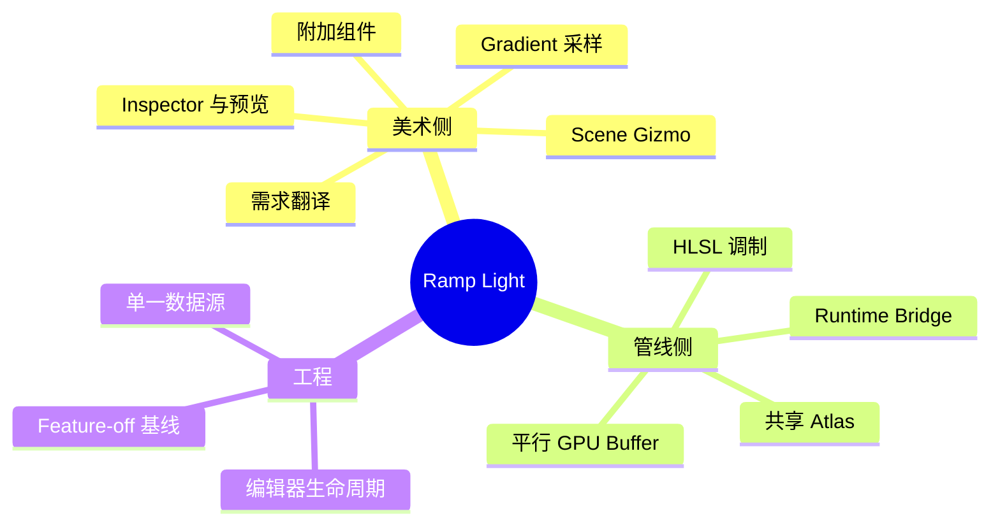
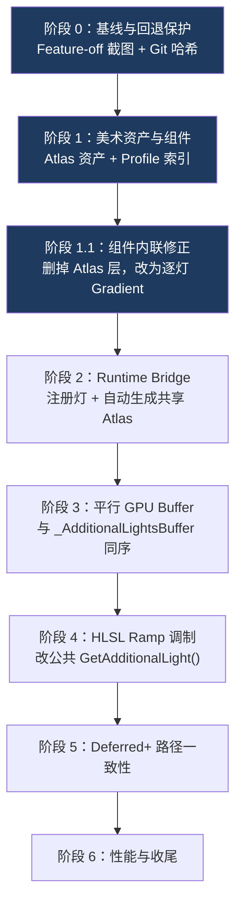

# Ramp Light 知识地图

> 本系列把「在 Unity 6 URP Deferred+ 里做逐灯自定义 Ramp 光照」拆成一条**从美术需求到管线落地**的学习路径。承接 [[Unity 24H TA预研]] 的灯光表现需求，按 [[学习路径设计方法论]] 的八步法组织。
> **当前进度：阶段 0、1、1.1 已完成（美术创作侧）。阶段 2–6 未开始（管线侧）。**
> **从 [[00 为什么要自定义 Ramp 灯光]] 开始。**

---

## 这个项目在做什么

让美术能给每盏 Point Light 单独指定一条 HDR 渐变，光照颜色随**距离**和**法线朝向**沿这条渐变变化——把原画里手绘的「渐变映射」搬进引擎，得到色块化、构成感强的戏剧化打光。

- 本地工程：`/Users/shuqiwang/UnityProject/Project24H`
- 美术侧代码：`Assets/Features/RampLight/`
- Unity 版本：`6000.3.10f1`，URP `17.3.0`（已 embed 到 `Packages/`，便于版本管理和改包）
- PC Renderer：Deferred+，Native RenderPass 开启
- 项目内详细计划：`Docs/AI/PLANS.md`；模块说明：`Docs/AI/Modules/URP_RAMP_LIGHT_ART_AUTHORING.md`
- 参考实现：[知乎：UE 自定义 Ramp 灯光](https://zhuanlan.zhihu.com/p/1985730965356704809)（UE 管线，需还原到 URP）



---

## 学习路径

| 阶段 | 笔记 | 核心问题 |
| --- | --- | --- |
| 选型 | [[00 为什么要自定义 Ramp 灯光]] | 美术要什么？Unity 为什么给不了？四条路为什么选这条 |
| 数据 | [[01 附加组件与单一数据源]] | 数据存哪里？为什么删掉了一整层 Atlas 资产 |
| 转换 | [[02 Gradient 采样与颜色空间]] | Gradient 怎么变像素？HDR 和 Linear 各管什么 |
| 工具 | [[03 Editor 扩展与实时预览]] | 怎么包成美术能用的界面？编辑器特有的坑 |

> [!tip] 怎么用这个系列
> - **想理解决策**：只看 00 和 01 的返工部分——**架构判断**是这个阶段最有价值的产出。
> - **要动手写类似工具**：03 可以当 Unity Editor 扩展的检查清单直接用。
> - **要接着做管线**：先看 00 的选型约束（平行 Buffer、改公共入口），再看下面的阶段规划。

---

## 六个阶段：现在在哪一步



蓝色 = 已完成。**目前场景光照没有任何变化**——美术侧的数据、预览、Gizmo 都通了，但数据还停在 C# 侧，没有上 GPU。

> [!warning] 「工具能用」不等于「效果成立」
> 这个阶段很容易产生一种错觉：Inspector 里预览条颜色对了、Gizmo 也画出来了，感觉功能好了。**实际渲染结果一像素都没变。**
> 项目文档里反复强调这条边界，也明确**不做伪造的 Light Color 预览**（比如临时把灯的颜色改成 Ramp 中段色来"看起来像"）——伪造预览会让后面真正接管线时无法判断哪里出错。
> 这是「已验证」和「看起来对」的区别，也是 [[学习路径设计方法论]] 原则 4 的验收纪律。

### 后续三个阶段的关键约束（已在计划里固化）

```hlsl
// 阶段 4 的采样公式（摘自 Docs/AI/PLANS.md）
distance01   = saturate(sqrt(distanceSqr * lightAttenuation.x));
distanceRamp = saturate((distance01 - distanceStart) / max(distanceEnd - distanceStart, epsilon));
normalRamp   = saturate(1.0 - dot(normalWS, light.direction));
rampU        = lerp(distanceRamp, normalRamp, normalInfluence);   // 距离/法线混合
rampV        = (atlasIndex + 0.5) * _RampLightAtlas_TexelSize.y;  // 纵向锁行中心
light.color *= rampColor.rgb * rampIntensity;                     // 在 BRDF 前调制
```

- Ramp 横轴：`0` = 靠近灯源 / 正对灯光，`1` = 靠近范围边缘 / 背离灯光。
- Ramp **不替代** URP 原本的距离衰减，是在其之上调制颜色。
- 在 BRDF **之前**调制 `light.color`，所以漫反射和高光都受影响。
- 灯的索引必须用**已解析的 Additional Light GPU Index**，不能用组件注册顺序推导。
- 纵向 `+0.5` 锁行中心的原因见 [[02 Gradient 采样与颜色空间]] 第五节。

---

## 给有图形背景的你

你写过软光栅、URP 的 HLSL、跟过 Games101，也做过 [[软体模拟知识地图]] 和 [[Unity 光线追踪实践]]。这个项目大部分能直接迁移：

| 你已经会的 | 在这里对应 |
| --- | --- |
| Toon Shading 的 ramp 贴图 | 同一个查表思想，但从**逐材质**变成**逐灯光** |
| 光追里的累积帧状态管理 | Editor 预览的脏标记 + 节流刷新 |
| Linear / sRGB 颜色空间 | `GradientUsage(ColorSpace.Linear)` + `RGBAHalf` 的 HDR 数据链 |
| GPU StructuredBuffer | 阶段 3 的平行 Ramp Buffer（同序索引对齐） |
| LUT / 一维查表 | Ramp Atlas 的一行就是一条 LUT |
| 软体模拟的「数据所有权」划分 | 组件 / Bridge / ShaderData 的单向依赖 |

真正需要新建立的直觉有两个：

1. **「附加组件 + 平行数据」的扩展模式**——不改动上游结构，而是并行挂一条同序数据。这是在**不能改**别人代码（URP Package）时的标准手法。
2. **美术工具的可信度是功能的一部分**——预览失真、场景莫名 Dirty、参数自己跳动，都会让工具被弃用，哪怕算法完全正确。这是 TA 岗位和纯渲染岗位的分野。

---

## 本阶段最值得记的三条

写在最前面，因为它们跨项目通用：

**1. GPU 的数据布局 ≠ 美术的编辑单位。** 阶段 1 把 GPU 侧需要的 Atlas 直接暴露成美术的编辑对象，导致工作流里出现"先创建资产"的仪式步骤和 `profileIndex` 这个脆弱间接层。阶段 1.1 删掉约 580 行，改为逐灯内联 Gradient + 运行时自动汇总 Atlas。详见 [[01 附加组件与单一数据源]]。

**2. 默认值必须 Feature-off 等价。** 新挂组件时画面零变化（白 Ramp × 原光色 = 原光色），才能随时用"有组件/无组件"对照排错。

**3. 用序号当引用是脆弱设计。** `profileIndex = 3` 在列表重排后静默错位，且不会报错。自动分配、**不序列化**的索引才安全。

---

## 参考

- [1] [知乎：基于距离与法线的自定义 Ramp 灯光（UE 实现）](https://zhuanlan.zhihu.com/p/1985730965356704809) — 本项目的方案来源
- [2] 项目内 `Docs/AI/PLANS.md` — 六阶段计划、采样公式、文件边界、验证矩阵
- [3] 项目内 `Docs/AI/LogicFlows/URP_DEFERRED_PLUS_RENDER_FLOW.md` — Deferred+ 渲染流程（基于本地 URP 17.3.0 源码确认）
- [4] 项目内 `Docs/AI/Solutions/URP_RAMP_LIGHT_STAGE0_BASELINE.md` — 阶段 0 的 Feature-off 视觉基线与回退边界
- [5] Unity 官方包源码（`NavMeshSurfaceEditor`、`ProbeVolumeEditor`）— `OnSceneGUI` 反射约定的用法依据

#DCC #Unity #RampLight
