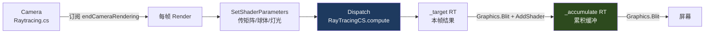
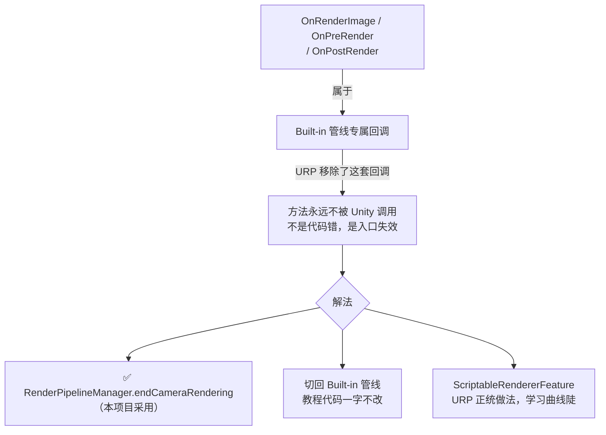
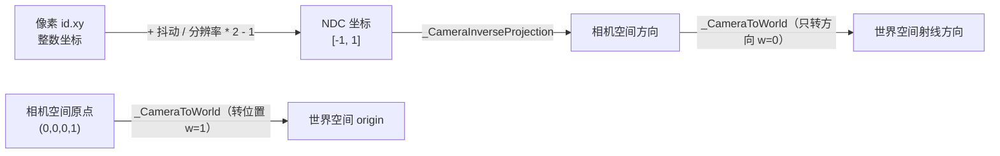
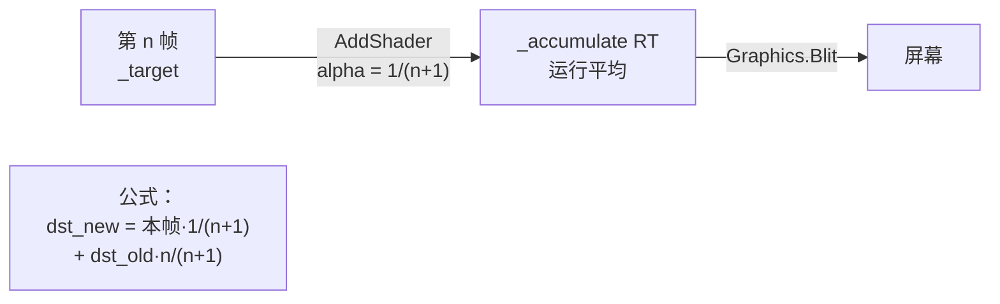
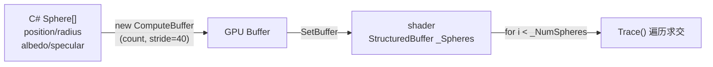

# Unity 光线追踪实践

> **项目定位**：跟随 *GPU Ray Tracing in Unity*（Three Eyed Games）教程，在 Unity URP 14 / Unity 2022 里用 Compute Shader 手写路径追踪。教程基于 Built-in 管线，本篇记录迁移到 URP 时遇到的所有坑与解法。
>
> - 工程路径：`/Users/vast/DccDev/Unity Project/Graphics Learning`
> - 核心脚本：`Assets/Scripts/Raytracing.cs`（挂在 Camera 上）
> - Compute Shader：`Assets/Shader/RayTracingCS.compute`

---

## 整体架构



---

## 第一道坎：URP 没有 `OnRenderImage`

这是本次实践卡最久的问题。**脚本挂好、Compute Shader 也拖进去了、Console 不报错，画面毫无变化。**

### 根因



> [!tip] 判断项目是否 URP
> 看 `ProjectSettings/GraphicsSettings.asset` 的 `m_CustomRenderPipeline` 是否指向 SRP 资产，或 `Packages/manifest.json` 里是否有 `com.unity.render-pipelines.universal`。

### 解法：订阅 `endCameraRendering`

```csharp
// Assets/Scripts/Raytracing.cs
[RequireComponent(typeof(Camera))]
public class Raytracing : MonoBehaviour
{
    private Camera _camera;

    private void Awake() => _camera = GetComponent<Camera>();

    // 成对订阅/取消，缺一不可——脚本禁用后回调若仍在跑会报错
    private void OnEnable()
    {
        SetupSpheres();
        RenderPipelineManager.endCameraRendering += OnEndCameraRendering;
    }

    private void OnDisable()
    {
        RenderPipelineManager.endCameraRendering -= OnEndCameraRendering;
        _sphereBuffer?.Release();   // ComputeBuffer 是非托管资源，必须手动释放
        _sphereBuffer = null;
    }

    private void OnEndCameraRendering(ScriptableRenderContext context, Camera camera)
    {
        if (camera != _camera) return;  // 过滤：只处理本相机，Scene 视图等不干扰
        SetShaderParameters();
        Render();
    }
}
```

> [!note] 关键细节
> `[RequireComponent(typeof(Camera))]` + `Awake` 缓存相机，既保证脚本只能挂在相机上，又避免每帧 `GetComponent`。

---

## 渲染目标与 RenderTexture

```csharp
private RenderTexture CreateRT(bool randomWrite)
{
    var rt = new RenderTexture(Screen.width, Screen.height, 0,
        RenderTextureFormat.ARGBFloat,      // HDR 浮点，适合光追累积
        RenderTextureReadWrite.Linear)
    {
        enableRandomWrite = randomWrite     // Compute Shader 写入的前提，漏了就黑屏
    };
    rt.Create();
    return rt;
}
```

| RT | 用途 | `enableRandomWrite` |
|---|---|---|
| `_target` | Compute Shader 每帧覆写 | ✅ 必须开 |
| `_accumulate` | 硬件混合做运行平均 | ❌ 不需要 |

> [!warning] 黑屏常见原因
> 漏设 `enableRandomWrite = true`，或 `RenderTextureFormat` 用了不支持随机写入的格式。

---

## Compute Shader 侧：射线生成

### 像素 → 世界射线



```hlsl
// Assets/Shader/RayTracingCS.compute
Ray CreateCameraRay(float2 uv)
{
    // w=1：转位置（含平移）
    float3 origin = mul(_CameraToWorld, float4(0.0f, 0.0f, 0.0f, 1.0f)).xyz;
    // 逆投影矩阵把 NDC → 相机空间
    float3 direction = mul(_CameraInverseProjection, float4(uv, 0.0, 1.0)).xyz;
    // w=0：转方向（不含平移）
    direction = mul(_CameraToWorld, float4(direction, 0.0f)).xyz;
    direction = normalize(direction);
    return CreateRay(origin, direction);
}
```

> [!warning] 高频坑：矩阵名和内容必须一致
> C# 变量叫 `_CameraInverseProjection`，就必须传 `projectionMatrix.inverse`（逆矩阵）。传成 `projectionMatrix` 本身不报错，但射线方向全错——**这种错误只有渲染结果才能暴露，编译期无法发现**。

```csharp
// 每帧更新相机矩阵
private void SetShaderParameters()
{
    RayTracingShader.SetMatrix("_CameraToWorld",          _camera.cameraToWorldMatrix);
    RayTracingShader.SetMatrix("_CameraInverseProjection", _camera.projectionMatrix.inverse);
    // ...
}
```

---

## 路径追踪主循环

```hlsl
[numthreads(8,8,1)]
void CSMain (uint3 id : SV_DispatchThreadID)
{
    _Pixel = id.xy;
    uint width, height;
    Result.GetDimensions(width, height);

    // 像素中心 + 随机亚像素抖动 → NDC
    float2 uv = float2((id.xy + _PixelOffset * _AntiScale) / float2(width, height) * 2.0f - 1.0f);
    Ray ray = CreateCameraRay(uv);

    float3 color = float3(0, 0, 0);
    for (int i = 0; i < 8; i++)        // 最多 8 次弹射
    {
        RayHit hit = Trace(ray);
        color += ray.energy * Shade(ray, hit);
        if (!any(ray.energy)) break;   // 能量归零提前退出
    }

    // Reinhard tone mapping：防止 HDR 溢出
    Result[id.xy] = float4(color / (color + 1.0f), 1.0f);
}
```

### 球体求交

```hlsl
void IntersectSphere(Ray ray, inout RayHit bestHit, Sphere sphere)
{
    float3 d = ray.origin - sphere.position;
    float p1 = -dot(ray.direction, d);
    float p2sqr = p1 * p1 - dot(d, d) + sphere.radius * sphere.radius;
    if (p2sqr < 0) return;             // 判别式 < 0：不相交

    float p2 = sqrt(p2sqr);
    float t = p1 - p2 > 0 ? p1 - p2 : p1 + p2;   // 取近交点
    if (t > 0 && t < bestHit.distance)
    {
        bestHit.distance = t;
        bestHit.position = ray.origin + ray.direction * t;
        bestHit.normal   = normalize(bestHit.position - sphere.position);
        // 从 buffer 读材质，不能写死，否则所有球同色
        bestHit.albedo   = sphere.albedo;
        bestHit.specular = sphere.specular;
    }
}
```

---

## 渐进式抗锯齿（Progressive AA）

### 原理

每帧随机偏移采样位置（亚像素抖动），用运行平均把多帧结果收敛——相机静止时噪点逐渐消失，相机移动时重置计数。



### 为什么不能在屏幕上直接累积

> [!warning] macOS / Metal 平台陷阱
> 教程原版 `Graphics.Blit(_target, destination, _addMaterial)` 直接往 `OnRenderImage` 给的屏幕 `destination` 上累积，**依赖「帧缓冲保留上一帧内容」这个 DX11 行为**。macOS Metal 的 swapchain 多缓冲轮换 + tile 架构默认不 load 旧内容 → 混合读到的历史值是垃圾 → 运行平均收敛到常数 → **整屏一片灰**。
>
> 修法：累积到自己持有的 `_accumulate` RT，它作为渲染目标时硬件会 load 旧内容。

```csharp
private void Render()
{
    InitRenderTexture();

    // 1) Compute Shader 画本帧（带随机抖动）进 _target
    RayTracingShader.SetTexture(0, "Result", _target);
    int gx = Mathf.CeilToInt(Screen.width  / 8.0f);
    int gy = Mathf.CeilToInt(Screen.height / 8.0f);
    RayTracingShader.Dispatch(0, gx, gy, 1);

    if (_addMaterial == null)
        _addMaterial = new Material(Shader.Find("Hidden/AddShader"));

    // 2) 硬件混合：本帧 → _accumulate（保留旧内容的自持 RT）
    _addMaterial.SetFloat("_Sample", _currentSample);
    Graphics.Blit(_target, _accumulate, _addMaterial);

    // 3) 显示累积结果
    Graphics.Blit(_accumulate, (RenderTexture)null);

    _currentSample++;
}
```

### 三个叠加坑（累积 AA 完全不生效）

> [!warning] 坑 1：属性名字符串不一致
> C# 设 `_Sample`，但 AddShader 里写的是 `_SampleRate` → 值永远是 shader 的默认值 `1.0`，权重恒为 `1/2`，每帧 50/50 混合，永不收敛。**`SetFloat` / `SetVector` 的字符串必须和 shader 属性名逐字一致。**

> [!warning] 坑 2：在屏幕上累积 → 一片灰
> 见上节"macOS / Metal 平台陷阱"。

> [!warning] 坑 3：`transform.hasChanged` 不可靠
> 挂了 `Controller.cs` 之后，它每帧写 `transform.position`（即使加零向量）也会把 `hasChanged` 置 `true` → 采样计数每帧清零，永远累积不起来。改为**手动比较上一帧的 position / rotation**：

```csharp
private void Update()
{
    if (transform.position != _lastPos || transform.rotation != _lastRot)
    {
        _currentSample = 0;
        _lastPos = transform.position;
        _lastRot = transform.rotation;
    }
    if (mainlight != null && mainlight.transform.rotation != _lastLightRot)
    {
        _currentSample = 0;
        _lastLightRot = mainlight.transform.rotation;
    }
}
```

---

## 多球体：ComputeBuffer + 结构体对齐

### 数据流



### 最大坑：C# / HLSL 结构体必须逐字段对齐

```csharp
// C#（Sequential 布局，无填充，10 个 float = 40 字节）
struct Sphere
{
    public Vector3 position;  // 3 floats
    public float   radius;    // 1 float
    public Vector3 albedo;    // 3 floats
    public Vector3 specular;  // 3 floats
}

// stride 手算：3+1+3+3 = 10 × 4 = 40 字节
_sphereBuffer = new ComputeBuffer(_actualCount, sizeof(float) * 10);
```

```hlsl
// HLSL（字段顺序、类型必须和 C# 完全一致）
struct Sphere
{
    float3 position;
    float  radius;
    float3 albedo;
    float3 specular;
};
StructuredBuffer<Sphere> _Spheres;
```

> [!warning] 加字段时两边必须同步
> HLSL 有 16 字节对齐规则，某些字段顺序会插入填充。当前布局刚好不触发，但换顺序或加字段后要重新验证 stride。写错 stride → 运行时报错或 GPU 读出乱数据。

### 球体生成：重叠用重试而非丢弃

```csharp
// 每个球最多试 20 次找不重叠的位置，避免「请求 10 个只生成 2 个」
for (int attempt = 0; attempt < 20; attempt++)
{
    Vector2 pos = Random.insideUnitCircle * spawnRadius;
    sphere.position = new Vector3(pos.x, radius, pos.y);   // y=radius 落在地面
    bool overlap = false;
    foreach (Sphere other in spheres)
    {
        float minDist = sphere.radius + other.radius;
        if (Vector3.SqrMagnitude(sphere.position - other.position) < minDist * minDist)
        { overlap = true; break; }
    }
    if (!overlap) { placed = true; break; }
}
if (!placed) continue;  // 试满才放弃
```

> [!note] 传给 shader 的数量用 `_actualCount`
> 剔除重叠后实际生成数可能少于请求数。用请求数 `sphereCount` 当 `_NumSpheres` 会让 shader 越界读 buffer。

---

## Shader 编译错误的通用排查

> [!warning] 编译错误会让所有 kernel 失效
> 一个漏逗号（`float4(0.0f 0.0f, ...)`）→ shader 编译失败 → `Dispatch(0, ...)` 报 `Kernel at index (0) is invalid`。
>
> **看到「kernel index invalid」先去查 shader 语法，而不是怀疑 kernel 名或索引。**

黑屏时的快速验证：用渐变测试色确认管线通不通，再写真正的光追逻辑：

```hlsl
[numthreads(8,8,1)]
void CSMain (uint3 id : SV_DispatchThreadID)
{
    uint w, h;
    Result.GetDimensions(w, h);
    // 输出 UV 渐变，随视角变化说明射线和 Blit 都通了
    Result[id.xy] = float4(id.x / (float)w, id.y / (float)h, 0.2, 1);
}
```

---

## 阶段完成情况

### ✅ 第一阶段（URP 下多球体路径追踪）

- [x] URP 下 Compute Shader 接入（`RenderPipelineManager.endCameraRendering`）
- [x] 相机射线构建（`_CameraToWorld` + `_CameraInverseProjection`）
- [x] 地面平面 + 球体求交，法线可视化
- [x] 天空盒采样（equirectangular 全景图）
- [x] 渐进式 AA（亚像素抖动 + 自持 RT 加权平均）
- [x] 反射 + 多次弹射（`ray.energy` 衰减 + 半球重要性采样）
- [x] 方向光 + shadow ray 硬阴影
- [x] 多球体（ComputeBuffer + struct 对齐，随机材质）

### 📌 下一阶段

- [ ] 性能：分辨率缩放、线程组尺寸调优
- [ ] 更丰富的材质（粗糙度、能量守恒的重要性采样）
- [ ] 迁移到 `ScriptableRendererFeature`（URP 正统做法）
- [ ] https://github.com/SebLague/Ray-Tracing
- [ ] https://github.com/huailiang/ray_tracing

---

## 配套：飞行相机 Controller.cs

飞行相机 MVP，用于验证射线/天空盒随视角实时变化：

- 鼠标左键拖拽旋转（yaw + pitch，pitch 限 ±89° 防翻转）
- WASD 沿 `transform.forward` / `transform.right` 移动，`dir.normalized * speed * deltaTime` 保证斜向不加速

> [!warning] Controller 会让 `transform.hasChanged` 永远为 true
> 它每帧写 `transform.position`（即使加零向量）也会触发 `hasChanged`，导致采样计数每帧清零。见上文"坑 3"的修法。

#Renderer
