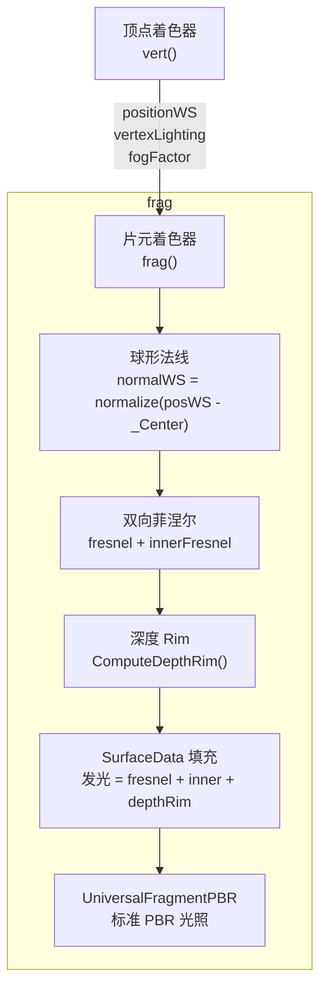
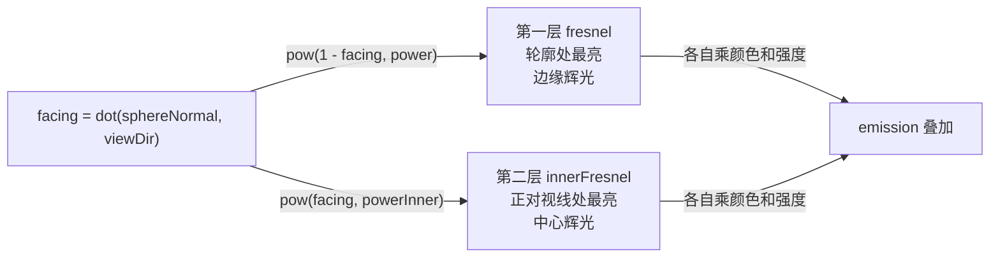
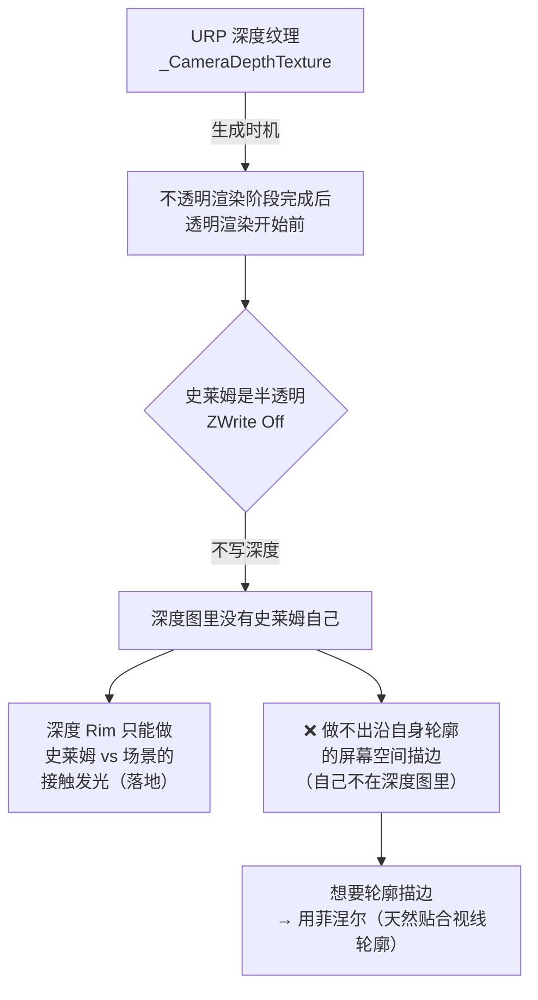

# Unity 半透明果冻 Shader

> [[09 表面重建与渲染]] 的 shader 实现深入篇。物理跑通后，给史莱姆做半透明果冻质感。理论/选型见 09，本篇是具体着色器代码与踩坑。
> 系列总纲：[[软体模拟知识地图]]。
>
> - Shader：`Assets/Shader/SoftSlime/Soft.shader`（URP HLSL，单 Pass）
> - 关注点：**球形法线** + **双向菲涅尔** + **深度接触发光** + **材质序列化坑**

---

## 整体 Shader 结构



---

## 球形法线：用质心替代几何法线

史莱姆软体形变时，mesh 法线会随形变歪扭，菲涅尔高光也跟着乱跳。**用从质心出发的「球形法线」替代**——它始终从球心向外辐射，光照/菲涅尔稳定，不随局部形变抖动。

```hlsl
// Soft.shader — vert()
VertexPositionInputs positionInput = GetVertexPositionInputs(input.positionOS.xyz);
// 球形法线：世界坐标 - 质心（由 C# 通过 MaterialPropertyBlock 传入）
half3 sphericalNormal = SafeNormalize(positionInput.positionWS - _Center.xyz);
output.vertexLighting = VertexLighting(positionInput.positionWS, sphericalNormal);

// frag() 里同样用球形法线
half3 normalWS = SafeNormalize(input.positionWS - _Center.xyz);
```

`_Center` 每帧由 `SoftBodySimulation.UpdateMesh()` 用 `MaterialPropertyBlock` 传入真实质心，不实例化材质、无 GC：

```csharp
// SoftBodySimulation.cs
_renderer.GetPropertyBlock(_propertyBlock);
_propertyBlock.SetVector(CenterPropertyId, _focusPoint);  // 所有质点质心
_renderer.SetPropertyBlock(_propertyBlock);
```

---

## 双向菲涅尔：边缘 + 中心互补

单层菲涅尔只有边缘光。加第二层「从中心出发」的辉光，两层**互补**做出果冻层次：



```hlsl
// Soft.shader — frag()
half facing    = saturate(dot(normalWS, viewDirectionWS));
half rawFresnel = pow(1.0h - facing, _FresnelPower);       // 边缘：1-facing

// 硬度控制：sharpness→1 收窄成硬描边，→0 退化为平滑渐变
half edge    = 0.5h * (1.0h - _FresnelSharpness);
half fresnel = smoothstep(0.5h - edge, 0.5h + edge, rawFresnel);

half innerFresnel = pow(facing, _FresnelPowerInner);       // 中心：facing（互补方向）

surfaceData.emission =
    _FresnelColor.rgb      * fresnel      * _FresnelIntensity      // 边缘辉光
  + _FresnelColorInner.rgb * innerFresnel * _FresnelIntensityInner // 中心辉光
  + _DepthRimColor.rgb     * ComputeDepthRim(input.positionCS) * _DepthRimIntensity;
```

> [!warning] 踩过的坑：两层同向效果互相污染
> 一开始第二层也用 `1 - facing`（只是不同 power），两层亮区高度重叠——大 power 的宽辉光把锐边缘冲淡，看起来像「第一层也坏了」。
>
> **叠加两个同向效果 = 互相污染；要做层次感就用正交/互补的量。**

### 边缘透明

边缘处越透明，给果冻「通透感」：

```hlsl
// alpha：边缘(fresnel≈1)更透，中心(fresnel≈0)保持底色 alpha
surfaceData.alpha = _MainColor.a * (1.0h - fresnel * _FresnelAlpha);
```

---

## 深度接触 Rim

让史莱姆与场景接触处发光（落地接触带发光）：

```hlsl
// Soft.shader — ComputeDepthRim()
half ComputeDepthRim(float4 positionCS)
{
    float2 screenUv    = GetNormalizedScreenSpaceUV(positionCS);
    float sceneDepth   = LinearEyeDepth(SampleSceneDepth(screenUv), _ZBufferParams);
    float fragmentDepth = LinearEyeDepth(positionCS.z, _ZBufferParams);
    // 差值越小（越接近场景表面）→ rim 越亮
    return 1.0h - saturate((sceneDepth - fragmentDepth) / _DepthRimDistance);
}
```

### 深度 Rim 的天花板（必须理解）



> [!warning] 必须开启 URP 深度纹理
> Project Settings → Quality → 每个质量档的 URP Asset → **Depth Texture = On**。注意 QualitySettings 每个质量档各引用一个 URP Asset，**三个都要开**，否则切档失效。
>
> 用 Frame Debugger 确认「史莱姆没写入深度」是定位这个天花板的关键手段——这不是 bug，是管线结构决定的。

---

## 材质旧属性不序列化的坑

> [!warning] 高频、隐蔽——今天连踩两次

**现象**：给 shader 加了新属性，Inspector 里怎么调都不生效，甚至拖滑块也没用。

**根因**：材质是在加属性**之前**保存的。Unity 对已存在的 `.mat`，**不会自动把新加的 shader 属性写进它序列化的 `m_Floats` / `m_Colors` 表**。Shader 读到未初始化值（0）→ 效果不出现或除零。

**定位手段（拿数据而非猜）**：

```hlsl
// 在 frag 里临时 return 来直接可视化参数值
return half4(_FresnelAlpha, _FresnelAlpha, _FresnelAlpha, 1);
// 整片均匀且拖滑块不变 → 材质没存该属性
```

**修法**：删掉重建材质，或直接在 `.mat` 的 `m_Floats` / `m_Colors` 里手写属性条目（按字母序）。

---

## 所有参数一览

| 参数 | 含义 | 典型值 |
|---|---|---|
| `_MainColor` | 主体颜色（含 alpha） | `(0.2, 0.73, 0.7, 0.62)` |
| `_SurfaceColor` | 表面高亮色 | `(0.5, 1, 0.68, 1)` |
| `_SurfaceColorFresnel` | 表面色随菲涅尔混合强度 | `0.35` |
| `_FresnelColor` | 边缘辉光色（HDR） | 青色 |
| `_FresnelPower` | 边缘辉光锐度 | `3` |
| `_FresnelSharpness` | 边缘硬度（1=硬描边） | `0.5` |
| `_FresnelAlpha` | 边缘透明度强度 | `0.5` |
| `_FresnelColorInner` | 中心辉光色（HDR） | 粉色 |
| `_FresnelPowerInner` | 中心辉光锐度 | `2` |
| `_DepthRimColor` | 接触发光色（HDR） | 浅蓝 |
| `_DepthRimDistance` | 接触发光范围（世界单位） | `0.3` |
| `_Center` | 球形法线球心（质心，C# 每帧传） | — |

#Renderer
