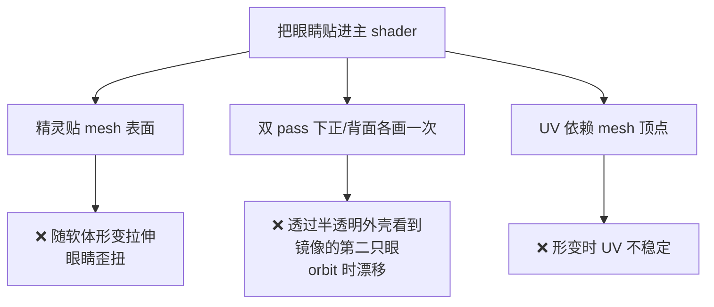
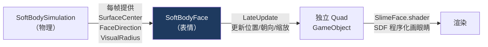
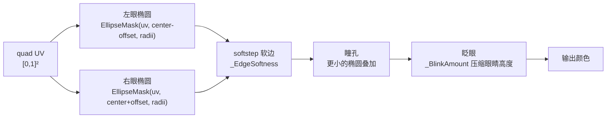

# Unity 程序化表情系统

> 承接 [[Unity 软体模拟实践]] 的表情部分。给史莱姆加一张会眨眼、朝向运动方向的脸。
>
> - 组件：`Assets/Scripts/SoftBody/SoftBodyFace.cs`
> - Shader：`Assets/Shader/SoftSlime/SlimeFace.shader`（SDF 程序化，不用贴图）
> - 关注点：**为什么用独立 billboard** + **SDF 画眼睛** + **帧率无关指数平滑**

---

## 架构决策：为什么不塞进主 Shader

一开始试过把眼睛画进史莱姆主 shader，问题不断：



**最终改为独立 Billboard 组件**：一个单独的 quad，朝相机，贴在质心表面外侧，用自己的 shader 程序化画眼睛。



> [!note] 核心教训
> 一个视觉元素若**不该跟随载体的局部形变**（脸就该整体稳定），把它做成**独立的、只吃载体整体状态（质心/朝向/尺度）的组件**，比嵌进载体自身的着色更稳、更好调。

---

## 组件接口：SoftBodySimulation 暴露给脸的数据

```csharp
// SoftBodySimulation.cs 提供的属性（每帧从质点计算）
public Vector3 SurfaceCenter    { get; }  // surface 质点质心（脸的锚点）
public Vector3 FaceDirection    { get; }  // 运动方向在水平面的投影
public float   VisualRadius     { get; }  // 整体水平半径（脸的宽度参考）
public float   FaceSurfaceRadius{ get; }  // 朝运动方向最远的 surface 质点投影距离
public Vector3 VisualExtents    { get; }  // AABB 半尺寸（脸的高度参考）
```

---

## 帧率无关指数平滑

朝向和缩放都用**帧率无关的指数平滑**，避免抖动：

```csharp
// SoftBodyFace.cs — LateUpdate()
// 帧率无关插值率：t = 1 - exp(-k · dt)
// k 越大，响应越快；不管帧率多少，1秒后剩余差距都是 exp(-k)
float interpolation = 1f - Mathf.Exp(-turnResponsiveness * Time.deltaTime);
_smoothedDirection = Vector3.Slerp(
    _smoothedDirection,
    desiredDirection.normalized,
    interpolation).normalized;   // 方向用 Slerp（球面插值，不缩短）

float scaleInterpolation = 1f - Mathf.Exp(-scaleResponsiveness * Time.deltaTime);
_smoothedScale = Vector3.Lerp(_smoothedScale, targetScale, scaleInterpolation);
```

| 参数 | 推荐值 | 效果 |
|---|---|---|
| `turnResponsiveness` | `8` | 转脸快速跟手 |
| `scaleResponsiveness` | `2` | 挤压/拉伸时脸不剧烈抖缩 |

> [!note] `1 - exp(-k·dt)` 是标准帧率无关插值率
> 和 `CpuSlimeSolver` 里的 `ToProjectionFraction` 同源。固定 `dt`（如 FixedUpdate）时它退化为常数 `t`，效果完全一样；可变帧率下它自动补偿，不会高帧率过冲、低帧率欠响应。

---

## Quad 的位置与朝向

```csharp
// SoftBodyFace.cs — LateUpdate()
float radius        = Mathf.Max(_simulation.VisualRadius, 0.01f);
float surfaceRadius = Mathf.Max(_simulation.FaceSurfaceRadius, radius * 0.35f);
float height        = Mathf.Max(_simulation.VisualExtents.y, radius * 0.35f);

faceTransform.SetPositionAndRotation(
    // 位置：质心 + 平滑方向 × 表面半径（inset 控制贴近程度）
    _simulation.SurfaceCenter + _smoothedDirection * (surfaceRadius * surfaceInset),
    // 朝向：面朝运动方向
    Quaternion.LookRotation(_smoothedDirection, Vector3.up));

// 缩放跟随整体尺寸
Vector3 targetScale = new Vector3(
    radius * widthScale,
    height * heightScale * 2f,
    radius);
```

---

## SDF 画眼睛

`SlimeFace.shader` 在 quad 的 UV 空间用 SDF 程序化画两只椭圆眼 + 瞳孔，**不用贴图**：



**眨眼**：`_BlinkAmount`（0→1）把眼睛的**高度**从 `_EyeHeight` 线性压到 `_ClosedEyeHeight`，闭眼是一条缝：

```hlsl
// SlimeFace.shader（示意）
float eyeH = lerp(_EyeHeight, _ClosedEyeHeight, _BlinkAmount);  // 高度随 blink 压缩
float mask = EllipseMask(uv, eyeCenter, float2(_EyeWidth, eyeH));
mask = smoothstep(0.5 - _EdgeSoftness, 0.5 + _EdgeSoftness, mask);
```

### 眨眼节奏（C# 驱动）

```csharp
// SoftBodyFace.cs — UpdateBlink()
private void UpdateBlink()
{
    float blinkAmount = 0f;
    if (blinkEnabled)
    {
        // 到时间触发眨眼
        if (Time.time >= _nextBlinkTime)
        {
            _blinkStartTime = Time.time;
            _nextBlinkTime  = Time.time + blinkInterval;
        }
        // blinkDuration 内用 sin 曲线 0→1→0 驱动 blinkAmount
        float elapsed = Time.time - _blinkStartTime;
        if (elapsed >= 0f && elapsed < blinkDuration)
            blinkAmount = Mathf.Sin(Mathf.PI * elapsed / blinkDuration);
    }
    // MaterialPropertyBlock 传参，不实例化材质、无 GC
    _faceMaterial.SetFloat(BlinkAmountPropertyId, blinkAmount);
}
```

> [!tip] SDF 画简单表情的优势
> 分辨率无关、完全参数化（眼距/大小/瞳孔/软边都是 `[Range]` 滑块）、眨眼只是改一个高度参数。适合程序化、可调、无美术资源的场景。

---

## Quad Mesh 的微微弯曲

`CreateFaceMesh()` 生成的 quad 不是平的，z 方向有轻微曲率，使脸贴合球形表面：

```csharp
// SoftBodyFace.cs — CreateFaceMesh()
for (int row = 0; row <= rows; row++)
{
    for (int column = 0; column <= columns; column++)
    {
        float x = u - 0.5f;
        float y = v - 0.5f;
        // z 随 x²+y² 向后弯（-0.22 系数），模拟贴合球面
        vertices[vertex] = new Vector3(x, y, -0.22f * (x * x + y * y));
    }
}
```

---

## 参数与生命周期

| 分类 | 做法 |
|---|---|
| Inspector 参数 | `[SerializeField]` + `OnValidate` clamp，实时预览 |
| 传参给 shader | `MaterialPropertyBlock`，不实例化材质、无 GC |
| 属性 ID | `Shader.PropertyToID` 静态缓存，避免每帧字符串 hash |
| 清理 | `OnDestroy` 销毁动态创建的 quad GameObject / Mesh / Material |
| 渲染队列 | `Transparent+20`，确保脸画在史莱姆本体之后 |
| 阴影 | 关闭阴影投射和接收（`ShadowCastingMode.Off`） |

---

## 关联

- 物理/整体状态来源：[[Unity 软体模拟实践]]
- 被取代的精灵贴表面方案 + 双 pass 镜像问题：[[Unity 半透明果冻 Shader]]

#Renderer
