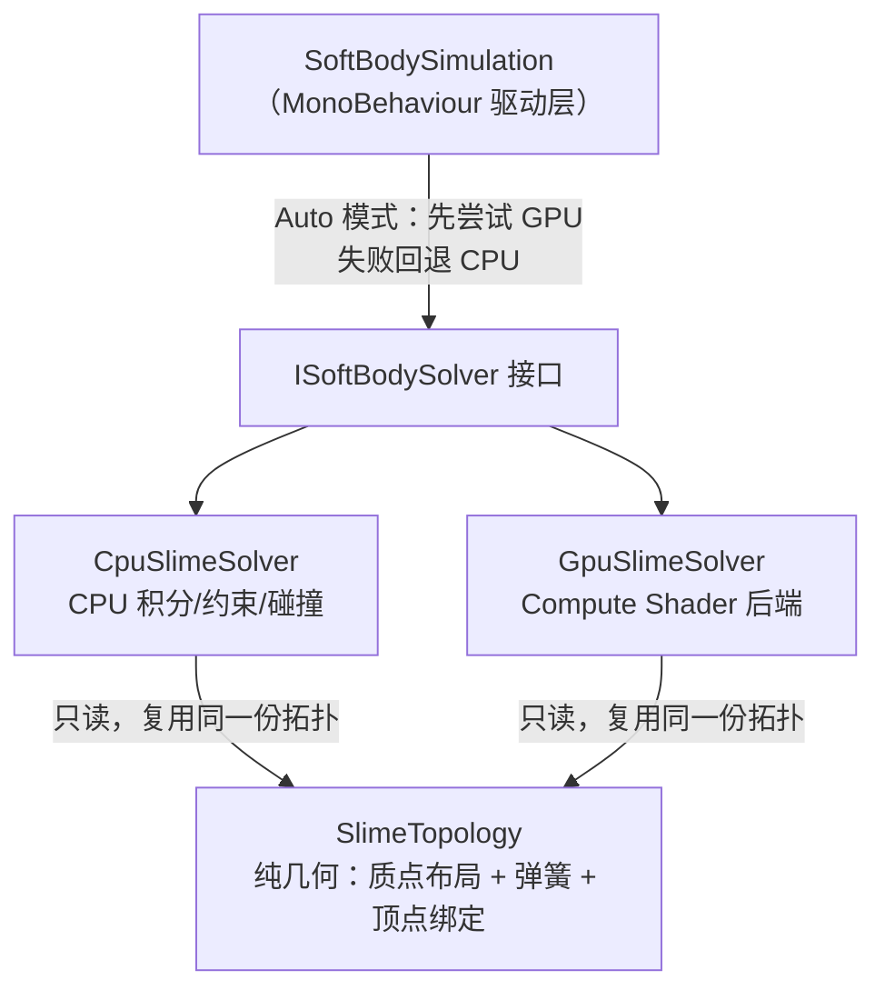
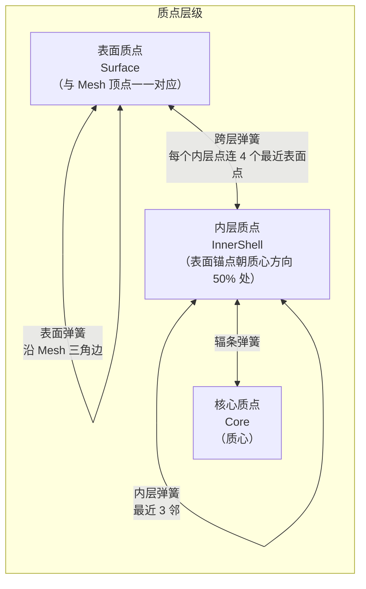
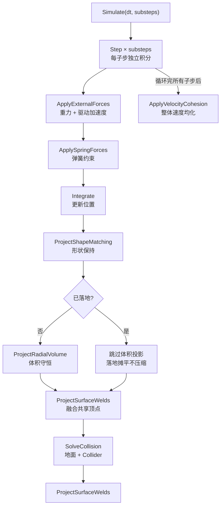
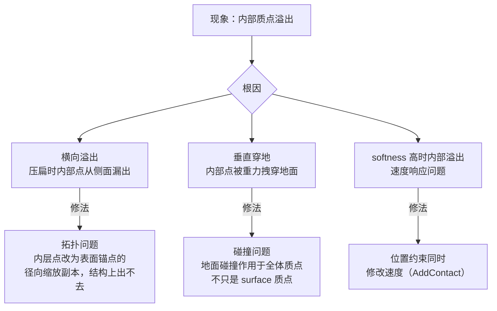
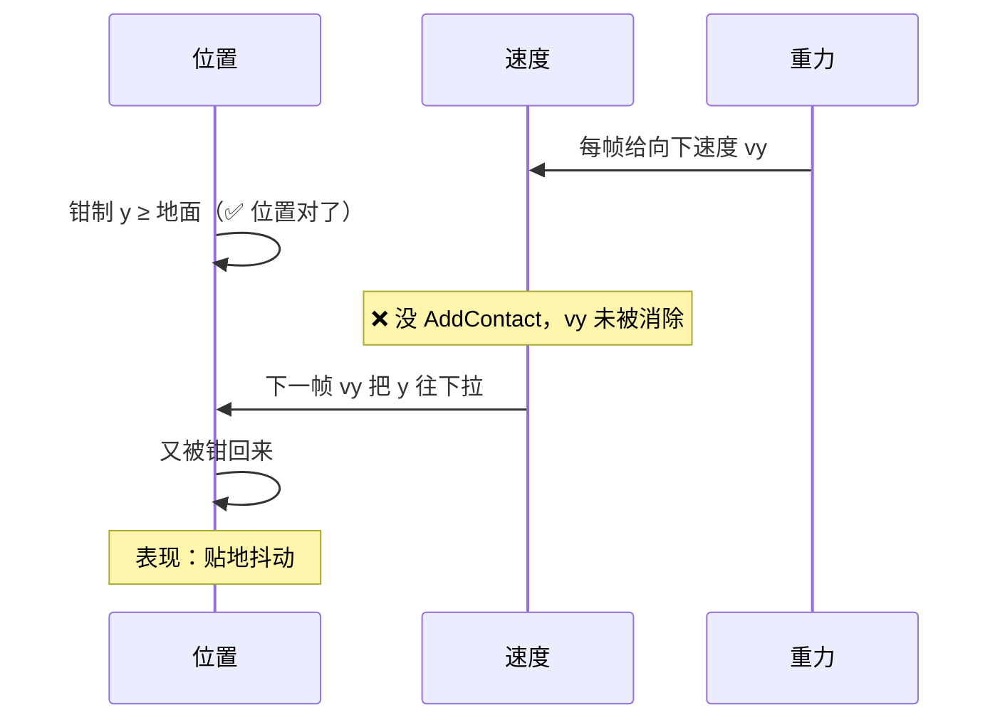
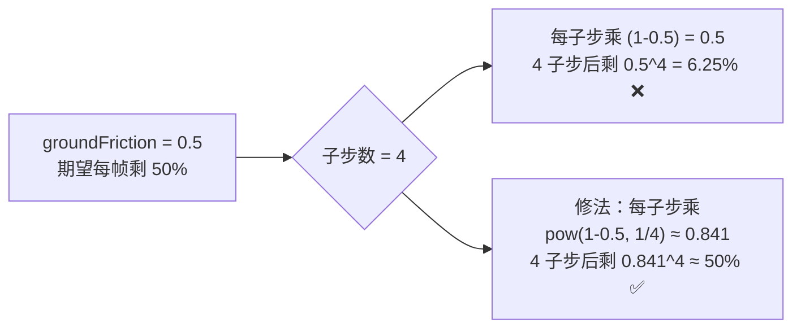
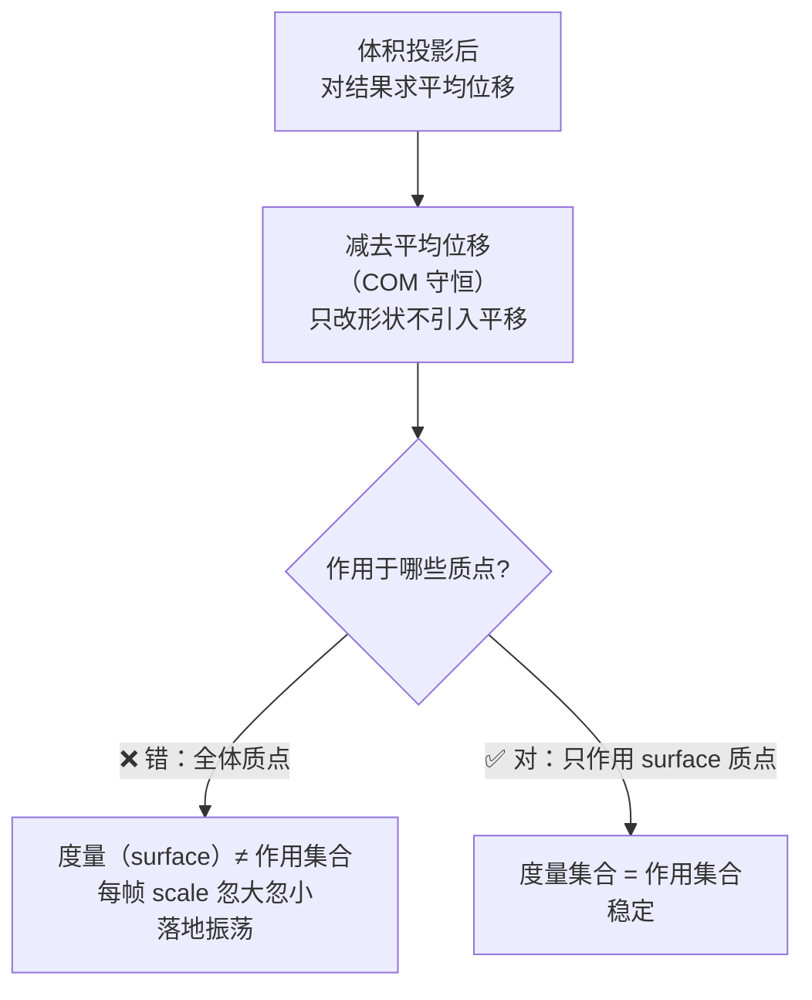

# Unity 软体模拟实践

> **项目定位**：在 Unity 里实现史莱姆软体——落地能压扁摊开、有弹性、可被推动。方案是**质点弹簧 + Shape Matching + 体积投影**混合模型，CPU 求解，后续扩展了 GPU Compute 后端。
>
> - 工程路径：`/Users/vast/DccDev/Unity Project/Graphics Learning`
> - 核心代码：`Assets/Scripts/SoftBody/`
>   - `SlimeTopology.cs` — 几何（质点布局、弹簧拓扑、顶点绑定）
>   - `CpuSlimeSolver.cs` — CPU 物理求解
>   - `GpuSlimeSolver.cs` — GPU Compute 求解
>   - `SoftBodySimulation.cs` — MonoBehaviour 驱动层
> - 渲染/表情见：[[Unity 半透明果冻 Shader]]、[[Unity 程序化表情系统]]

---

## 架构：三层分离



> [!note] 为什么要分层
> `SlimeTopology` **不含任何积分/碰撞代码**，只负责几何。这是能加 GPU 后端的前提——两个 Solver 复用同一份拓扑，切换后端不改 MonoBehaviour 任何代码。
>
> `ISoftBodySolver` 接口把 `SoftBodySimulation` 和具体后端解耦，`Auto` 模式自动选 GPU、失败回退 CPU：

```csharp
// SoftBodySimulation.cs — CreateSolver()
private ISoftBodySolver CreateSolver(SlimeTopology lattice)
{
    bool wantsGpu = settings.backend != SoftBodySolverBackend.Cpu;
    if (wantsGpu && SystemInfo.supportsComputeShaders)
    {
        ComputeShader cs = Resources.Load<ComputeShader>("SoftBody/SlimeSolver");
        if (cs != null)
        {
            var world = new UnityColliderCollisionWorld(transform);
            try { return new GpuSlimeSolver(lattice, cs, world); }
            catch (Exception e)
            {
                world.Dispose();
                Debug.LogWarning($"GPU solver failed; using CPU. {e.Message}", this);
            }
        }
    }
    return new CpuSlimeSolver(lattice, new UnityColliderCollisionWorld(transform));
}
```

---

## 质点布局：表面 + 内层 + 核心

### 结构



### 关键代码：内层点生成

```csharp
// SlimeTopology.cs — BuildInteriorPoints()
private static Vector3[] BuildInteriorPoints(
    Vector3[] surfacePoints, Vector3 center,
    int interiorCount, out int[] surfaceAnchors)
{
    // 从表面均匀选 N 个锚点（最大间距算法，让内层点均匀分布）
    int[] anchors = SelectSurfaceAnchors(uniqueSurfacePoints, center, interiorCount);
    var points = new Vector3[interiorCount + 1];
    for (int i = 0; i < interiorCount; i++)
    {
        // 内层点 = 对应表面锚点到质心 50% 处
        points[i] = Vector3.Lerp(center, uniqueSurfacePoints[anchors[i]], InteriorRadiusFraction);
        //                                                                 ↑ = 0.5f
        surfaceAnchors[i] = representativeSurfaceIndices[anchors[i]];
    }
    points[points.Length - 1] = center;  // 最后一个是核心质点
    return points;
}
```

> [!tip] 这套布局的根本收益
> 内层点在结构上被径向弹簧拴在对应表面点内侧，**横向溢出从拓扑上被杜绝**，不再需要每帧后处理去补。

---

## 顶点绑定：质点位移驱动 Mesh 形变

每个 Mesh 顶点绑定到**最近的 4 个质点**，形变时用加权位移叠加：

```csharp
// SlimeTopology.cs — SlimeVertexBinding.EvaluateDisplacement()
public Vector3 EvaluateDisplacement(Vector3[] positions, Vector3[] restPositions)
{
    return (positions[A] - restPositions[A]) * Weights.x
         + (positions[B] - restPositions[B]) * Weights.y
         + (positions[C] - restPositions[C]) * Weights.z
         + (positions[D] - restPositions[D]) * Weights.w;
}
```

```csharp
// SoftBodySimulation.cs — UpdateMesh()
for (int i = 0; i < _deformedVertices.Length; i++)
{
    SlimeVertexBinding binding = _lattice.VertexBindings[i];
    Vector3 worldPos = transform.TransformPoint(binding.RestPosition)
                     + binding.EvaluateDisplacement(_particlePositions, _lattice.RestPositions);
    _deformedVertices[i] = transform.InverseTransformPoint(worldPos);
}
_runtimeMesh.vertices = _deformedVertices;
_runtimeMesh.RecalculateNormals();
```

---

## 求解主循环



---

## 调试踩坑

### 溢出是三个独立问题，不是一个

「内部质点溢出 mesh」这个**现象**我误判过多次，实际是三个独立根因：



> [!warning] 最大教训
> **「内部质点穿地」我一开始当拓扑问题查，绕了很久。它其实是碰撞问题**——内部质点压根没参与地面碰撞。现象相似的 bug 可能根因完全不同，别被「看起来像上次那个」带偏。

---

### 坑：落地要「停住」，只钳位置不够

**现象**：内部质点落地后贴地抖动，同时把 surface 质点往下拽。

**根因分析**：



**修法**：内部质点落地时也调 `AddContact`，走和 surface 相同的速度响应（消除向下速度分量）：

> [!note] 核心原则
> **位置约束（PBD 式钳位）和速度必须保持一致。只改位置不改速度，下一帧速度会把位置「拽回去」，表现为抖动。**

---

### 坑：摩擦子步复利

**现象**：物体落地后底部被钉死，顶部继续前移，形成拖尾（「破麻袋」）。

**根因**：摩擦 `frictionScale = 1 - groundFriction` 在每个子步的速度响应里施加。设 4 子步，底部横向速度实际剩 `(1 - friction)^4`，**被过度钉死**；顶部不接触地面，继续前移 → 剪切拉伸。



> [!note] 通用原则
> **任何每子步施加的乘性衰减（摩擦、阻尼）都会随子步数复利。要么 `pow(value, 1/substeps)` 开方，要么每帧只施加一次。改子步数不该改变物理手感。**

---

### 坑：体积度量不稳定

**旧方案**：用「surface 质点到质心平均距离 → 球体积」估计。落地压扁时 surface 分布极不均匀 → 体积估计每帧剧烈波动 → 收缩/扩张振荡。

**新方案**：签名四面体和（Signed Tetrahedral Sum）——对每个表面三角形累加有符号体积：

```csharp
// SlimeTopology.cs — CalculateClosedSurfaceVolume()
float signedVolume = 0f;
for (int i = 0; i + 2 < triangleIndices.Length; i += 3)
{
    Vector3 a = positions[triangleIndices[i]]     - center;
    Vector3 b = positions[triangleIndices[i + 1]] - center;
    Vector3 c = positions[triangleIndices[i + 2]] - center;
    signedVolume += Vector3.Dot(a, Vector3.Cross(b, c)) / 6f;  // 标准四面体公式
}
return Mathf.Abs(signedVolume);
```

> [!warning] Rest Volume 和 Runtime Volume 必须用同一公式
> `SlimeTopology.CalculateClosedSurfaceVolume`（初始化）和 `CpuSlimeSolver` 里的运行时计算必须完全一致，否则 `restVol / curVol` 比值有恒定偏差，rest 状态不落在 scale 1.0。CPU / GPU 两端也要同步。

---

### 坑：体积投影的净平移与振荡

**现象**：史莱姆落地后产生一股莫名的净水平漂移，体积投影开启就漂。

**根因**：体积投影以 surface 质心为参考放大偏移，将结果作用于**全体质点**。但 surface 的 Fibonacci 方向和有微小残差、层间相干累加 → 全体质点求和不为零 → 引入净平移。

**修法**：



> [!note] 核心原则
> **约束的作用集合必须和它的度量集合一致**，否则会引入意想不到的耦合。体积是由 surface 度量的，就只能作用于 surface 质点。

---

## GPU 后端要点

把求解器搬到 Compute Shader 时，并行竞态是核心问题：

| 操作 | 正确做法 | 错误做法 |
|---|---|---|
| 弹簧力 | **per-particle gather**：每线程只写自己 | scatter：多线程写同一质点 → 竞态 |
| 自碰撞 | **gather-into-scratch**：读全体只写自己的 scratch，再统一拷回 | 直接写共享位置 → 竞态 |
| 速度 | **ping-pong 双缓冲**：`_VelocitiesRead` / `_VelocitiesWrite` 分离 | 读写同一 buffer → 竞态 |
| 约束 pass 同步 | **每个 pass 独立 Dispatch**（dispatch 间有隐式同步） | 同一 Dispatch 内跨线程依赖 |

> [!warning] 资源生命周期
> 18 个 `ComputeBuffer` 必须全在 `Dispose` 释放。构造函数里 `FindKernel` 抛异常会让已分配的 buffer 泄漏（对象没构造完，调用方 `Dispose` 不到）——要先 `FindKernel`，再分配 buffer，或用 try-finally。

> [!note] 回读代价
> 每帧 `GetData` 是同步阻塞回读，会冲掉 GPU 流水线。mesh 更新需要 CPU 侧位置时难免，可考虑 `AsyncGPUReadback` 延迟一帧。

---

## 渲染与表情

软体表面渲染和表情各自成篇：

- **半透明果冻 Shader**（双 pass 自穿插、双向菲涅尔、深度 Rim、材质序列化坑）→ [[Unity 半透明果冻 Shader]]
- **程序化表情系统**（billboard 脸、SDF 眼睛、眨眼、为何独立组件）→ [[Unity 程序化表情系统]]

其中**球形法线 + 质心球心**是连接物理与渲染的关键——`SoftBodySimulation.UpdateMesh()` 每帧把真实质心通过 `MaterialPropertyBlock` 传给 shader，不让 `transform` 追物理：

```csharp
// SoftBodySimulation.cs — UpdateMesh() 末尾
_renderer.GetPropertyBlock(_propertyBlock);
_propertyBlock.SetVector(CenterPropertyId, _focusPoint);   // _focusPoint = 所有质点质心
_renderer.SetPropertyBlock(_propertyBlock);
// 用 MaterialPropertyBlock 不会实例化材质，无 GC
```

---

## 后续

- [x] GPU 后端的 3 个 major bug（构造函数资源泄漏、surface 索引假设、weld 组互斥不变量）修复
- [x] 自碰撞 O(n²) → 空间哈希优化（均匀网格 + 链表桶）
- [x] 摩擦子步无关化、全体质点地面碰撞、签名四面体体积
- [ ] CPU / GPU 约束顺序 side-by-side 对齐，避免 Auto 切后端手感跳变
- [ ] `ApplyVelocityCohesion` 确认是否需要子步归一化（当前在 substep 循环外全 dt 调用）
- [ ] GPU `_SurfaceTriangleIndices` 隐式不变量加注释
- [ ] 更真实的碰撞（任意 Collider、软体间碰撞）

#Renderer
