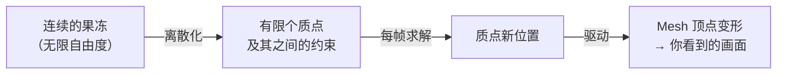
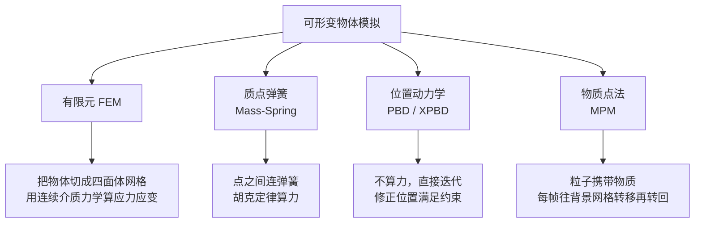
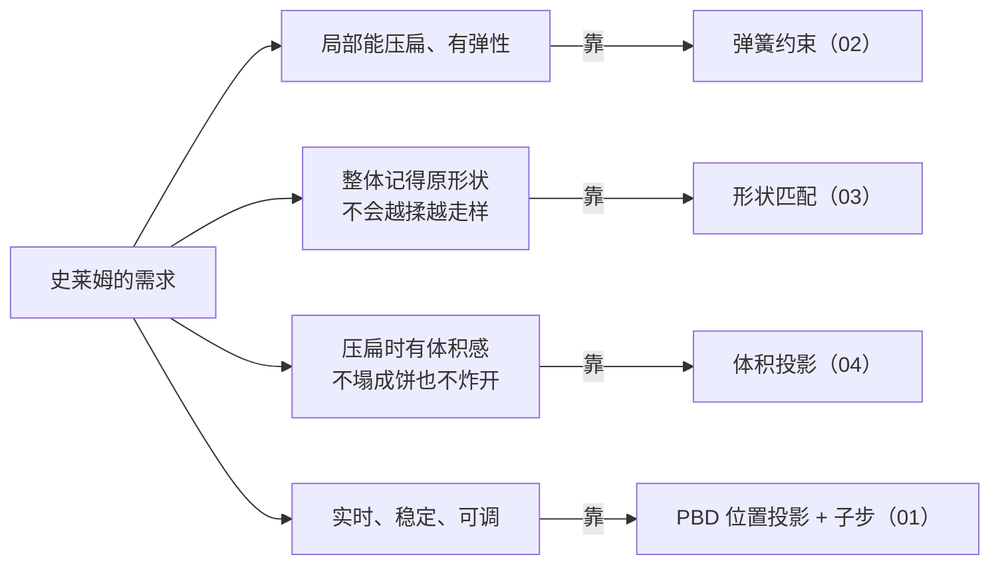
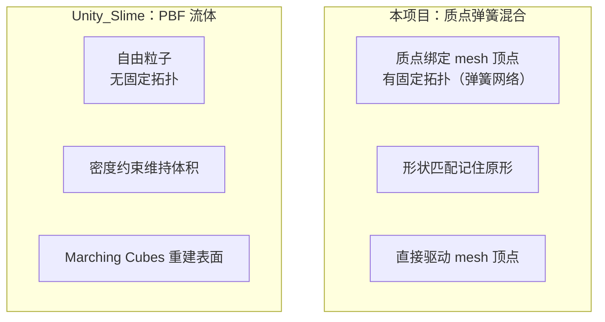

# 00 什么是软体模拟

> 系列开篇。动手之前，我们先花几分钟建立心智模型：软体到底在模拟什么、业界有哪几派做法、我们这只史莱姆为什么选这条路。
> 这一篇不写代码，只画「地图」。别急着跳过——看完它，后面 01–10 每一步你都知道自己站在整张图的哪个位置，不会迷路。
> 返回 [[软体模拟知识地图]]。

---

## 一、软体在模拟什么

先想想你已经熟悉的**刚体**。你在 Unity 里放个 `Rigidbody`，它撞墙会弹开，但永远是块硬邦邦的东西——只有 6 个自由度：位置 + 朝向，整体不变形。

我们要的史莱姆完全不同：落地会压扁、被戳会凹陷、松手会回弹。这种「会形变的物体」就是**软体（soft body）**。问题来了——一个物体如果每一处都能独立变形，那它有无穷多个自由度，计算机没法直接算无穷。怎么办？

答案是**离散化**——这也是整个计算机图形学的老套路（你在软光栅里把连续的三角形拆成像素，就是同一个思想）：

> 用**一堆离散的点**（质点 / 粒子）近似这个物体，让每个点各自运动，再用**约束**把它们绑在一起，让整体表现得像一坨有弹性的胶质。

这就是所有粒子类软体的通用套路。分歧只在于：**质点之间用什么约束、怎么求解**。

---

## 二、四大流派

### 1. 有限元 FEM

把物体切成四面体网格，用连续介质力学（应力、应变、本构模型）精确计算形变。

- ✅ 物理最准确，工业仿真、影视特效用它
- ❌ 慢、实现复杂、大形变时网格易翻转（inversion）导致爆炸
- 适合：离线高精度仿真。**不适合实时游戏里的史莱姆**。

### 2. 质点弹簧 Mass-Spring

质点之间连弹簧，用胡克定律 `F = -k·x` 算弹力，牛顿第二定律积分出运动。布料模拟的经典方法。

- ✅ 直观、好理解、好实现
- ❌ 刚度大时数值易爆炸（需要极小时间步或隐式积分）；**光靠弹簧会「布袋化」**——像一个装了水的塑料袋，软塌塌没有体积感
- 适合：布料、绳子。做体积软体需要**额外约束补救**。

### 3. 位置动力学 PBD（Position Based Dynamics）

**不算力，直接操作位置**。预测一个位置，然后反复迭代「修正位置直到满足所有约束」（距离约束、体积约束、碰撞约束……）。

- ✅ 无条件稳定（不会数值爆炸）、可控、快、约束可自由组合
- ✅ 游戏工业界主流（Unity 的 Obi、NVIDIA 的 FleX、UE 的 Chaos 都是 PBD 家族）
- ❌ 刚度和迭代次数/时间步耦合（XPBD 修正了这点）
- 详见 [[07 PBD 与 PBF]]

### 4. 物质点法 MPM（Material Point Method）

粒子携带物质属性，每帧把信息转移到背景网格上求解、再转回粒子。擅长雪、沙、相变、大形变。

- ✅ 大形变、拓扑变化、多材料交互一把抓（《冰雪奇缘》的雪）
- ❌ 重、需要背景网格、实时开销大
- 参考文献 [7] 的自适应时间步就是 MPM 的优化方向

---

## 三、本项目的选择：混合模型

> [!note] 一句话定位
> **本项目 = 质点弹簧（局部弹性）+ 形状匹配（整体记忆）+ 体积投影（不塌不胀），用 PBD 式的位置投影来求解。**

为什么不是单一方法？因为单一方法都有硬伤，而史莱姆的需求是「又软又有体积感又稳定」：

| 需求 | 只用弹簧 | 加形状匹配 | 加体积投影 |
| --- | --- | --- | --- |
| 局部弹性 | ✅ | ✅ | ✅ |
| 不布袋化 | ❌ 软塌 | ✅ 有骨架 | ✅ |
| 压扁体积感 | ❌ | ⚠️ 会缩水 | ✅ |
| 稳定 | ⚠️ 刚度高会爆 | ✅ | ✅ |

这三层叠加是本知识库 02→03→04 的主线：**先给它弹性，再给它记忆，最后给它体积**。

---

## 四、和参考项目 Unity_Slime 的对照

参考实现 [lamp-cap/Unity_Slime](https://github.com/lamp-cap/Unity_Slime) 走的是**另一条路：PBF（Position Based Fluids）**——把史莱姆当**流体**模拟，用密度约束维持不可压缩性，最后用各向异性核 + Marching Cubes 重建表面。

| | 本项目（质点弹簧混合） | Unity_Slime（PBF 流体） |
| --- | --- | --- |
| 心智 | 有骨架的胶块 | 一坨会流动的水 |
| 拓扑 | 固定（质点连成弹簧网络） | 无（粒子自由聚散） |
| 保持形状 | 形状匹配 | 靠密度约束 + 表面张力 |
| 渲染 | 直接变形原 mesh | 表面重建（[[09 表面重建与渲染]]） |
| 能不能「流开」 | 不能，始终是一坨 | 能，可以泼出去 |
| 实现复杂度 | 中 | 高（邻居搜索 + 表面重建） |

> [!tip] 为什么两个都值得学
> 本项目教你「约束怎么叠加成一个有骨架的软体」，Unity_Slime 教你「PBF 流体 + 表面重建的完整管线」。两条路的**共同内核都是 PBD 的位置投影思想**——理解了 [[07 PBD 与 PBF]]，两边的代码你都能读懂。

---

## 五、下一步

方法地图有了，但别急着写物理。先看 [[00.1 从零搭起：工程骨架]]——建工程、搭 MonoBehaviour 入口、看清代码分层和一帧的数据流。有了骨架，再进 [[01 质点系统与时间积分]] 写第一层物理才不会「悬空」。

## 速记

- 软体 = 用一堆质点 + 约束近似会形变的物体。
- 四派：FEM（准慢）、质点弹簧（直观易爆）、PBD（稳且主流）、MPM（大形变）。
- 本项目 = 弹簧（弹性）+ 形状匹配（记忆）+ 体积投影（体积感），PBD 式求解。
- 参考项目 Unity_Slime = PBF 流体，共同内核都是 PBD 位置投影。

#Renderer #软体模拟
