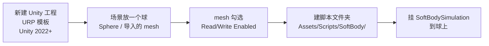
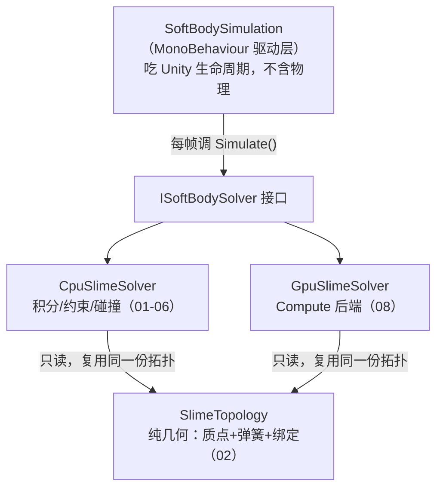
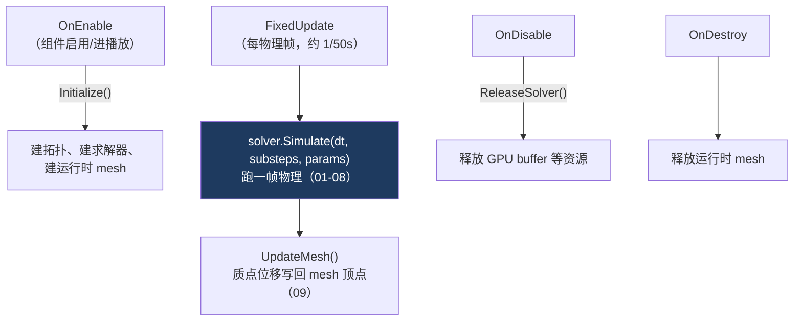
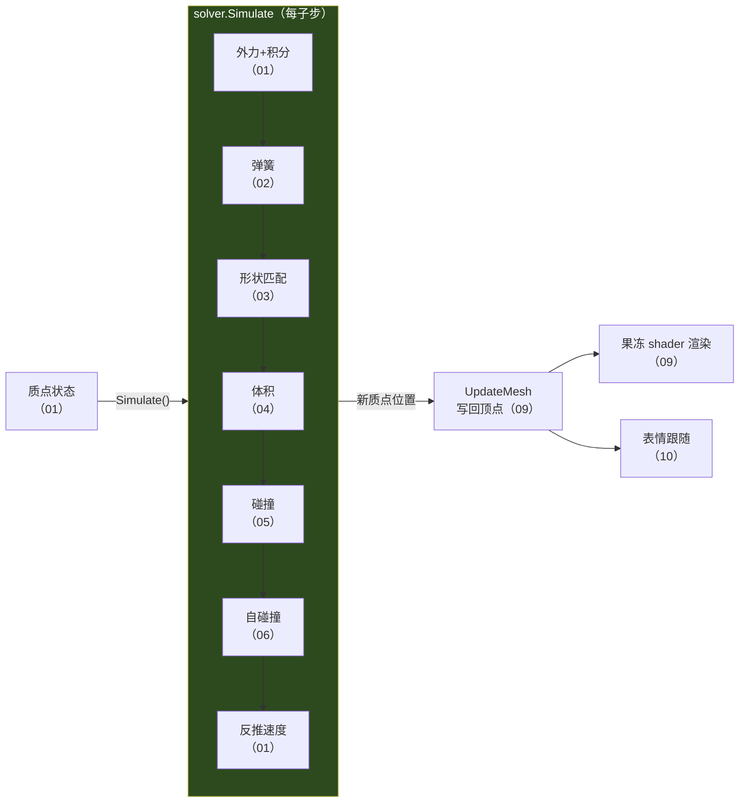

# 00.1 从零搭起：工程骨架

> 承接 [[00 什么是软体模拟]] 的方法地图。在动手写第一行物理代码（[[01 质点系统与时间积分]]）之前，先把「工程怎么搭、代码住在哪、每帧怎么被调用」讲清楚。
> 关注点：**新建工程与文件夹** + **MonoBehaviour 入口** + **Unity 生命周期** + **代码全景图**。
> 返回 [[软体模拟知识地图]]。

---

## 一、新建工程与准备

从零开始需要一个 URP 工程和一个能形变的 mesh。



> [!warning] mesh 必须勾选 Read/Write Enabled
> 软体要在运行时**逐帧改写顶点位置**（[[09 表面重建与渲染]]）。Unity 默认把 mesh 数据上传 GPU 后从 CPU 释放，此时 `mesh.vertices` 不可写。在模型 Import Settings 里勾上 **Read/Write Enabled**，否则一运行就报错：
> ```
> SoftBodySimulation requires Read/Write enabled on the source mesh.
> ```
> 这是 `Initialize()` 里第一批防御性检查之一——先验条件不满足就 `enabled = false` 并打清晰的错误，而不是让后面莫名崩溃。

### 文件夹结构

物理代码全部放在 `Assets/Scripts/SoftBody/`，Compute Shader 放 `Assets/Resources/SoftBody/`（放 Resources 才能用 `Resources.Load` 运行时加载）：

```
Assets/
├── Scripts/SoftBody/
│   ├── SoftBodySimulation.cs      ← MonoBehaviour 入口（本篇主角）
│   ├── SoftBodySolver.cs          ← 接口 + 参数结构体
│   ├── SlimeTopology.cs           ← 纯几何：质点布局/弹簧/绑定（02）
│   ├── CpuSlimeSolver.cs          ← CPU 物理求解（01-06）
│   ├── GpuSlimeSolver.cs          ← GPU 后端（08）
│   ├── SoftBodyFace.cs            ← 表情（10）
│   └── UnityColliderCollisionWorld.cs  ← 碰撞世界（05）
├── Resources/SoftBody/
│   └── SlimeSolver.compute        ← GPU kernel（08）
└── Shader/SoftSlime/
    ├── Soft.shader                ← 果冻材质（09）
    └── SlimeFace.shader           ← 脸（10）
```

> [!tip] 括号里的数字是本知识库的篇号
> 每个文件对应系列里的一篇。这篇（00.1）只讲把它们串起来的**入口**，具体实现从 01 开始逐篇展开。

---

## 二、职责分层：代码住在哪

在写任何一行之前，先记住 [[00 什么是软体模拟]] 强调的**几何/物理/驱动三层分离**。这决定了「哪段逻辑写进哪个文件」——分层清晰，后面加 GPU 后端才不用动上层。



| 层 | 文件 | 职责 | 不该做什么 |
| --- | --- | --- | --- |
| 驱动 | `SoftBodySimulation` | 吃 Unity 生命周期、调求解器、把结果写回 mesh | 不含任何积分/约束数学 |
| 接口 | `ISoftBodySolver` | 隔离驱动层和后端 | — |
| 物理 | `CpuSlimeSolver` / `GpuSlimeSolver` | 每帧 `Simulate` 做积分/约束/碰撞 | 不碰 Unity API、不管 mesh |
| 几何 | `SlimeTopology` | 质点布局、弹簧拓扑、顶点绑定 | **不含任何积分/碰撞代码** |

> [!note] 为什么几何层不含物理
> `SlimeTopology` 只描述「点在哪、弹簧怎么连、mesh 顶点绑哪些点」，不含一行积分代码。正因如此，CPU 和 GPU 两个后端能**复用同一份拓扑**——这是 [[08 GPU 并行求解]] 能低成本加 GPU 后端的前提。分层不是为了好看，是为了可扩展。

---

## 三、MonoBehaviour 入口：每帧怎么被调用

`SoftBodySimulation` 是唯一挂在物体上的组件。它靠 Unity 生命周期驱动整个求解：



### 生命周期骨架

```csharp
// SoftBodySimulation.cs — 骨架（省略防御性检查）
[RequireComponent(typeof(MeshFilter))]
public sealed class SoftBodySimulation : MonoBehaviour
{
    [SerializeField] private SoftBodySettings settings = new SoftBodySettings();
    private ISoftBodySolver _solver;

    private void OnEnable()
    {
        if (Application.isPlaying) Initialize();   // 建拓扑 + 求解器 + 运行时 mesh
    }

    private void FixedUpdate()
    {
        if (_solver == null) return;

        int substeps = Mathf.Clamp(settings.solverSubsteps, 1, 8);
        var stepParameters = new SoftBodyStepParameters(settings, Physics.gravity);
        _solver.Simulate(Time.fixedDeltaTime, substeps, stepParameters);  // ← 物理在这

        UpdateMesh();   // ← 把质点位移映射回 mesh 顶点
    }

    private void OnDisable() => ReleaseSolver();     // GPU buffer 是非托管资源，必须释放
    private void OnDestroy() => ReleaseRuntimeMesh();
}
```

> [!note] 为什么是 FixedUpdate 不是 Update
> 物理必须用**固定时间步**（`FixedUpdate`，默认 50Hz）。`Update` 的 `deltaTime` 随帧率波动，会让弹簧刚度、积分稳定性忽好忽坏（[[01 质点系统与时间积分]] 会讲时间步对稳定性的影响）。固定步长才能保证物理可复现、稳定。表情（[[10 程序化表情系统]]）反而放 `LateUpdate`——它要贴在物理**算完之后**的位置上。

> [!warning] 成对的资源管理
> `OnEnable` 建、`OnDisable` 放，必须成对。GPU 后端持有一堆 `ComputeBuffer`（非托管资源），忘了在 `OnDisable` 释放就会泄漏。这条规则在 [[08 GPU 并行求解]] 会重申——那里泄漏的代价更大。

---

## 四、一帧的数据流（把全系列串起来）

`FixedUpdate` 一帧内，数据这样流过整个系统。这张图是**整个知识库的目录**——每个环节对应后面一或多篇：



看懂这张图，你就知道后面每一篇在整体的什么位置：
- **01–06**：`Simulate` 内部一个子步里，按顺序施加的各层约束（这是主线）。
- **07**：把 01–06 的约束纳入 PBD 统一框架，并对照 PBF 流体方案。
- **08**：把整个 `Simulate` 搬到 GPU。
- **09–10**：`Simulate` 之后的渲染与表情。

---

## 五、下一步

工程骨架、生命周期、代码全景都清楚了。现在进入 `Simulate` 内部——[[01 质点系统与时间积分]] 从最底层开始：质点的状态怎么存、怎么在重力下正确运动。你已经知道它被 `FixedUpdate` 每帧调用，接下来看它内部做什么。

## 速记

- URP 工程 + mesh 勾 **Read/Write Enabled**（否则顶点不可写）；代码放 `Assets/Scripts/SoftBody/`，compute 放 `Resources/SoftBody/`。
- 三层分离：驱动（MonoBehaviour）/ 物理（Solver）/ 几何（Topology）。几何层不含物理，才能 CPU/GPU 复用。
- 入口 `SoftBodySimulation`：`OnEnable→Initialize`、`FixedUpdate→Simulate+UpdateMesh`、`OnDisable→释放`。
- 物理用 `FixedUpdate`（固定步长稳定），表情用 `LateUpdate`（贴物理算完的位置）。
- 一帧数据流 = 质点状态 → 各层约束（01-06）→ 写回 mesh（09）→ 渲染/表情（09-10），就是本知识库的目录。

#Renderer #软体模拟
