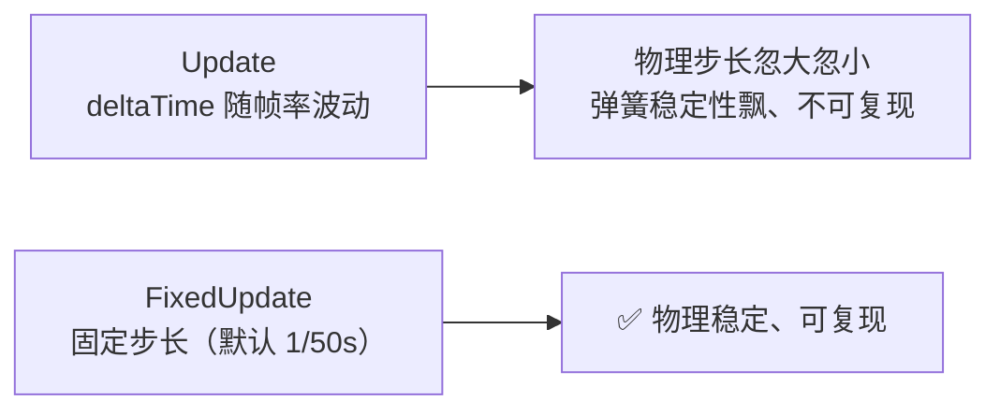
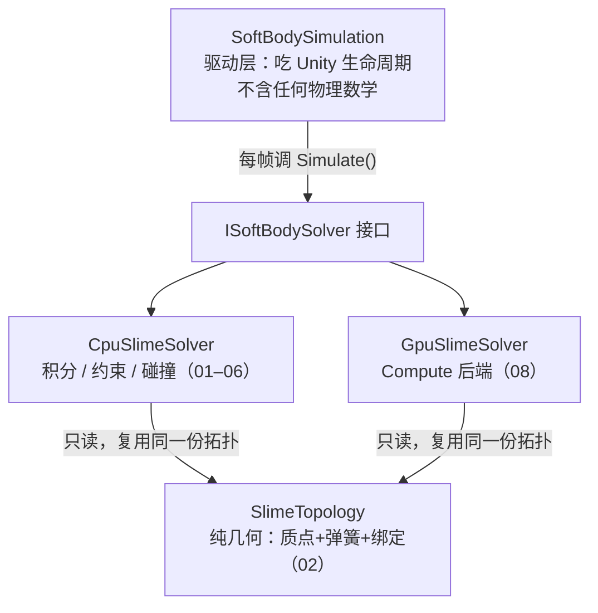
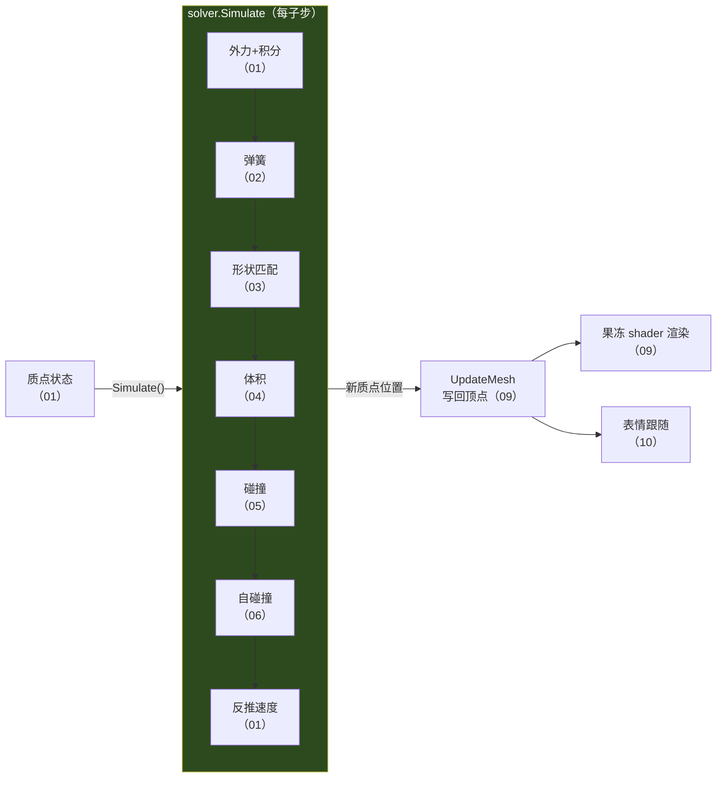

# 00.1 从零搭起：工程骨架

> 承接 [[00 什么是软体模拟]] 的方法地图。理论讲完了，现在我们真的动手——从打开 Unity 点「New Project」开始，一步步把工程搭起来，最后让一个球在屏幕上受重力掉下去。
> 这一篇不写物理算法（那从 [[01 质点系统与时间积分]] 开始），只做一件事：**把舞台搭好，让你有一个能跑、能改、能看到画面的工程**。跟着做，别跳。
> 返回 [[软体模拟知识地图]]。

---

## 开始之前

我们的目标很具体：结束时，你的场景里有一个球，按下 Play 会看到它**受重力下落、砸到地面**。它还不是史莱姆——不会形变、不会弹——但整条「Unity 每帧调用我们的代码 → 我们移动质点 → 画面更新」的管线会完整跑通。

后面每一篇（01–10）都往这个骨架里填一层：先让点会动（01），再连弹簧（02），再记形状（03）…… 所以这一篇的工程，就是你接下来所有代码的家。

需要的东西：**Unity 2022.3 LTS 或更新**、大约二十分钟。不需要任何图形或物理基础——你会 C#、跟过 shader，这些绰绰有余。

---

## 第一步：新建 URP 工程

打开 **Unity Hub → New Project**。为什么是 URP 而不是内置管线？因为史莱姆最后要做半透明果冻质感（[[09 表面重建与渲染]]），URP 的深度纹理、Shader Graph、后处理都更顺手，也是现在 Unity 项目的主流选择。

1. 顶部选 **Unity 2022.3 LTS**（或更新的版本）。
2. 模板选 **3D (URP)** —— 注意是带 URP 字样的那个，不是纯 3D。
3. 项目命名 `SlimeSim`（随意），选个路径，**Create Project**。

> [!note] 已经有非 URP 工程了？
> 也能补装：**Window → Package Manager → Universal RP → Install**，再在 **Project Settings → Graphics** 里指定一个 URP Asset。但如果是全新开始，直接用 URP 模板最省事。

工程打开后，你会看到一个已经配好 URP 的空场景。舞台有了。

---

## 第二步：放一个球，铺一块地

我们需要两样东西：一个将来会变成史莱姆的**球**，和一块接住它的**地面**。

1. **Hierarchy 右键 → 3D Object → Sphere**。这就是我们的史莱姆本体。
2. 选中球，在 Inspector 里把 **Transform → Position Y** 设成 `3`，让它悬在半空（等下好看它掉下来）。
3. **Hierarchy 右键 → 3D Object → Plane**，位置留在原点 `(0,0,0)` 当地面。

按一下 Play——什么都不会发生，球稳稳浮在空中。因为我们还没让任何东西驱动它。这正是接下来要做的：**写一段代码，每帧把球往下挪一点**。

---

## 第三步：让 mesh 可写（关键一步，别漏）

软体的核心动作是**运行时逐帧改写 mesh 的顶点**（[[09 表面重建与渲染]] 会真正用到）。但 Unity 默认把 mesh 上传 GPU 后就从 CPU 内存释放，这时候顶点数据是**只读**的。

球用的是 Unity 内置 mesh，内置 mesh 无法改 Import Settings。所以正式做史莱姆时，我们会用**导入的模型**（FBX / OBJ），并给它勾上：

- 选中模型文件 → Inspector → **Model → Read/Write Enabled ✓ → Apply**

> [!warning] 忘了勾会怎样
> 运行时试图写 `mesh.vertices` 会直接报错。我们的入口脚本第一件事就是检查这个前提，不满足就打一条清楚的错误并禁用自己，而不是让后面莫名其妙地崩：
> ```
> SoftBodySimulation requires Read/Write enabled on the source mesh.
> ```
> 现在用内置球先跑通骨架没问题（下面的最小脚本不改顶点）；等进到 09 真正形变 mesh 时，记得换成勾了 Read/Write 的导入模型。

---

## 第四步：建脚本文件夹

在动手写代码前，先想好东西放哪。软体这套代码不小（最终十来个文件），乱放很快就找不着。约定一个清晰的结构：

在 **Project 窗口** 里，`Assets` 下依次右键 **Create → Folder**，建出：

```
Assets/
├── Scripts/SoftBody/          ← 所有 C# 物理代码
└── Resources/SoftBody/        ← Compute Shader（放 Resources 才能运行时 Resources.Load）
```

> [!note] 为什么 compute 要放 Resources
> [[08 GPU 并行求解]] 的 GPU 后端用 `Resources.Load<ComputeShader>("SoftBody/SlimeSolver")` 在运行时加载 compute。只有放在名为 `Resources` 的文件夹里，这个 API 才找得到。现在还用不上，先把位置留好。

---

## 第五步：写第一个脚本，让球动起来

现在写我们的第一段代码。目标最小：**每帧把球往下挪一点**，先证明「Unity 调用我们 → 我们移动物体 → 画面更新」这条链是通的。

在 `Assets/Scripts/SoftBody/` 右键 **Create → C# Script**，命名 `SoftBodySimulation`。打开，替换成：

```csharp
using UnityEngine;

public class SoftBodySimulation : MonoBehaviour
{
    [SerializeField] private float gravity = -9.81f;
    private Vector3 _velocity;

    private void FixedUpdate()
    {
        // 半隐式欧拉：先加速度改速度，再用新速度移动（原理见 01）
        _velocity.y += gravity * Time.fixedDeltaTime;
        transform.position += _velocity * Time.fixedDeltaTime;
    }
}
```

把这个脚本**拖到球上**（或选中球 → Add Component → SoftBodySimulation）。按 **Play**——球加速下落，穿过地面继续掉。

> [!tip] 你刚刚做的，就是整个软体的雏形
> 这段代码只有一个「质点」（整个球），但它已经包含了 [[01 质点系统与时间积分]] 的全部核心：**存速度、每帧用重力更新速度、用速度更新位置**。接下来我们要做的，无非是把「一个球」换成「几百个质点」，再给它们加上弹簧、形状、体积、碰撞等约束。骨架不变，只是往里填东西。

---

## 为什么是 FixedUpdate，不是 Update

你可能注意到我们用的是 `FixedUpdate` 而不是 `Update`。这不是随意的选择：



物理模拟对时间步长很敏感——步长忽大忽小会让弹簧刚度、积分稳定性跟着抖（[[01 质点系统与时间积分]] 会详细讲）。`FixedUpdate` 以固定频率调用，是所有物理代码的正确落点。

（顺带一提：将来那张会眨眼的脸 [[10 程序化表情系统]] 反而放 `LateUpdate`——它要贴在物理**算完之后**的位置上，逻辑不同。）

---

## 全景：代码将怎么长大

现在球会掉了，但真正的史莱姆需要成百上千个质点和一整套约束。如果全塞进一个 `SoftBodySimulation`，很快就会变成没法维护的一坨。所以从一开始就分层——这也是 [[00 什么是软体模拟]] 强调的**几何 / 物理 / 驱动三层分离**。

最终的文件长这样（括号是本知识库对应的篇号，现在只有 `SoftBodySimulation` 存在，其余会逐篇长出来）：

```
Assets/Scripts/SoftBody/
├── SoftBodySimulation.cs      ← 驱动层：吃 Unity 生命周期（本篇）
├── SoftBodySolver.cs          ← 接口 + 参数结构体
├── SlimeTopology.cs           ← 纯几何：质点布局 / 弹簧 / 顶点绑定（02）
├── CpuSlimeSolver.cs          ← CPU 物理求解（01–06）
├── GpuSlimeSolver.cs          ← GPU 后端（08）
├── SoftBodyFace.cs            ← 表情（10）
└── UnityColliderCollisionWorld.cs  ← 碰撞世界（05）
Assets/Resources/SoftBody/
└── SlimeSolver.compute        ← GPU kernel（08）
Assets/Shader/SoftSlime/
├── Soft.shader                ← 果冻材质（09）
└── SlimeFace.shader           ← 脸（10）
```

三层各管一摊，边界清楚：



| 层 | 文件 | 管什么 | 绝不做什么 |
| --- | --- | --- | --- |
| 驱动 | `SoftBodySimulation` | 吃生命周期、调求解器、写回 mesh | 不含积分 / 约束数学 |
| 接口 | `ISoftBodySolver` | 隔离驱动层和后端 | — |
| 物理 | `CpuSlimeSolver` / `GpuSlimeSolver` | 每帧 `Simulate` 做积分 / 约束 / 碰撞 | 不碰 Unity API、不管 mesh |
| 几何 | `SlimeTopology` | 质点布局、弹簧、顶点绑定 | **不含任何积分 / 碰撞代码** |

> [!note] 这个分层不是为了好看
> 因为 `SlimeTopology` 只描述几何、不含物理，CPU 和 GPU 两个后端才能**复用同一份拓扑**——这正是 [[08 GPU 并行求解]] 能低成本加 GPU 后端的前提。分层是为了可扩展，你到 08 会真切感受到它的价值。

---

## 真正的入口长什么样

我们第五步写的极简版，将来会长成完整的 `SoftBodySimulation`。骨架不变，还是那三个生命周期方法，只是每个里面做的事更完整：

```csharp
// 完整版骨架（省略防御性检查）
[RequireComponent(typeof(MeshFilter))]
public sealed class SoftBodySimulation : MonoBehaviour
{
    [SerializeField] private SoftBodySettings settings = new SoftBodySettings();
    private ISoftBodySolver _solver;

    private void OnEnable()
    {
        if (Application.isPlaying) Initialize();   // 建拓扑 + 求解器 + 运行时 mesh
    }

    private void FixedUpdate()
    {
        if (_solver == null) return;
        int substeps = Mathf.Clamp(settings.solverSubsteps, 1, 8);
        var stepParameters = new SoftBodyStepParameters(settings, Physics.gravity);
        _solver.Simulate(Time.fixedDeltaTime, substeps, stepParameters);  // ← 物理在这（01–08）
        UpdateMesh();   // ← 质点位移写回 mesh 顶点（09）
    }

    private void OnDisable() => ReleaseSolver();     // 释放 GPU buffer 等资源
    private void OnDestroy() => ReleaseRuntimeMesh();
}
```

对照你刚写的极简版，能看出对应关系：`FixedUpdate` 里那两行「重力→速度→位置」，将来被 `_solver.Simulate(...)` 取代——只不过 solver 内部对**每个质点**做这件事，还加上了弹簧、形状、体积、碰撞。你已经理解了骨架，剩下的都是往 `Simulate` 里填内容。

> [!warning] 记住：建和放要成对
> `OnEnable` 建、`OnDisable` 放。GPU 后端会持有一堆 `ComputeBuffer`（非托管资源），忘了在 `OnDisable` 释放就泄漏。这条规则在 [[08 GPU 并行求解]] 会重申——那里泄漏的代价更大。

---

## 一帧的数据流（这就是本知识库的目录）

最后看一眼 `FixedUpdate` 一帧内数据怎么流过整个系统。这张图其实就是**整个知识库的地图**——每个环节对应后面一到两篇：



看懂它，你就知道后面每篇在整体的哪个位置：
- **01–06**：`Simulate` 内部一个子步里，按顺序施加的各层约束（主线）。
- **07**：把 01–06 纳入 PBD 统一框架，对照 PBF 流体方案。
- **08**：把整个 `Simulate` 搬上 GPU。
- **09–10**：`Simulate` 之后的渲染与表情。

---

## 下一步

工程建好了，球会掉了，代码分层和一帧数据流也心里有数了。现在我们把「一个球」拆成「一堆质点」——[[01 质点系统与时间积分]] 会带你把刚写的那几行重力代码，扩展成一个能驱动成百上千质点的求解器地基。你已经写过它的雏形，接下来只是把它做扎实。

## 速记

- URP 工程 + 场景放球和地面 + 导入模型勾 **Read/Write Enabled**（否则顶点不可写）。
- 代码放 `Assets/Scripts/SoftBody/`，compute 放 `Resources/SoftBody/`。
- 最小可跑骨架：一个 `FixedUpdate` 里「重力→速度→位置」的 MonoBehaviour——这就是单质点软体。
- 物理用 `FixedUpdate`（固定步长稳定），表情用 `LateUpdate`。
- 三层分离：驱动（MonoBehaviour）/ 物理（Solver）/ 几何（Topology）；几何不含物理，才能 CPU/GPU 复用。
- 一帧数据流 = 质点状态 → 各层约束（01–06）→ 写回 mesh（09）→ 渲染/表情（09–10），就是本知识库的目录。

#Renderer #软体模拟
