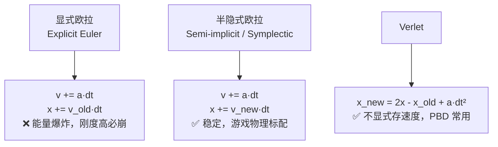
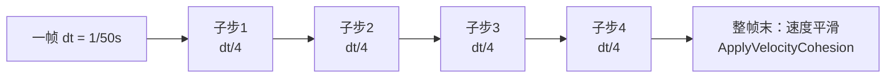
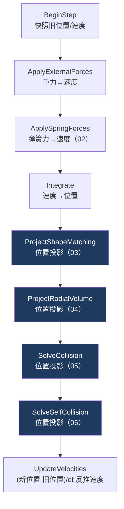

# 01 质点系统与时间积分

> 承接 [[00.1 从零搭起：工程骨架]]。你已经知道 `FixedUpdate` 每帧调用 `solver.Simulate(dt, substeps, params)`——现在走进 `Simulate` 内部，从最底层开始。所有约束（02–06）都建立在这一篇的「质点状态 + 时间积分」之上。
> 关注点：**质点的状态怎么存** + **半隐式欧拉积分** + **为什么要子步（substep）**。
> 返回 [[软体模拟知识地图]]。

---

## 一、质点的状态

进 `CpuSlimeSolver` 看第一件事：它怎么表示「一堆质点」。答案很朴素——**几个平行数组**，每个数组第 `i` 个元素对应第 `i` 个质点的一个属性（这种 SoA 布局对 CPU 缓存和后面搬 GPU 都友好）。

一个质点需要记住三件事：**当前位置、上一帧位置、速度**。对图形背景的你，这就像光追里累积帧的状态——每帧读旧值、算新值、写回。

```csharp
// CpuSlimeSolver.cs — 每个数组一个 entry 对应一个质点
private readonly Vector3[] _positions;          // 当前位置
private readonly Vector3[] _previousPositions;  // 子步开始时的位置（算速度用）
private readonly Vector3[] _velocities;          // 速度
private readonly Vector3[] _restPositions;      // 静止参考位置（形状匹配用，见 03）
private readonly Vector3[] _restOffsets;         // 静止时相对质心的偏移（形状匹配用）
```

> [!note] 为什么要存「上一帧位置」
> PBD 的约束是**直接改位置**的（不算力）。位置被改完后，「真实速度」不再是 `_velocities` 里那个旧值，而要用 `(新位置 - 旧位置) / dt` 重新反推。所以每个子步开始时先快照一份 `_previousPositions`：

```csharp
private void BeginStep()
{
    for (int i = 0; i < _positions.Length; i++)
    {
        _previousPositions[i] = _positions[i];   // 快照，子步末尾算速度用
        _incomingVelocities[i] = _velocities[i]; // 入射速度，碰撞回弹用（见 05）
    }
}
```

---

## 二、时间积分：让点动起来

「积分」就是从加速度 → 速度 → 位置的推进。你在光追里已经见过时间步进的思想，这里是它在物理里的标准形式。

### 三种积分方式



**关键区别只在一行**：位置更新用的是**旧速度**还是**更新后的速度**。

- 显式欧拉用旧速度 → 系统会不断注入能量 → 弹簧越弹越高 → 爆炸。
- **半隐式欧拉**用刚更新的速度 → 天然耗散一点能量 → 稳定。这是游戏物理的默认选择。

### 本项目的写法

还记得 [[00.1 从零搭起：工程骨架]] 里你写的那两行吗？

```csharp
_velocity.y += gravity * Time.fixedDeltaTime;   // 先改速度
transform.position += _velocity * Time.fixedDeltaTime;  // 再用新速度移动
```

那时候只有「一个质点」（整个球）。现在我们要对**每个质点**做同一件事——只是把单个 `_velocity`、`transform.position` 换成数组，用 `for` 循环遍历。逻辑一模一样：

```csharp
// 1) 先更新速度（半隐式的关键：位置将用这个新速度）
private void ApplyExternalForces(float deltaTime, Vector3 gravity, ...)
{
    for (int i = 0; i < _velocities.Length; i++)
    {
        Vector3 acceleration = gravity;
        // ... 压缩、驱动等附加加速度
        _velocities[i] += acceleration * deltaTime;   // v += a·dt
    }
}

// 2) 再用新速度推进位置
private void Integrate(float deltaTime)
{
    for (int i = 0; i < _positions.Length; i++)
        _positions[i] += _velocities[i] * deltaTime;  // x += v_new·dt
}
```

看，你在 00.1 写的球，其实就是这段代码 `_positions.Length == 1` 的特例。从「一个球」到「一堆质点」，代码骨架没变，只是长出了循环。

> [!warning] 别用显式欧拉做弹簧
> 弹簧刚度 `k` 越大，显式欧拉的稳定时间步越小（`dt < 2/√(k/m)`）。史莱姆要 55 的刚度，显式欧拉需要极小的 `dt` 才不炸，性能不可接受。半隐式 + 子步（见下）+ 后面的位置投影约束，才是稳定的组合。

---

## 三、子步（Substep）：稳定性的杠杆

### 问题

一帧 `FixedUpdate` 的 `dt` 大概 1/50 秒。这个时间步对高刚度弹簧、快速碰撞来说**太大**——点在一帧里移动太远，约束来不及收敛，表现为抖动、穿透、软趴趴。

### 解法

把一帧切成 N 个子步，每个子步用 `dt/N` 完整跑一遍求解。**时间分辨率提高 N 倍，稳定性大幅提升**。



```csharp
// CpuSlimeSolver.cs — Simulate() 顶层
public void Simulate(float deltaTime, int substeps, SoftBodyStepParameters parameters)
{
    substeps = Mathf.Max(1, substeps);
    float substepTime = deltaTime / substeps;      // 每个子步的 dt
    for (int i = 0; i < substeps; i++)
        Step(substepTime, substeps, parameters);   // 每个子步完整求解一遍

    ApplyVelocityCohesion(deltaTime, parameters.VelocityCohesion);
}
```

默认 `solverSubsteps = 4`。更多子步 = 更稳但更慢（线性开销）。

> [!warning] 子步不是「免费加稳定」——乘性衰减会复利
> 任何**每子步施加一次的乘性衰减**（摩擦、阻尼）都会被执行 N 次，效果随子步数变化。比如摩擦 `1 - friction` 跑 4 子步就变成 `(1-friction)⁴`，被过度钉死。
>
> 修法：按子步数开方，`pow(1 - friction, 1/substeps)`，N 次累乘正好回到 `1 - friction`。详见 [[05 碰撞与接触]] 的摩擦一节。**「改子步数不该改变物理手感」是子步无关性的基本要求。**

---

## 四、一个子步里发生了什么（全景）

这是 `Step()` 的完整骨架。现在只需看懂「先积分、再一串位置投影、最后反推速度」的结构，每个约束的细节留给后续各篇：



> [!note] 「力」和「位置投影」在一个子步里共存
> 本项目是混合模型：弹簧走**力**（`ApplySpringForces` 改速度），而形状匹配/体积/碰撞走 **PBD 式位置投影**（直接改位置）。积分（`Integrate`）是二者的分界线——积分前处理力，积分后处理位置约束，最后 `UpdateVelocities` 把位置投影造成的位移也反映回速度。

```csharp
// 位置投影后，速度必须重新从位置反推——否则下一帧速度还是旧的，把投影成果拽回去
private void UpdateVelocities(float deltaTime, int substeps, ...)
{
    for (int i = 0; i < _positions.Length; i++)
    {
        // 真实速度 = 这个子步里位置实际移动了多少 / dt
        Vector3 velocity = (_positions[i] - _previousPositions[i]) / deltaTime * velocityScale;
        // ... 碰撞法线方向的速度响应见 [[05 碰撞与接触]]
        _velocities[i] = velocity;
    }
}
```

---

## 五、帧率无关插值：$1 - e^{-k \cdot \Delta t}$

后面每个位置投影都不会「一步到位」，而是按一个比率 `correction` 向目标 lerp。这个比率不能直接用常数，否则帧率变了手感就变。标准做法是**帧率无关插值率**：

```csharp
// CpuSlimeSolver.cs
private static float ToProjectionFraction(float rate, float deltaTime)
{
    return 1f - Mathf.Exp(-rate * deltaTime);
}
```

> [!tip] 为什么是 $1 - e^{-k \cdot \Delta t}$
> 它是「指数趋近」的离散形式：不管 $\Delta t$ 多大，1 秒后剩余的偏差恒为 $e^{-k}$，与帧率无关。高帧率不会过冲、低帧率不会欠响应。
> 这个公式在 [[10 程序化表情系统]] 的朝向/缩放平滑里也会再见到——同一个数学工具，跨物理和渲染复用。

---

## 六、下一步

点已经能在重力下运动了，但它们还是一盘散沙。[[02 弹簧约束：局部弹性]] 给它们连上弹簧，得到第一层「弹性」——同时你会看到，光靠弹簧为什么不够。

## 速记

- 质点存三件事：当前位置、上一帧位置、速度。
- 半隐式欧拉：先更新速度，再用**新速度**推进位置 → 稳定。别用显式欧拉做弹簧。
- 子步 = 把一帧切成 N 份，稳定性的主要杠杆；但乘性衰减会随子步复利，要开方归一。
- 一个子步：积分（处理力）→ 一串位置投影（约束）→ 反推速度。
- 位置投影后必须 `UpdateVelocities`，否则速度把投影成果拽回去。
- $1 - e^{-k \cdot \Delta t}$ 是帧率无关插值率，贯穿全项目。

#Renderer #软体模拟
