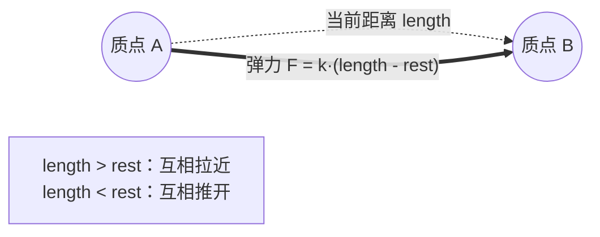
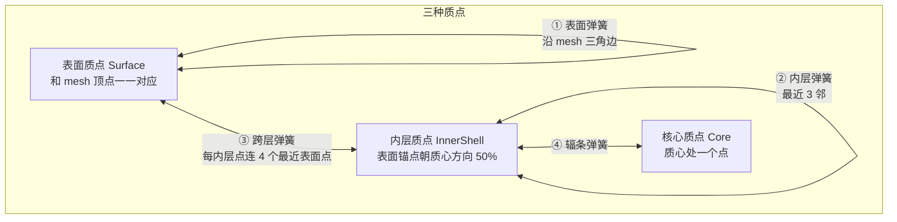

# 02 弹簧约束：局部弹性

> 承接 [[01 质点系统与时间积分]]。现在我们的质点已经能在重力下运动了，但它们还是一盘散沙——各掉各的，彼此毫无关系。这一篇给它们连上弹簧，让「一堆点」第一次变成「一个有弹性的整体」。
> 关注点：**胡克定律 + 阻尼** + **弹簧网络怎么搭（表面/内层/跨层/核心）** + **为什么光靠弹簧会「布袋化」**。
> 返回 [[软体模拟知识地图]]。

---

## 一、先从一根弹簧说起

复杂的东西都从最小单元理解起。先只看**两个质点之间的一根弹簧**——搞懂它，几百根弹簧的网络无非是它的重复。

这根弹簧有个「静止长度」`RestLength`（它觉得最舒服的长度）。被拉长了它想收缩、被压短了它想扩张——就是你中学学过的胡克定律。



### 代码

```csharp
// CpuSlimeSolver.cs — ApplySpringForces()
Vector3 delta = _positions[spring.B] - _positions[spring.A];
float length = delta.magnitude;
if (length <= Epsilon) continue;      // 重合时方向未定义，跳过

Vector3 direction = delta / length;   // A→B 单位向量
float displacement = length - spring.RestLength;   // 形变量（正=拉伸）

// 相对速度在弹簧方向上的投影，用于阻尼
float relativeSpeed = Vector3.Dot(_velocities[spring.B] - _velocities[spring.A], direction);

// 弹力 = 刚度·形变 + 阻尼·相对速度
Vector3 force = direction * (stiffness * displacement + damping * relativeSpeed);
_velocities[spring.A] += force * deltaTime;   // A 受力朝 B
_velocities[spring.B] -= force * deltaTime;   // B 受反作用力（牛顿第三定律）
```

| 项 | 作用 | 参数 |
| --- | --- | --- |
| `stiffness * displacement` | 胡克定律，恢复形变 | `springStiffness = 55` |
| `damping * relativeSpeed` | 阻尼，吸收振荡能量、防止永远弹 | `springDamping = 4` |

> [!note] 为什么需要阻尼
> 纯胡克弹簧是无损的——拉一下会永远振荡下去。`damping * relativeSpeed` 项和「两点相互靠近/远离的速度」成正比、方向相反，相当于给相对运动加阻力，让振荡衰减。没有它，史莱姆会像果冻一样抖个不停。

> [!warning] 弹簧力施加在速度上，不是位置上
> 注意这里改的是 `_velocities`，发生在 [[01 质点系统与时间积分]] 的 `Integrate` **之前**。弹簧走的是「力 → 速度 → 位置」的经典路线；而后面的形状匹配/体积/碰撞走的是 PBD「直接改位置」的路线。混合模型里两者分工。

---

## 二、弹簧网络：不是随便乱连

一根弹簧只是弹性，要让整坨史莱姆有结构，得**系统地连成网络**。本项目的质点分三种（[[03 形状匹配：整体记忆]] 还会用到这个分层）：



### 四类弹簧的代码

```csharp
// SlimeTopology.cs — BuildSprings()
// ① 表面弹簧：沿 mesh 每个三角形的三条边
for (int i = 0; i + 2 < triangles.Length; i += 3)
{
    AddSpring(links, keys, positions, triangles[i],     triangles[i + 1]);
    AddSpring(links, keys, positions, triangles[i + 1], triangles[i + 2]);
    AddSpring(links, keys, positions, triangles[i + 2], triangles[i]);
}

// ② 内层弹簧：内层质点之间连最近 3 个邻居
AddLocalSprings(links, keys, positions, interiorStart, interiorCount, 3);

// ③ 内层→对应表面锚点（径向拴住）
for (int i = 0; i < interiorCount; i++)
    AddSpring(links, keys, positions, interiorStart + i, interiorSurfaceAnchors[i]);

// ③b 跨层：每个内层点再连 4 个最近表面点
AddCrossLayerSprings(links, keys, positions,
    interiorStart, interiorCount, 0, surfaceCount, SurfaceLinksPerInteriorParticle);

// ④ 核心 hub：质心连所有内层点
int centerParticle = surfaceCount + interiorCount;
for (int i = 0; i < interiorCount; i++)
    AddSpring(links, keys, positions, centerParticle, interiorStart + i);
```

> [!tip] 用 HashSet 去重
> `AddSpring` 里用一个 `HashSet<ulong>` 记录已连接的点对（把两个 int 索引打包成一个 ulong 键），避免重复弹簧——同一条边可能被相邻两个三角形都请求一次。

### 为什么要「跨层 + 辐条 + 核心」这么复杂

> [!warning] 内层点溢出是拓扑问题，靠结构杜绝
> 内层点不是随机撒的，而是**表面锚点沿质心方向缩放 50% 得到**（`InteriorRadiusFraction = 0.5`）。加上③的径向弹簧把它拴在对应表面点内侧，**横向溢出从拓扑上被杜绝**——不需要每帧后处理去「把跑出去的点塞回来」。
>
> 这是踩了大坑后重构的结论：能用**拓扑/数据结构**从根源保证的性质，就不要用**每帧后处理**去补。后处理补丁会掩盖真正的问题（见 [[05 碰撞与接触]] 的「穿地」）。

```csharp
// SlimeTopology.cs — 内层点 = 表面锚点朝质心 lerp 50%
points[i] = Vector3.Lerp(center, uniqueSurfacePoints[anchors[i]], InteriorRadiusFraction);
//                                                                 ↑ 0.5f
```

---

## 三、光靠弹簧不行：布袋化

如果只有弹簧，会发生什么？


**原因**：弹簧只约束「相邻点的距离」，不约束「整体形状」。大量弹簧被轻微拉伸时，网络可以整体坍塌成任意形状而每根弹簧都「基本满意」——就像布料能任意褶皱，因为它只有距离约束。

要让史莱姆**记得自己原来是个球**，需要一个作用于整体的约束：

- **形状匹配（Shape Matching）**：记住每个点相对质心的原始偏移，把整体往那个形状拉。→ [[03 形状匹配：整体记忆]]
- **体积保持（Volume）**：压扁时横向撑开，维持体积感。→ [[04 体积保持：不塌不胀]]

> [!note] 类比布料 vs 果冻
> 布料模拟只用弹簧（距离约束）就够了，因为布料本来就该能任意褶皱。但史莱姆是**有体积、有形状记忆**的胶块——弹簧给它局部弹性，形状匹配给它骨架，体积约束给它膨胀感。缺一层就不像史莱姆。

---

## 四、本阶段完整代码

这一篇给 [[01 质点系统与时间积分]] 的求解器加了两样东西：**存弹簧数组**，和**一个施加弹簧力的方法**。它插在 `Step()` 的「外力之后、积分之前」——因为弹簧也是一种力，和重力一起改速度：

```csharp
// CpuSlimeSolver 新增：持有弹簧（拓扑在 03 之后由 SlimeTopology 构建，这里先接收）
private readonly SpringLink[] _springs;

// 构造函数里接管拓扑的弹簧数组
_springs = topology.Springs;

// Step() 里新增一行调用（外力之后、积分之前）
private void Step(float deltaTime, int substeps, SoftBodyStepParameters parameters)
{
    if (deltaTime <= Epsilon) return;

    BeginStep();
    ApplyExternalForces(deltaTime, parameters.Gravity);
    ApplySpringForces(deltaTime, parameters.SpringStiffness, parameters.SpringDamping);  // ← 新增
    Integrate(deltaTime);
    UpdateVelocities(deltaTime, substeps, parameters.Damping);
}

// 本阶段的核心：遍历每根弹簧，把胡克力+阻尼力施加到两端
private void ApplySpringForces(float deltaTime, float stiffness, float damping)
{
    for (int i = 0; i < _springs.Length; i++)
    {
        SpringLink spring = _springs[i];
        Vector3 delta = _positions[spring.B] - _positions[spring.A];
        float length = delta.magnitude;
        if (length <= Epsilon) continue;      // 重合时方向未定义，跳过

        Vector3 direction = delta / length;
        float displacement = length - spring.RestLength;   // 形变量（正=拉伸）
        float relativeSpeed = Vector3.Dot(_velocities[spring.B] - _velocities[spring.A], direction);

        // 弹力 = 刚度·形变 + 阻尼·相对速度
        Vector3 force = direction * (stiffness * displacement + damping * relativeSpeed);
        _velocities[spring.A] += force * deltaTime;   // A 受力朝 B
        _velocities[spring.B] -= force * deltaTime;   // B 受反作用力
    }
}
```

弹簧的静止长度 `RestLength` 和整张弹簧网络（表面/内层/跨层/核心）由 `SlimeTopology` 在初始化时构建——`SpringLink` 结构体和四类弹簧的搭建代码见本篇「二、弹簧网络」。求解器只管**用**这些弹簧，不管它们怎么连出来的（几何/物理分层，见 [[00.1 从零搭起：工程骨架]]）。

---

## 五、下一步

弹簧提供了局部弹性，但整体会布袋化。[[03 形状匹配：整体记忆]] 加上「形状记忆」——这是从「一袋弹簧」变成「一坨史莱姆」的关键一步。

## 速记

- 一根弹簧 = 胡克力（`k·形变`）+ 阻尼（`d·相对速度`），施加在速度上，牛顿三定律成对施加。
- 阻尼吸收振荡能量，没有它会抖个不停。
- 弹簧网络四类：表面（沿三角边）、内层（最近邻）、跨层（内层拴表面）、核心 hub。
- 内层点 = 表面锚点缩放 50%，径向弹簧拴住 → 拓扑上杜绝横向溢出。
- 光靠弹簧会布袋化（塌了回不来），需要形状匹配 + 体积约束补救。

#Renderer #软体模拟
