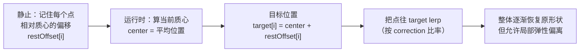
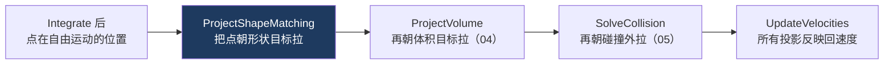
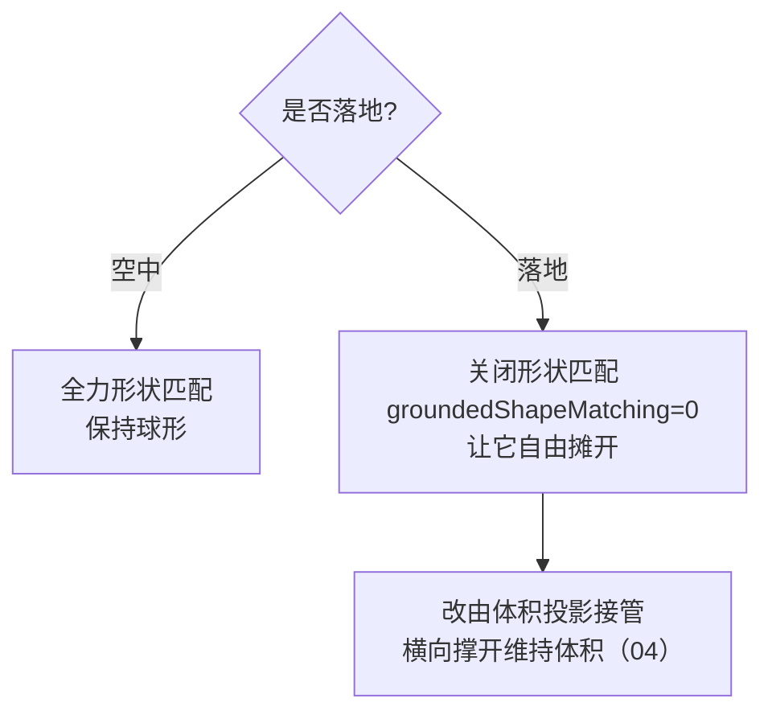
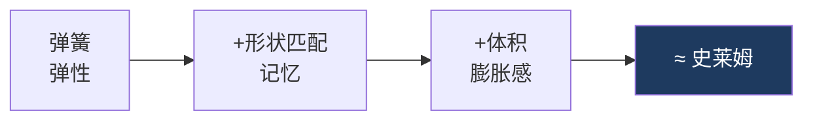

# 03 形状匹配：整体记忆

> 承接 [[02 弹簧约束：局部弹性]]。弹簧给了局部弹性但会布袋化。形状匹配（Shape Matching）给史莱姆「记住原形状」的能力。
> 关注点：**形状匹配的核心思想** + **本项目的简化实现（刚性偏移）** + **为什么落地时要关掉它**。
> 返回 [[软体模拟知识地图]]。

---

## 一、核心思想：把点往「它本该在的位置」拉

形状匹配是 Müller 2005 提出的经典方法。直觉极简单：

> 记住每个质点在静止状态下**相对质心的偏移** `restOffset`。每帧算出当前质心，把每个点往「质心 + 它的原始偏移」这个目标位置拉一点。



这就是「形状记忆」：不管怎么被揉，只要松手，每个点都被往「相对质心的原始位置」拉，整体回到球形。而弹簧允许它在恢复过程中有弹性的局部偏离——两者叠加出「Q 弹」的手感。

---

## 二、完整版 vs 本项目的简化版

> [!note] 完整形状匹配要解一个旋转
> 严格的 Shape Matching 要为「当前点云」和「静止点云」求一个最优刚性变换（旋转 R + 平移 t），通常用极分解（polar decomposition）从协方差矩阵提取旋转。这样物体**旋转**时形状记忆也跟着转。

本项目做了简化：**只用平移（质心），不提取旋转**。目标位置直接是 `center + restOffset`，`restOffset` 是世界空间里固定的静止偏移：

```csharp
// CpuSlimeSolver.cs — ProjectShapeMatching()
private void ProjectShapeMatching(float deltaTime, float strength, float groundedStrength, bool isGrounded)
{
    Vector3 center = CalculateCenter(_positions);          // 当前质心
    float rate = isGrounded ? strength * groundedStrength : strength;
    float correction = ToProjectionFraction(rate, deltaTime);  // 帧率无关比率（见 01）

    for (int i = 0; i < _positions.Length; i++)
    {
        Vector3 target = center + _restOffsets[i];          // 目标 = 质心 + 原始偏移
        _positions[i] = Vector3.Lerp(_positions[i], target, correction);  // 拉一点
    }
}
```

> [!tip] 为什么简化版够用
> 史莱姆是个**大致各向同性的球**，且靠地面移动、不做整体自旋。不提取旋转，省掉了每帧的极分解（协方差矩阵 + SVD），性能好、代码短。代价是：如果让它整体翻滚，形状记忆不会跟着转——但史莱姆不需要这个。
>
> 参考项目 Unity_Slime 是 PBF 流体，**根本没有形状匹配**（流体不记形状），靠密度约束维持团聚。方法不同，见 [[07 PBD 与 PBF]]。

`restOffset` 在拓扑构建时就算好：

```csharp
// SlimeTopology.cs — BuildOffsets()
offsets[i] = positions[i] - center;   // 每个点相对静止质心的偏移
```

---

## 三、这是一次「位置投影」

注意 `ProjectShapeMatching` 直接改 `_positions`，发生在 [[01 质点系统与时间积分]] 的 `Integrate` **之后**。这就是 PBD 的「位置投影」风格：



> [!warning] 投影用 lerp 比率，不是一步到位
> $correction = 1 - e^{-strength \cdot \Delta t}$ 只拉一部分（比如一帧拉 20%），不是直接 `= target`。这样：
> - 多个约束（形状、体积、碰撞）可以**共存**，各拉一点，最终收敛到都基本满足的位置。
> - 恢复有「过程感」，不会瞬间弹回，符合果冻的黏弹性。
>
> `strength` 越大恢复越快、越硬；越小越软趴、恢复越慢。`shapeMatchingStrength = 8`。

---

## 四、关键设计：落地时关掉形状匹配

> [!warning] 落地摊平和形状记忆是矛盾的
> 史莱姆落地应该**压扁摊开**（像果冻掉地上），而形状匹配想把它**拉回球形**。两者直接打架——如果落地还全力恢复球形，史莱姆会在地上顽固地鼓成球，不摊开。

修法：落地时把形状匹配强度乘一个系数 `groundedShapeMatching`，默认是 **0**（完全关闭）：

```csharp
// grounded 时用 strength * groundedStrength；groundedShapeMatching 默认 0
float rate = isGrounded ? strength * groundedStrength : strength;
```

```csharp
// SoftBodySolver.cs — 参数定义
[Range(0f, 1f)] public float groundedShapeMatching = 0f;  // 落地时形状恢复的倍率，0=完全关闭
```



落地后的「体积感」不再靠形状匹配，而是交给**接地体积投影**（`ProjectGroundedVolume`）——它让史莱姆横向摊开而不是竖直鼓起。这是 [[04 体积保持：不塌不胀]] 的内容。

> [!note] 状态驱动的行为切换
> 「空中恢复球形、落地摊开」是一个**根据 `isGrounded` 切换约束行为**的典型例子。同一套求解器，靠状态位改变约束的强弱组合，做出不同情境下的合理表现。这个模式在碰撞（[[05 碰撞与接触]]）、体积（[[04 体积保持：不塌不胀]]）里反复出现。

---

## 五、三层叠加：现在它像史莱姆了

到这里，前三层约束凑齐了：

| 层 | 提供 | 笔记 |
| --- | --- | --- |
| 弹簧 | 局部弹性、Q 弹手感 | [[02 弹簧约束：局部弹性]] |
| 形状匹配 | 整体形状记忆，不布袋化 | 本篇 |
| 体积投影 | 压扁不缩水、摊开有膨胀感 | [[04 体积保持：不塌不胀]] |



---

## 六、下一步

形状匹配让它记得原形，但有个副作用：形状恢复时体积可能缩水，落地摊平又需要主动膨胀。[[04 体积保持：不塌不胀]] 用签名四面体体积精确度量、投影维持——并揭示一个隐蔽的「净平移」陷阱。

## 速记

- 形状匹配 = 记住每点相对质心的原始偏移，每帧把点往「质心+偏移」拉。
- 完整版要提取旋转（极分解）；本项目简化为只用平移，够用且省算力。
- 它是位置投影，用 $1-e^{-strength \cdot \Delta t}$ 比率 lerp，和其他约束共存。
- **落地时关掉形状匹配**（`groundedShapeMatching=0`），否则和「摊平」打架；体积投影接管膨胀感。
- 弹簧+形状匹配+体积，三层叠加才像史莱姆。

#Renderer #软体模拟
