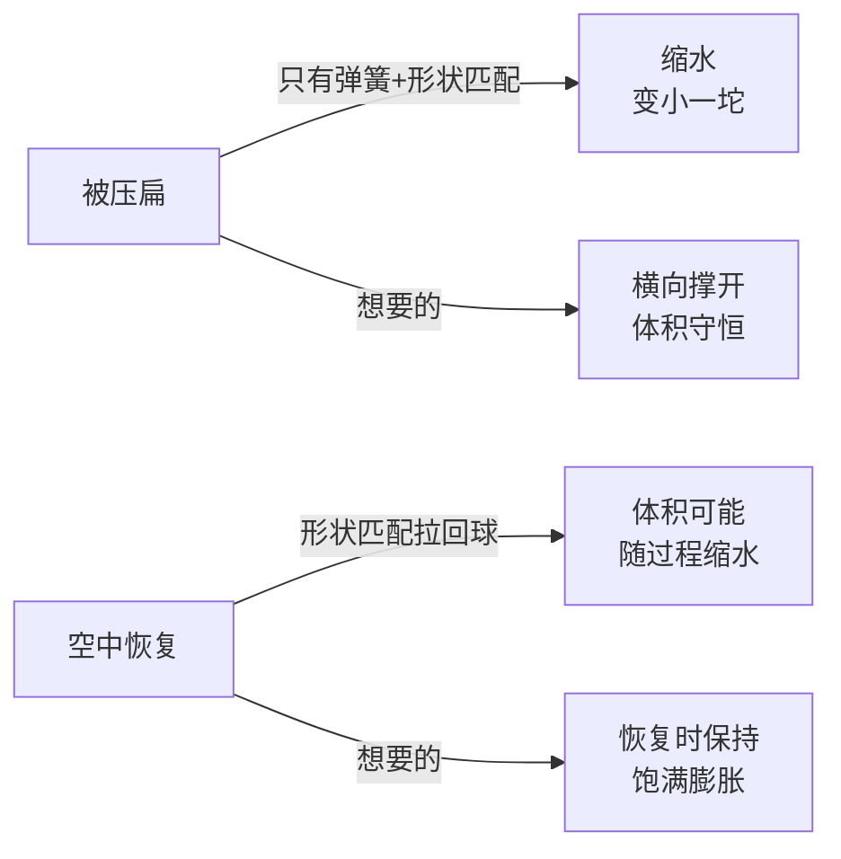
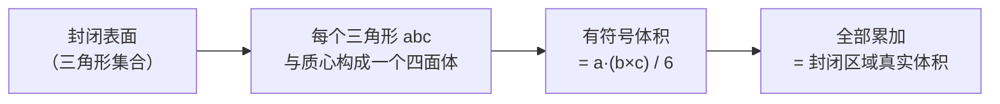
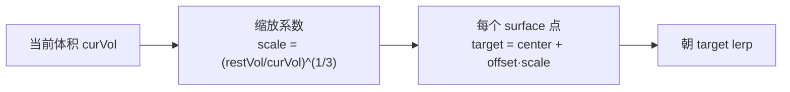
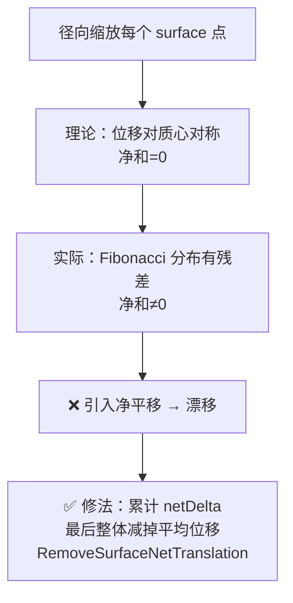
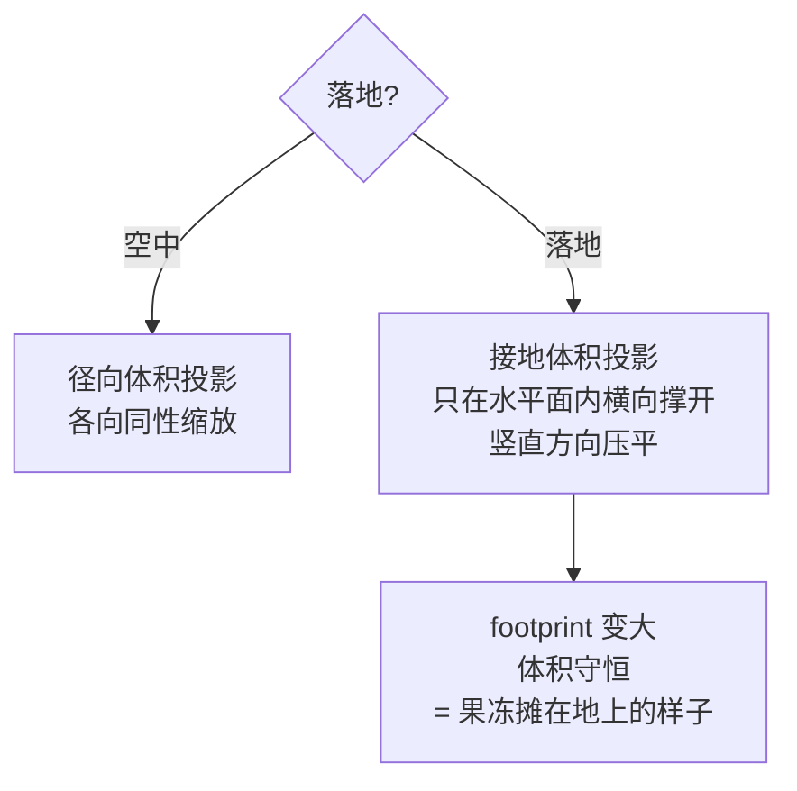

# 04 体积保持：不塌不胀

> 承接 [[03 形状匹配：整体记忆]]。到这里史莱姆已经有弹性、也记得原形了。但你按 Play 压它一下会发现：它压扁的同时**缩水**了，像漏了气。真实果冻压扁时会往旁边鼓——体积守恒。这一篇给它加上第三层约束，补上这份「膨胀感」。
> 关注点：**怎么度量体积（签名四面体）** + **径向投影 vs 接地投影** + **净平移陷阱**。
> 返回 [[软体模拟知识地图]]。

---

## 一、为什么需要单独的体积约束

弹簧和形状匹配都不直接管体积。会出现两种糟糕情况：



真实果冻是**近似不可压缩**的——压扁时会向侧面鼓出去，总体积基本不变。要模拟这个「膨胀感」，得先能**度量当前体积**，再把它投影回静止体积。

---

## 二、怎么度量体积：签名四面体和

### 旧方案的坑

> [!warning] 用「平均半径 → 球体积」不稳定
> 最初用「surface 质点到质心的平均距离 → 当球算体积」。落地压扁时 surface 分布极不均匀（底部一片、顶部稀疏），平均距离每帧剧烈波动 → 体积估计忽大忽小 → 收缩/扩张振荡，史莱姆抖个不停。

### 新方案：签名四面体和（Signed Tetrahedral Sum）

任意封闭三角网格的体积，等于**每个表面三角形与原点（这里用质心）构成的四面体有符号体积之和**。朝外的面贡献正体积、朝内的贡献负体积，加起来正好是封闭区域的真实体积——这是散度定理的离散形式。



```csharp
// SlimeTopology.cs — CalculateClosedSurfaceVolume()
float signedVolume = 0f;
for (int i = 0; i + 2 < triangleIndices.Length; i += 3)
{
    Vector3 a = positions[triangleIndices[i]]     - center;
    Vector3 b = positions[triangleIndices[i + 1]] - center;
    Vector3 c = positions[triangleIndices[i + 2]] - center;
    signedVolume += Vector3.Dot(a, Vector3.Cross(b, c)) / 6f;  // 标准四面体体积公式
}
return Mathf.Abs(signedVolume);
```

> [!warning] Rest 体积和运行时体积必须用同一个公式
> 静止体积 `_restVolume`（初始化时算一次）和运行时 `CalculateSurfaceVolume`（每帧算）**必须逐字使用同一公式**。否则 `restVol / curVol` 比值有恒定偏差，静止状态就不落在 scale=1.0，史莱姆一开始就偏胖或偏瘦。CPU / GPU 两个后端也要严格对齐（见 [[08 GPU 并行求解]]）。

---

## 三、径向体积投影（空中）

空中时，把 surface 质点沿「质心→自己」的径向方向缩放，让体积回到静止值。



体积是三维量，线性尺寸的三次方，所以缩放系数开**立方根** `^(1/3)`：

```csharp
// CpuSlimeSolver.cs — ProjectRadialVolume()
Vector3 center = CalculateSurfaceCenter();
float currentVolume = CalculateSurfaceVolume(center);
float volumeScale = Mathf.Clamp(
    Mathf.Pow(_restVolume / Mathf.Max(currentVolume, Epsilon), 1f / 3f),  // 立方根
    1f / maximumScale, maximumScale);   // 夹住，防止极端缩放炸开
float correction = ToProjectionFraction(strength, deltaTime);

Vector3 netDelta = Vector3.zero;
for (int i = 0; i < _surfaceParticleIndices.Length; i++)
{
    int particle = _surfaceParticleIndices[i];
    Vector3 offset = _positions[particle] - center;
    Vector3 target = center + offset * volumeScale;     // 沿径向缩放
    Vector3 newPosition = Vector3.Lerp(_positions[particle], target, correction);
    netDelta += newPosition - _positions[particle];     // 累计净位移（关键，见下）
    _positions[particle] = newPosition;
}
RemoveSurfaceNetTranslation(netDelta);   // 消除净平移
```

> [!note] 只推 surface 质点，内层由弹簧带动
> 体积投影**只作用于 surface 质点**，内层点靠弹簧被动跟随，保持 [[02 弹簧约束：局部弹性]] 建立的径向层次。这也引出下面这条核心原则。

---

## 四、净平移陷阱（本项目最隐蔽的 bug 之一）

> [!warning] 现象：史莱姆落地后无故水平漂移
> 体积投影一开，史莱姆就朝某个方向匀速漂走，关掉就不漂。

### 根因

径向投影以质心为参考缩放每个点的偏移。理论上所有偏移的缩放对质心对称、净位移应为零。但实际中 surface 点的分布（Fibonacci 球面方向）**有微小残差**，层间相干累加后，所有点位移的**矢量和不为零** → 相当于给整体施加了一个净平移 → 漂移。



### 修法：显式扣除净平移（质心守恒）

```csharp
// 把累计的净位移平摊回每个 surface 点，抵消掉整体平移，只保留「形状变化」
private void RemoveSurfaceNetTranslation(Vector3 netDelta)
{
    Vector3 correction = netDelta / _surfaceParticleIndices.Length;
    for (int i = 0; i < _surfaceParticleIndices.Length; i++)
        _positions[_surfaceParticleIndices[i]] -= correction;
}
```

> [!note] 通用原则：约束的作用集合 = 度量集合
> 体积是由 surface 质点度量的，投影就**只能作用于 surface 质点**。如果度量用 surface、却把结果作用到全体质点，度量集合 ≠ 作用集合，每帧 scale 忽大忽小 → 落地振荡。这条原则在软体调试里反复出现——**任何「求和/求平均」得到的全局量，作用回去时要保证作用对象和度量对象一致，并注意质心守恒。**

---

## 五、接地体积投影（落地）

落地后不该竖直鼓成球（那是形状匹配干的，已在 [[03 形状匹配：整体记忆]] 关掉），而应该**横向摊开**维持体积——形成平坦的接触带。



接地投影把缩放限制在**地面切平面内**（用地面法线分解），横向缩放用平方根（二维面积 → 线性开方）：

```csharp
// CpuSlimeSolver.cs — ProjectGroundedVolume()（节选）
Vector3 normal = CalculateGroundNormal();          // 接触法线（通常朝上）
float lateralScale = Mathf.Clamp(
    Mathf.Sqrt(_restVolume / Mathf.Max(currentVolume, Epsilon)),  // 横向：面积→开方
    ...);
// 把 offset 分解成「沿法线」和「切平面内」，只放大切平面分量
```

这样落地的史莱姆是一摊扁的、接触地面有平坦带的果冻，而不是顽固鼓着的球。

---

## 六、本阶段完整代码

这一篇新增第二个位置投影 `ProjectRadialVolume`，插在形状匹配之后。它只在**空中**跑（落地改用接地投影，见「五」）：

```csharp
// Step() 里新增：形状匹配之后、空中时做径向体积投影
private void Step(float deltaTime, int substeps, SoftBodyStepParameters parameters)
{
    // ... BeginStep / 外力 / 弹簧 / Integrate / ProjectShapeMatching ...
    if (!wasGrounded)   // 空中才做径向投影；落地由 ProjectGroundedVolume 接管
        ProjectRadialVolume(deltaTime, parameters.VolumeStrength, parameters.MaximumVolumeScale);
    // ... UpdateVelocities ...
}

// 本阶段核心：沿径向缩放 surface 质点，把体积拉回静止值
private void ProjectRadialVolume(float deltaTime, float strength, float maximumScale)
{
    Vector3 center = CalculateSurfaceCenter();
    float currentVolume = CalculateSurfaceVolume(center);
    float volumeScale = Mathf.Clamp(
        Mathf.Pow(_restVolume / Mathf.Max(currentVolume, Epsilon), 1f / 3f),  // 立方根
        1f / maximumScale, maximumScale);
    float correction = ToProjectionFraction(strength, deltaTime);

    // 只推 surface 质点，内部由弹簧带动
    Vector3 netDelta = Vector3.zero;
    for (int i = 0; i < _surfaceParticleIndices.Length; i++)
    {
        int particle = _surfaceParticleIndices[i];
        Vector3 offset = _positions[particle] - center;
        Vector3 target = center + offset * volumeScale;          // 沿径向缩放
        Vector3 newPosition = Vector3.Lerp(_positions[particle], target, correction);
        netDelta += newPosition - _positions[particle];          // 累计净位移
        _positions[particle] = newPosition;
    }
    RemoveSurfaceNetTranslation(netDelta);   // 消除净平移（质心守恒）
}

// 把累计净位移平摊扣除，抵消整体漂移，只保留形状变化
private void RemoveSurfaceNetTranslation(Vector3 netDelta)
{
    Vector3 meanDelta = netDelta / _surfaceParticleIndices.Length;
    for (int i = 0; i < _surfaceParticleIndices.Length; i++)
        _positions[_surfaceParticleIndices[i]] -= meanDelta;
}

// 签名四面体和度量体积（散度定理离散形式）—— rest 体积初始化时用同一公式
private float CalculateSurfaceVolume(Vector3 center)
{
    float signedVolume = 0f;
    for (int i = 0; i + 2 < _surfaceTriangleIndices.Length; i += 3)
    {
        Vector3 a = _positions[_surfaceTriangleIndices[i]]     - center;
        Vector3 b = _positions[_surfaceTriangleIndices[i + 1]] - center;
        Vector3 c = _positions[_surfaceTriangleIndices[i + 2]] - center;
        signedVolume += Vector3.Dot(a, Vector3.Cross(b, c)) / 6f;
    }
    return Mathf.Abs(signedVolume);
}
```

接地投影 `ProjectGroundedVolume`（落地横向摊开）结构类似，只是把缩放限制在地面切平面内、系数改开平方根——完整逻辑见本篇「五、接地体积投影」。

---

## 七、下一步

三层形变约束（弹簧/形状/体积）齐了。但史莱姆还会穿过地面——它还不知道「地面」的存在。[[05 碰撞与接触]] 处理落地停住，并揭示一个经典教训：**只钳位置不够，必须同时处理速度**。

## 速记

- 体积约束让史莱姆压扁不缩水、落地横向摊开。
- 度量体积用**签名四面体和**（散度定理离散形式），别用平均半径（不稳定）。rest 和 runtime 必须同公式。
- 径向投影缩放系数开**立方根**（体积→线性）；接地横向投影开**平方根**（面积→线性）。
- 净平移陷阱：径向缩放的位移净和不为零会漂移，累计 `netDelta` 后整体扣除（质心守恒）。
- 核心原则：约束的**作用集合 = 度量集合**（都用 surface）。

#Renderer #软体模拟
