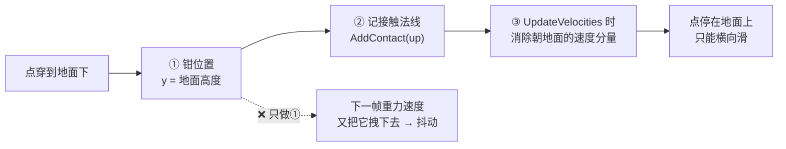
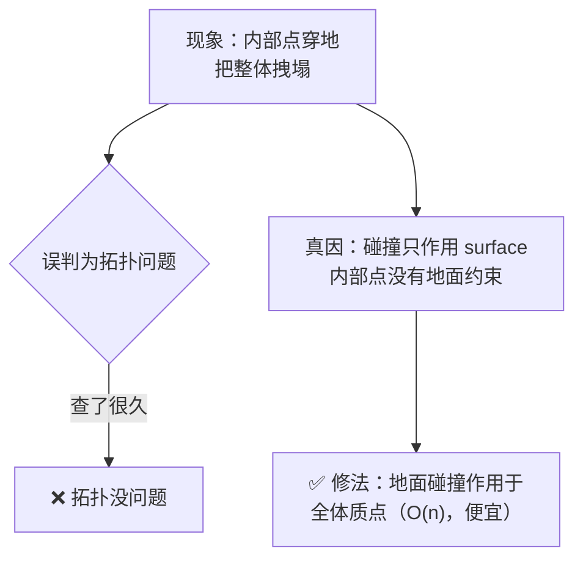
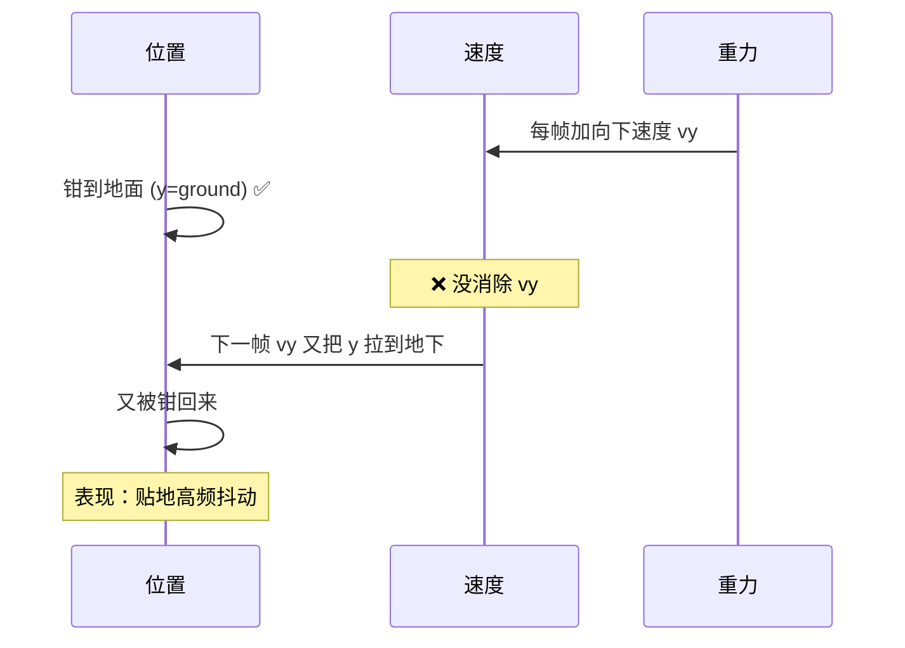
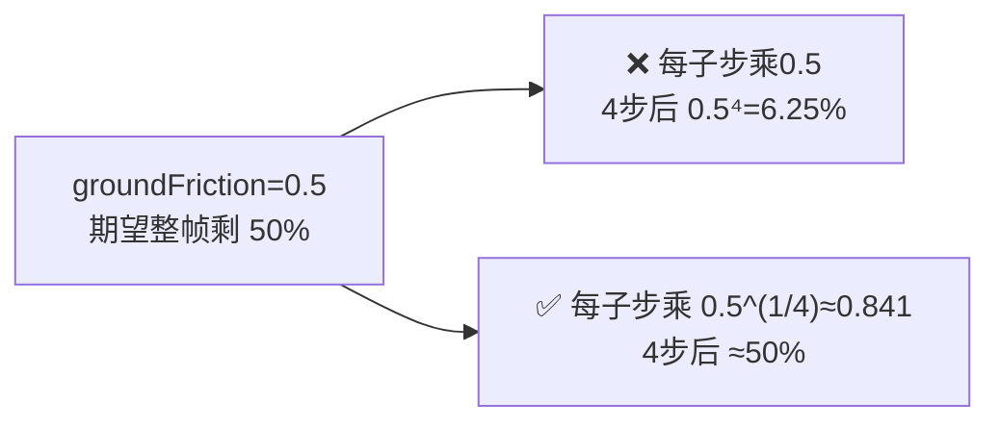

# 05 碰撞与接触

> 承接 [[04 体积保持：不塌不胀]]。现在的史莱姆有弹性、记得形、也不缩水了——但你按 Play 会看到它一路穿过地面掉进虚空。它还不知道「地面」的存在。这一篇让它落地停住，并揭开一个新手几乎都会踩的坑：**为什么只把点拉回地面还不够**。
> 关注点：**位置钳制 + 速度响应必须成对** + **接触法线的作用** + **摩擦的子步复利** + **回弹**。
> 返回 [[软体模拟知识地图]]。

---

## 一、碰撞的两个动作：钳位置 + 改速度

新手最容易犯的错：以为「把穿地的点拉回地面」就完事了。实际上碰撞是**两个动作**，缺一不可：



### 位置钳制（简单的一半）

```csharp
// CpuSlimeSolver.cs — SolveGroundCollision()
private void SolveGroundCollision(float groundHeight)
{
    float surfaceHeight = groundHeight + _particleRadius;
    for (int i = 0; i < _positions.Length; i++)
    {
        // surface 点留一个球半径的间隙，内层点直接钳到地面
        float minimumHeight = _isSurfaceParticle[i] ? surfaceHeight : groundHeight;
        if (_positions[i].y >= minimumHeight) continue;

        Vector3 position = _positions[i];
        position.y = minimumHeight;   // ① 钳位置
        _positions[i] = position;
        AddContact(i, Vector3.up);     // ② 记接触法线（关键！）
    }
}
```

---

## 二、经典教训：穿地是碰撞问题，不是拓扑问题

> [!warning] 绕了最久的一个 bug
> **现象**：内部质点被重力拽穿地面，把整个史莱姆往下拽塌成锥形。
>
> 我一开始当**拓扑问题**查（以为内层点结构不对），改了半天没用。真正的根因是**碰撞问题**：地面碰撞当时只作用于 surface 质点，内部质点**根本没参与地面碰撞** → 内部点自由穿地。



修法就是上面代码里的 `for (int i = 0; i < _positions.Length; i++)`——**遍历全体质点**，不只是 surface。地面碰撞是 O(n) 的，很便宜（真正贵的是 O(n²) 的自碰撞，那个才只在 surface 间做，见 [[06 自碰撞与空间哈希]]）。

> [!note] 教训
> **现象相似的 bug 可能根因完全不同，别被「看起来像上次那个」带偏。** 「溢出」这一个现象在本项目里其实是三个独立问题：横向溢出（拓扑）、垂直穿地（碰撞）、softness 高时溢出（速度响应）。对症才能解决。

---

## 三、速度响应：为什么钳位置不够

假设只钳位置、不改速度：



`AddContact` 记录的接触法线，在 `UpdateVelocities` 里被用来**消除朝接触面内的速度分量**——这才让点真正「停」在地面上：

```csharp
// CpuSlimeSolver.cs — UpdateVelocities()（节选）
Vector3 velocity = (_positions[i] - _previousPositions[i]) / deltaTime * velocityScale;
Vector3 contactNormal = _contactNormals[i];
if (contactNormal.sqrMagnitude > Epsilon)
{
    contactNormal.Normalize();
    // 分解速度为法线分量 + 切向分量
    float normalVelocity = Vector3.Dot(velocity, contactNormal);
    Vector3 normalComponent = contactNormal * normalVelocity;
    Vector3 tangentComponent = velocity - normalComponent;
    // 切向施加摩擦，法线分量按回弹处理（见下）
    // ...
}
```

> [!note] 位置约束和速度必须一致
> **PBD 式的位置钳制和速度必须保持一致**。只改位置不改速度，下一帧速度会把位置「拽回去」，表现为抖动。这是 PBD 碰撞的通用规则——位置投影解决「现在在哪」，速度响应解决「接下来往哪走」。

---

## 四、摩擦：子步复利陷阱

> [!warning] 摩擦被子步执行 N 次
> **现象**：落地后底部被钉死、顶部继续前移，整坨被剪切成拖尾（「破麻袋」）。
>
> **根因**：摩擦 `1 - groundFriction` 在**每个子步**的速度响应里施加一次。设 4 子步，底部横向速度实际剩 `(1-friction)⁴`——被过度钉死；顶部不接触地面不受摩擦，继续前移 → 剪切拉伸。

修法：把每子步的摩擦系数**开子步数次方**，累乘后回到期望值：

```csharp
// CpuSlimeSolver.cs — UpdateVelocities()
// 每子步保留 (1-groundFriction)^(1/substeps)，substeps 个子步累乘正好 = (1-groundFriction)
float frictionScale = Mathf.Pow(Mathf.Max(0f, 1f - groundFriction), 1f / substeps);
```



> [!note] 通用原则（呼应 [[01 质点系统与时间积分]]）
> **任何每子步施加的乘性衰减（摩擦、阻尼）都会随子步数复利。要么开子步数次方，要么每帧只施加一次。改子步数不该改变物理手感。**

---

## 五、回弹（Bounciness）

想让史莱姆落地有点弹性回跳，用「入射速度」驱动回弹。这就是 [[01 质点系统与时间积分]] 里 `BeginStep` 存 `_incomingVelocities` 的用途：

```csharp
// UpdateVelocities()（节选）
float incomingNormalVelocity = Vector3.Dot(_incomingVelocities[i], contactNormal);
// 入射速度足够快（超过阈值）才回弹，避免静止时无限微弹
float reboundVelocity = incomingNormalVelocity < -bounceVelocityThreshold
    ? -incomingNormalVelocity * bounciness   // 反向 × 弹性系数
    : 0f;
float normalVelocity = Vector3.Dot(velocity, contactNormal);
if (normalVelocity < reboundVelocity)
    velocity += contactNormal * (reboundVelocity - normalVelocity);
```

> [!tip] 阈值防抖
> `bounceVelocityThreshold` 让「慢速接触」不回弹，只有「砸下来」才弹。否则史莱姆静止在地上也会因为微小的数值残余无限弹跳。

---

## 六、任意 Collider 碰撞

除了平地，还支持 Unity 场景里的任意 Collider（见 `UnityColliderCollisionWorld.cs`）：

```csharp
// SolveUnityColliders()（节选）
_collisionWorld.Prepare(CalculateParticleBounds(), collisionMask);
for (int particle = 0; particle < _positions.Length; particle++)
{
    float radius = _isSurfaceParticle[particle]
        ? _particleRadius
        : _particleRadius * interiorRadiusScale;
    if (!_collisionWorld.ResolveSphere(ref position, radius, out Vector3 contactNormal))
        continue;
    _positions[particle] = position;   // 钳位置
    AddContact(particle, contactNormal);  // 记法线（同样的两动作套路）
}
```

同样是「钳位置 + 记接触法线」——碰撞的处理范式统一，只是接触法线不再固定朝上，而是 Collider 给出的表面法线。

---

## 七、本阶段完整代码

这一篇的新增分两半：`Step()` 里插入**地面碰撞**（钳位置 + 记接触法线），`UpdateVelocities` 从 [[01 质点系统与时间积分]] 的简版扩成**带接触响应**的完整版（法线速度置零/回弹 + 切向摩擦）：

```csharp
// Step() 里新增：积分与各投影之后、反推速度之前，解算地面碰撞
private void Step(float deltaTime, int substeps, SoftBodyStepParameters parameters)
{
    // ... 外力 / 弹簧 / 积分 / 形状匹配 / 体积投影 ...
    if (parameters.UseGroundPlane)
        SolveGroundCollision(parameters.GroundHeight);   // ← 新增
    UpdateVelocities(deltaTime, substeps, parameters.Damping,
                     parameters.GroundFriction, parameters.Bounciness,
                     parameters.BounceVelocityThreshold);  // ← 扩展
}

// 全体质点都和地面碰：surface 留一个球半径间隙，内部点直接钳到地面
private void SolveGroundCollision(float groundHeight)
{
    float surfaceHeight = groundHeight + _particleRadius;
    for (int i = 0; i < _positions.Length; i++)
    {
        float minimumHeight = _isSurfaceParticle[i] ? surfaceHeight : groundHeight;
        if (_positions[i].y >= minimumHeight) continue;

        Vector3 position = _positions[i];
        position.y = minimumHeight;    // ① 钳位置
        _positions[i] = position;
        AddContact(i, Vector3.up);      // ② 记接触法线（关键）
    }
}

private void AddContact(int particle, Vector3 normal)
{
    _contactNormals[particle] += normal;
    if (normal.y > 0.5f) _isGrounded = true;   // 朝上的接触 → 判定为落地
}

// UpdateVelocities 完整版：反推速度 + 接触点的法线响应/回弹 + 切向摩擦
private void UpdateVelocities(float deltaTime, int substeps, float damping,
                              float groundFriction, float bounciness, float bounceVelocityThreshold)
{
    float velocityScale = Mathf.Max(0f, 1f - damping);
    // 摩擦按子步开方，累乘后回到期望值，使手感与子步数无关
    float frictionScale = Mathf.Pow(Mathf.Max(0f, 1f - groundFriction), 1f / substeps);

    for (int i = 0; i < _positions.Length; i++)
    {
        Vector3 velocity = (_positions[i] - _previousPositions[i]) / deltaTime * velocityScale;
        Vector3 contactNormal = _contactNormals[i];
        if (contactNormal.sqrMagnitude > Epsilon)
        {
            contactNormal.Normalize();
            // 回弹：入射速度够快才弹（阈值防静止微弹）
            float incomingNormalVelocity = Vector3.Dot(_incomingVelocities[i], contactNormal);
            float reboundVelocity = incomingNormalVelocity < -bounceVelocityThreshold
                ? -incomingNormalVelocity * bounciness : 0f;
            float normalVelocity = Vector3.Dot(velocity, contactNormal);
            if (normalVelocity < reboundVelocity)
                velocity += contactNormal * (reboundVelocity - normalVelocity);

            // 分解速度：法线分量保留，切向分量施加摩擦
            float resolvedNormalVelocity = Vector3.Dot(velocity, contactNormal);
            Vector3 normalComponent = contactNormal * resolvedNormalVelocity;
            velocity = normalComponent + (velocity - normalComponent) * frictionScale;
        }
        _velocities[i] = velocity;
    }
}
```

任意 Collider 碰撞（`SolveUnityColliders`）套路完全一样——「钳位置 + `AddContact`」，只是法线来自 Collider 而非固定朝上，见本篇「六」。

---

## 八、下一步

地面碰撞是 O(n) 的。但史莱姆压扁时表面自己会**互相穿插**，处理这个需要「每个点和附近的点比较」，朴素做法是 O(n²)。[[06 自碰撞与空间哈希]] 用均匀网格把它降到接近 O(n)。

## 速记

- 碰撞 = ①钳位置 + ②记接触法线 + ③速度响应，三者缺一就抖动/穿透。
- 穿地是**碰撞问题**（内部点没参与地面碰撞），不是拓扑问题；地面碰撞作用于全体质点（O(n) 便宜）。
- 只钳位置不改速度 → 下一帧速度把位置拽回 → 抖动。位置和速度必须一致。
- 摩擦按子步开方 `pow(1-f, 1/substeps)`，避免复利导致的剪切拖尾。
- 回弹用入射速度 × 弹性系数，加阈值防静止微弹。
- 任意 Collider 碰撞同样是「钳位置+记法线」，只是法线来自 Collider。

#Renderer #软体模拟
