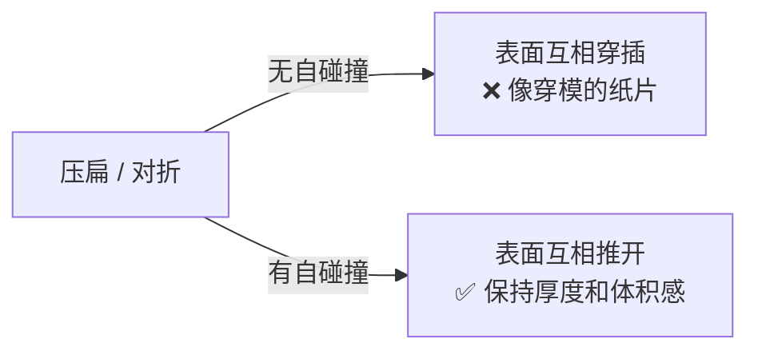
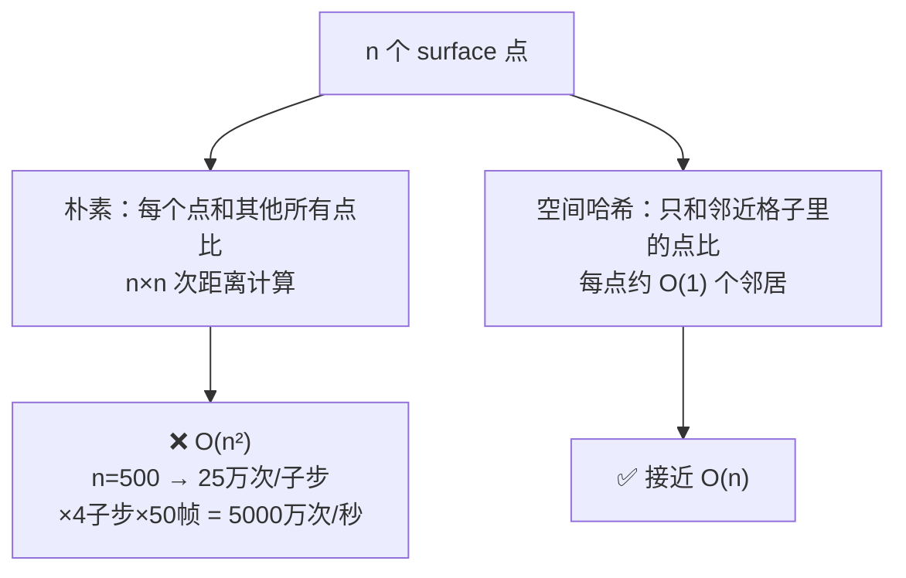
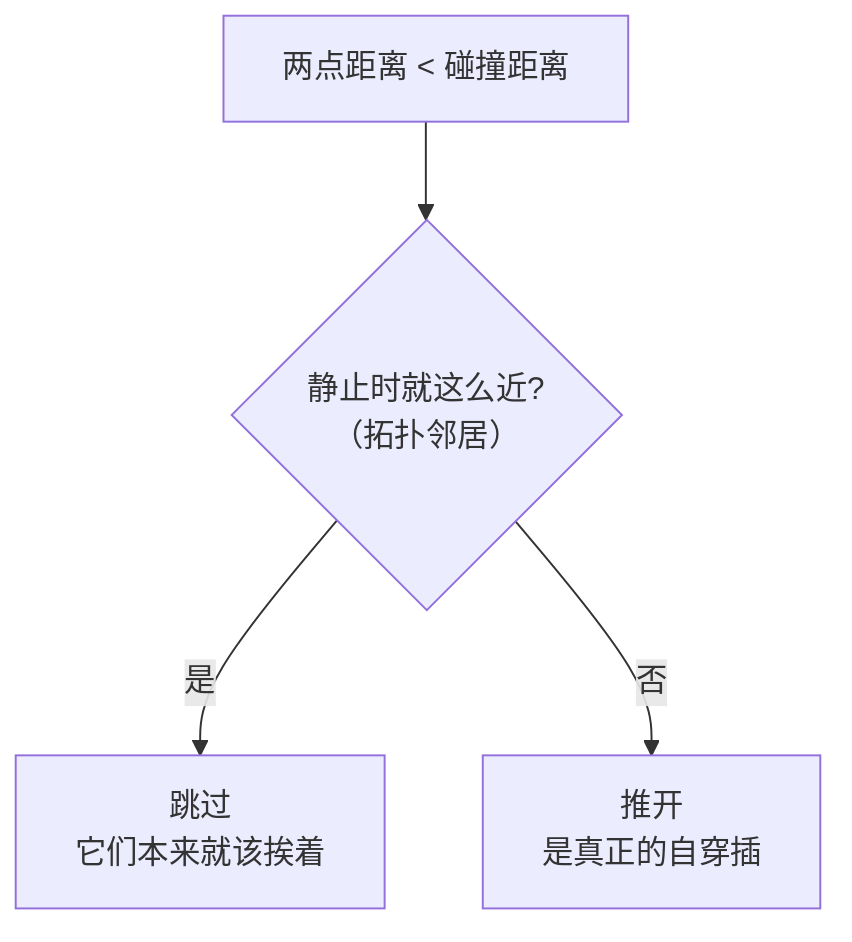

# 06 自碰撞与空间哈希

> 承接 [[05 碰撞与接触]]。史莱姆压扁时表面会自己穿插——处理这个要「每个点找附近的点」，朴素做法 O(n²)。这一篇用空间哈希降到接近 O(n)。
> 关注点：**为什么需要自碰撞** + **均匀网格哈希** + **3×3×3 邻域搜索** + **排除近邻**。
> 返回 [[软体模拟知识地图]]。

---

## 一、为什么需要自碰撞

史莱姆被压扁、对折时，表面的不同部分会挤到一起。没有自碰撞，表面会**互相穿透**，看起来像纸片叠在一起而不是有厚度的胶块。



自碰撞的规则很简单：**任意两个 surface 质点，如果距离小于 `2·半径`，就把它们推开到刚好接触**。

```csharp
// CpuSlimeSolver.cs — SolveSelfCollisionPair()
Vector3 delta = _positions[b] - _positions[a];
float sqrDistance = delta.sqrMagnitude;
if (sqrDistance >= minimumDistanceSquared) return;   // 够远，不管

float distance = Mathf.Sqrt(sqrDistance);
Vector3 direction = distance > Epsilon ? delta / distance : Vector3.right;
Vector3 correction = direction * ((minimumDistance - distance) * 0.5f);  // 各推一半
_positions[a] -= correction;
_positions[b] += correction;
```

---

## 二、朴素做法的问题：O(n²)

「任意两个点比较」= 双重循环 = O(n²)。几百个 surface 点，每帧几万次比较，还乘以子步数——性能崩盘。



**关键观察**：两个点要发生碰撞，必然**空间上很近**。所以没必要和远处的点比——只需要和「附近」的点比。怎么快速找到「附近的点」？空间哈希。

---

## 三、均匀网格空间哈希

### 思想

把空间切成边长 = `碰撞距离` 的立方格子。每个点落进一个格子。**只可能和自己格子 + 相邻 26 个格子（3×3×3）里的点碰撞**——因为再远就超过一个格子边长，不可能小于碰撞距离。


### 用「链表桶」存格子内容

不用「字典 → List」（每格一个 List 有 GC 压力），而用一个经典技巧：**头指针 + next 数组**构成隐式链表：

```csharp
// CpuSlimeSolver.cs — SolveSelfCollision()
private readonly Dictionary<Vector3Int, int> _selfCollisionCells;  // 格子 → 该格最后插入点的索引（链表头）
private readonly int[] _selfCollisionNext;                          // 每个点 → 同格子下一个点的索引（-1 结束）

float inverseCellSize = 1f / minimumDistance;   // 格子边长 = 碰撞距离
_selfCollisionCells.Clear();

for (int i = 0; i < _surfaceParticleIndices.Length; i++)
{
    int b = _surfaceParticleIndices[i];
    Vector3 position = _positions[b];
    var cell = new Vector3Int(
        Mathf.FloorToInt(position.x * inverseCellSize),
        Mathf.FloorToInt(position.y * inverseCellSize),
        Mathf.FloorToInt(position.z * inverseCellSize));

    // 遍历 3×3×3 = 27 个邻域格子
    for (int x = -1; x <= 1; x++)
    for (int y = -1; y <= 1; y++)
    for (int z = -1; z <= 1; z++)
    {
        var neighborCell = new Vector3Int(cell.x + x, cell.y + y, cell.z + z);
        if (!_selfCollisionCells.TryGetValue(neighborCell, out int a))
            continue;

        // 沿链表遍历这个格子里已插入的所有点
        while (a >= 0)
        {
            SolveSelfCollisionPair(a, b, minimumDistance, minimumDistanceSquared, exclusionDistanceSquared);
            a = _selfCollisionNext[a];   // 跳到同格子下一个点
        }
    }

    // 把 b 插入自己格子的链表头
    _selfCollisionNext[b] = _selfCollisionCells.TryGetValue(cell, out int head) ? head : -1;
    _selfCollisionCells[cell] = b;
}
```

> [!tip] 「边插入边查询」保证每对只算一次
> 注意循环里是**先查询邻域、再把自己插入**。这样点 `b` 只会和「已经插入的点」比较——每对点恰好比一次（后插入的那个负责比较），天然避免了 `(a,b)` 和 `(b,a)` 重复计算。

> [!note] 格子边长 = 碰撞距离，是最优选择
> 边长正好等于碰撞距离时，3×3×3 邻域恰好覆盖所有可能碰撞的点，且格子内点数最少。边长太小 → 要查更多格子；太大 → 每格点太多退化回 O(n²)。

---

## 四、排除近邻：别把「本来就该挨着的」推开

> [!warning] 相邻 surface 点本来就很近
> mesh 上相邻的 surface 质点，静止时距离可能就小于 `2·半径`。如果自碰撞把它们也推开，史莱姆表面会被自己「炸开」，鼓包、撕裂。

修法：如果两点在**静止状态**下就很近（是拓扑上的邻居），跳过自碰撞：

```csharp
// SolveSelfCollisionPair() 开头
// 静止时就靠得很近的点对（拓扑邻居），不参与自碰撞
if ((_restPositions[b] - _restPositions[a]).sqrMagnitude <= exclusionDistanceSquared)
    return;
```



> [!note] 用「静止距离」区分「邻居」和「穿插」
> 关键洞察：**当前很近**分两种——本来就该近（邻居，别管）vs 被挤到一起（穿插，要推开）。用 `_restPositions`（静止位置）判断，`exclusionScale` 控制阈值。这是自碰撞不炸开的关键。

---

## 五、性能对比

| | 朴素 O(n²) | 空间哈希 |
| --- | --- | --- |
| n=500 每子步比较次数 | ~250,000 | ~几千 |
| 复杂度 | O(n²) | 接近 O(n)（均匀分布时） |
| 额外内存 | 无 | 一个 Dictionary + 一个 next 数组 |
| GC | 无 | 用链表桶避免每格 List 的 GC |

> [!tip] 自碰撞只在 surface 之间
> 内层质点不做自碰撞——它们被 [[02 弹簧约束：局部弹性]] 的径向弹簧拴在结构里，不会互相穿插。只对 surface 质点做，进一步省算力。

搬到 GPU 时，空间哈希的并行版本更复杂（需要排序 + 前缀和构建桶），参考项目 Unity_Slime 用的就是 GPU 排序哈希。本项目 GPU 后端的自碰撞用 gather-into-scratch 避免竞态，见 [[08 GPU 并行求解]]。

---

## 六、下一步

到这里，六层约束（积分/弹簧/形状/体积/碰撞/自碰撞）构成了完整的 CPU 求解器。接下来两篇是**进阶**：[[07 PBD 与 PBF]] 把这些约束纳入统一的理论框架，并对照参考项目的流体方案；[[08 GPU 并行求解]] 把整个求解器搬到 Compute Shader。

## 速记

- 自碰撞防止压扁时表面互相穿插，保持厚度。
- 朴素 O(n²) 不可接受；空间哈希把空间切成「边长=碰撞距离」的格子，只比 3×3×3 邻域。
- 用「头指针 + next 数组」的链表桶存格子，避免 GC；边插入边查询保证每对只算一次。
- 排除近邻：静止时就很近的拓扑邻居跳过，否则表面被自己炸开。
- 只对 surface 质点做，内层靠弹簧约束不穿插。

#Renderer #软体模拟
