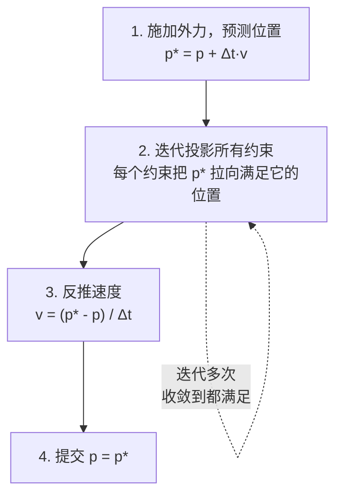
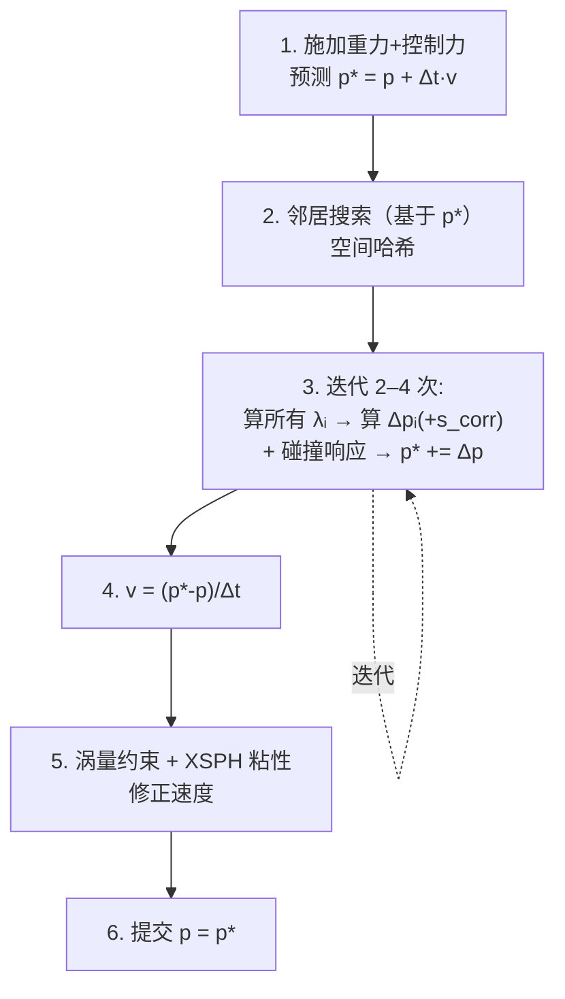
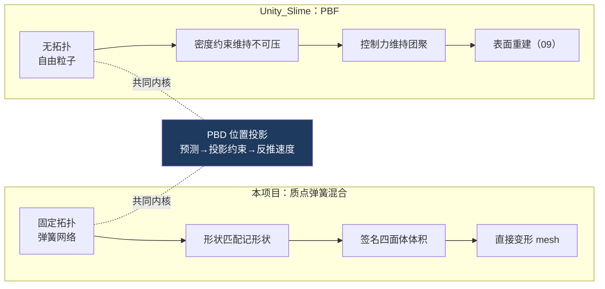

# 07 PBD 与 PBF

> 进阶篇。前面 02–06 的约束零散地讲了各自的实现，这一篇把它们纳入统一框架 **PBD**，并对照参考项目 Unity_Slime 用的流体方案 **PBF**。
> 关注点：**PBD 统一框架** + **约束投影的数学** + **PBF 密度约束** + **两条路的共同内核**。
> 返回 [[软体模拟知识地图]]。

---

## 一、回看：你其实一直在用 PBD

前面每篇都出现过「Project...」开头的函数：`ProjectShapeMatching`、`ProjectRadialVolume`、碰撞的位置钳制。它们的共同模式是：

> **不算力，直接把位置修正到满足某个约束。**

这就是 **PBD（Position Based Dynamics，位置动力学）** 的核心。Müller 2007 提出，现在是游戏物理的主流框架。



对照 [[01 质点系统与时间积分]] 的子步骨架，你会发现本项目的 `Step()` 就是这个循环：
- 「预测位置」= `ApplyExternalForces` + `Integrate`
- 「投影约束」= `ProjectShapeMatching` / `ProjectRadialVolume` / `SolveCollision` / `SolveSelfCollision`
- 「反推速度」= `UpdateVelocities`

> [!note] PBD 为什么无条件稳定
> 传统「力 → 加速度 → 速度 → 位置」里，大刚度会让力爆炸、时间步必须极小。PBD 直接操作位置，位置永远被「拉向合法状态」，不会因为刚度大而发散——最坏情况是收敛慢，但**不会炸**。这是它能用大时间步、适合实时的根本原因。

---

## 二、约束投影的数学

PBD 的每个约束是一个函数 `C(p) = 0`（满足时为零）。投影就是：沿约束的梯度方向，把位置移动到 `C(p)=0`。

$$\Delta p_i = -\lambda \, w_i \, \nabla_{p_i} C, \quad \lambda = \frac{C(p)}{\sum_k w_k |\nabla_{p_k} C|^2}$$

- `w_i` = 质点的逆质量（inverse mass），质量大的点动得少。
- `λ` = 拉格朗日乘子，保证约束被满足的同时，各点按质量分配位移。

### 举例：距离约束（弹簧的 PBD 版）

两点距离约束 `C = |p_a - p_b| - d`。投影后：

```
Δp_a = -w_a/(w_a+w_b) · (|p_a-p_b| - d) · n
Δp_b = +w_b/(w_a+w_b) · (|p_a-p_b| - d) · n     （n 是两点连线单位向量）
```

> [!tip] 本项目的自碰撞就是等质量距离约束
> [[06 自碰撞与空间哈希]] 里 `SolveSelfCollisionPair` 的 `correction = direction * ((minimumDistance - distance) * 0.5f)`，正是上式在 `w_a = w_b`（等质量，各分一半）时的形式。你早就在用 PBD 的距离约束了。

### XPBD：解决刚度和迭代次数耦合

原始 PBD 有个缺点：**同样的约束，迭代次数越多就越硬**——刚度不是物理量而是求解器参数。XPBD（eXtended PBD）引入 compliance（柔度）α，让刚度独立于迭代次数和时间步。本项目没用 XPBD（用的是 lerp 比率控制强度），但工业级软体（Unity Obi、UE Chaos）都是 XPBD。

---

## 三、PBF：把史莱姆当流体

参考项目 [Unity_Slime](https://github.com/lamp-cap/Unity_Slime) 走的是 **PBF（Position Based Fluids，Macklin & Müller 2013）**——PBD 家族里专门做流体的分支。它把「不可压缩」表达成一个 PBD 密度约束。

### 核心：密度约束

流体不可压缩 = 每个粒子处的密度都等于静止密度 ρ₀。约束写成：

$$C_i = \frac{\rho_i}{\rho_0} - 1, \quad \rho_i = \sum_j m_j W(p_i - p_j, h)$$

- `ρ_i` = 用 SPH 光滑核 `W`（Poly6 核）对邻居加权求和得到的密度。
- `h` = 光滑半径，`W` 是随距离衰减的核函数。

拉格朗日乘子和位置修正：

$$\lambda_i = \frac{-C_i}{\sum_k |\nabla_{p_k} C_i|^2 + \varepsilon}, \quad \Delta p_i = \frac{1}{\rho_0}\sum_j (\lambda_i + \lambda_j + s_{corr}) \nabla W(p_i - p_j, h)$$

- `ε` = CFM 松弛项，防止邻居太少时分母趋零爆炸。
- `s_corr` = 人工压力项，防止粒子聚团（clumping），顺便模拟表面张力：`s_corr = -k(W(p_i-p_j,h)/W(Δq,h))ⁿ`，典型 `k≈0.1, n=4`。

### PBF 求解循环



> [!note] Unity_Slime 的「史莱姆感」怎么来
> 纯 PBF 是水。Unity_Slime 额外加了一个**每粒子朝目标点的控制力/吸引力**（controller attraction force），把粒子拉向一个团聚的目标——这让流体表现得像「黏在一起的一坨」而不是泼开的水。表面张力（`s_corr`）也贡献了黏稠感。

---

## 四、两条路的对照



| 维度 | 本项目（弹簧混合） | Unity_Slime（PBF） |
| --- | --- | --- |
| 约束 | 距离+形状+体积 | 密度（不可压缩） |
| 拓扑 | 固定弹簧网络 | 无，粒子自由 |
| 邻居搜索 | 只自碰撞要（[[06 自碰撞与空间哈希]]） | 每步都要（密度求和） |
| 保持团聚 | 形状匹配+弹簧 | 控制力+表面张力 |
| 渲染 | 变形原 mesh | 表面重建（[[09 表面重建与渲染]]） |
| 能否流开 | 否 | 能 |
| 求解框架 | **PBD** | **PBD**（PBF 是其流体特化） |

> [!tip] 学这两条路的收益
> 理解了 PBD 统一框架，你会发现：本项目的距离约束、Unity_Slime 的密度约束、Obi 的 XPBD 约束，**都是同一个「预测→投影→反推」循环里的不同 `C(p)`**。换约束就换了物理行为，框架不变。这是软体/流体模拟最值钱的一个抽象。

---

## 五、下一步

理论框架清楚了。[[08 GPU 并行求解]] 把这套 PBD 循环搬到 Compute Shader——你会看到「顺序执行的位置投影」在并行环境下要重新设计，否则竞态会毁掉一切。

## 速记

- 前面所有「Project...」都是 PBD：不算力，直接把位置投影到满足约束。
- PBD 循环：预测位置 → 迭代投影约束 → 反推速度 → 提交。无条件稳定，适合实时。
- 约束投影 `Δp = -λ·w·∇C`，自碰撞就是等质量距离约束的特例。
- PBF = PBD 的流体特化，用密度约束 `C=ρ/ρ₀-1` 表达不可压缩；参考项目走这条路。
- 两条路共同内核都是 PBD；换 `C(p)` 就换物理行为，框架不变。

#Renderer #软体模拟
