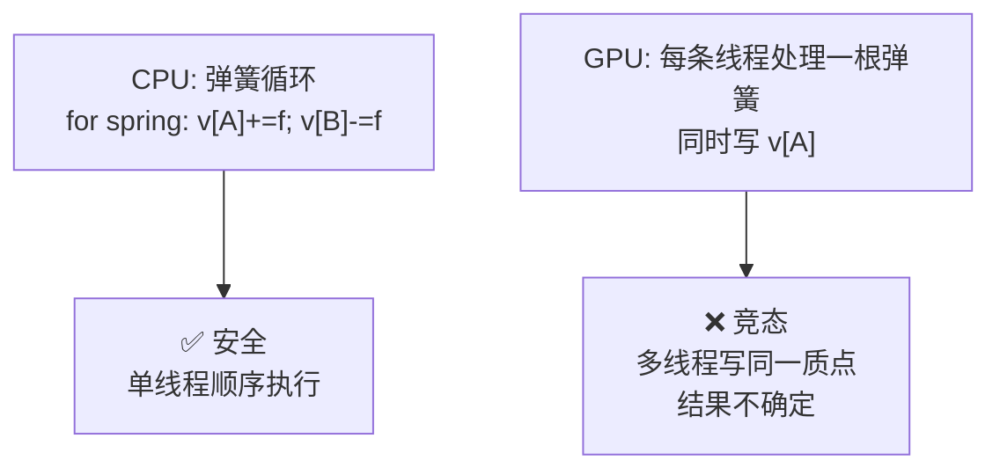
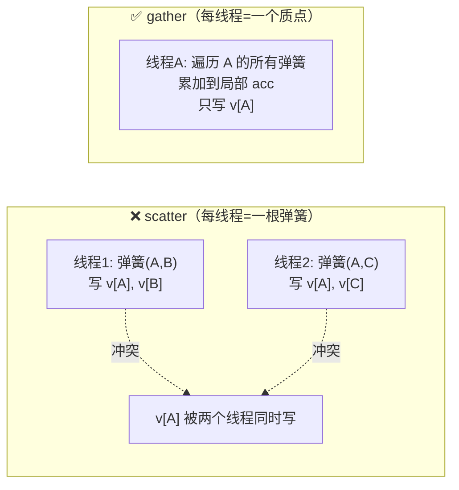
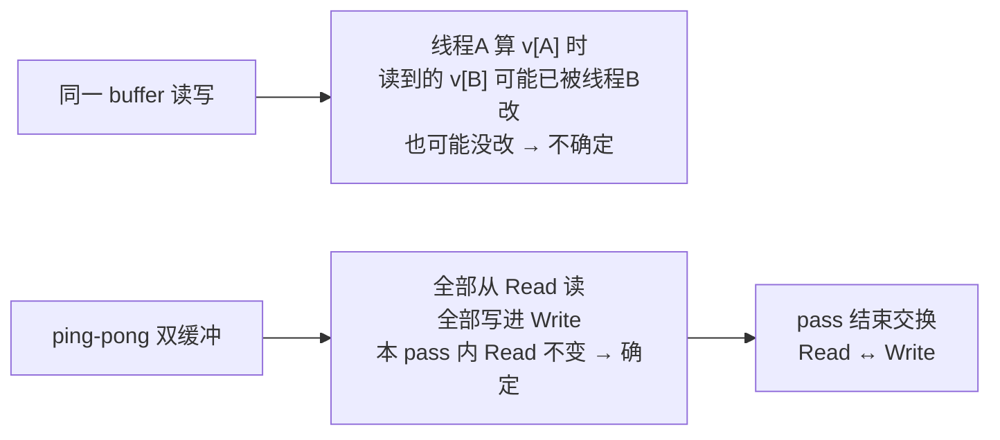
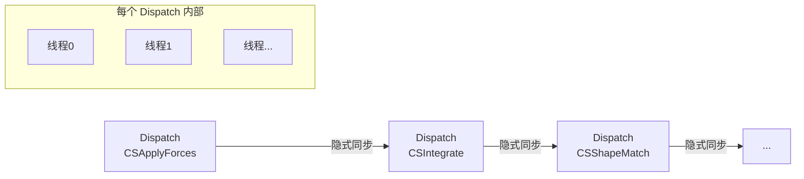
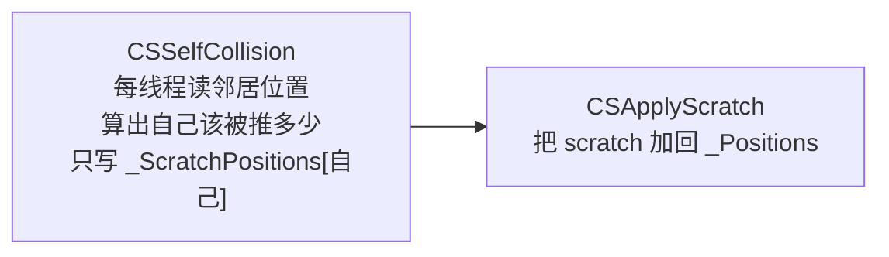

# 08 GPU 并行求解

> 进阶篇。把 [[07 PBD 与 PBF]] 的求解循环搬到 Compute Shader。你写过 compute 光追，API 不陌生；真正的新问题是**并行竞态**——顺序执行时天经地义的写法，在几百个线程同时跑时会互相破坏。
> 关注点：**gather vs scatter** + **ping-pong 双缓冲** + **kernel 拆分与同步** + **竞态实战踩坑**。
> 返回 [[软体模拟知识地图]]。

---

## 一、为什么要 GPU 后端

CPU 求解器（[[01 质点系统与时间积分]]–[[06 自碰撞与空间哈希]]）质点上千后就吃紧。GPU 有几千个核心，质点天然可以**每个一条线程**并行更新。本项目用 `ISoftBodySolver` 接口让两个后端可插拔：

```csharp
// SoftBodySimulation.cs — Auto 模式：优先 GPU，失败回退 CPU
if (wantsGpu && SystemInfo.supportsComputeShaders)
{
    ComputeShader cs = Resources.Load<ComputeShader>("SoftBody/SlimeSolver");
    try { return new GpuSlimeSolver(lattice, cs, world); }
    catch (Exception e) { /* 回退 CPU */ }
}
```

> [!note] 拓扑复用是前提
> [[00 什么是软体模拟]] 强调的「几何与物理分离」在这里兑现：`SlimeTopology` 不含求解代码，CPU 和 GPU 后端**复用同一份拓扑**（质点布局、弹簧连接、顶点绑定）。换后端不重建几何。

---

## 二、核心难题：顺序 → 并行

CPU 求解器里，`for` 循环一个个处理弹簧，改哪个数据都安全——因为只有一条线程。GPU 上几百条线程**同时**跑，就会出现：



这就是**数据竞态（race condition）**：多条线程同时读改写同一块内存，最终值取决于谁先谁后，不可复现。解决它是 GPU 物理的核心工作。

---

## 三、模式一：gather 而非 scatter

**scatter（分散写）**：一根弹簧同时改两个质点 → 多根弹簧改同一质点 → 竞态。
**gather（聚集读）**：每条线程负责**一个质点**，读取它所有弹簧的邻居、把力累加到**局部变量**，最后只写自己。**每个质点只被一条线程写** → 无竞态。



本项目 GPU 弹簧就是 gather——每个质点线程遍历自己的弹簧范围，把力累加进 `acceleration`，最后只写自己的速度：

```hlsl
// SlimeSolver.compute — CSApplyForces（每线程 = 一个质点）
float3 acceleration = _Gravity;
BufferRange range = _SpringRanges[id];              // 这个质点的弹簧在数组里的区间
for (int i = 0; i < range.Count; i++)
{
    SpringConnection spring = _SpringConnections[range.Start + i];
    float3 delta = _Positions[spring.Other] - position;   // 读邻居（只读，安全）
    float springLength = length(delta);
    if (springLength <= EPSILON) continue;
    float3 direction = delta / springLength;
    float relativeSpeed = dot(_VelocitiesRead[spring.Other] - velocity, direction);
    acceleration += direction *
        (_SpringStiffness * (springLength - spring.RestLength) + _SpringDamping * relativeSpeed);
}
_VelocitiesWrite[id] = velocity + acceleration * _DeltaTime;   // 只写自己
```

> [!note] 代价：每根弹簧算两次
> gather 下，弹簧 (A,B) 会被线程 A 和线程 B 各算一次（CPU 版只算一次）。用「算两遍」换「无竞态 + 无锁」,在 GPU 上是划算的——GPU 最怕的是同步和锁，不是重复计算。为此弹簧要存成**每质点的邻接表**（`_SpringRanges` + `_SpringConnections`），而非 CPU 的边列表。

---

## 四、模式二：ping-pong 双缓冲

上面代码里 `_VelocitiesRead`（读）和 `_VelocitiesWrite`（写）是**两个不同的 buffer**。为什么不能读写同一个？



- 所有线程从 `_VelocitiesRead` 读（本 pass 内它是只读快照，谁也不改），写进 `_VelocitiesWrite`。
- pass 结束后交换两个 buffer 的角色（C# 侧 `SetBuffer` 换绑定）。

> [!tip] ping-pong 是并行计算的通用套路
> 你在 compute 光追的累积缓冲、图像滤波、流体求解里都会见到它。本质是**把「就地更新」拆成「读旧、写新、再交换」**，消除「读到的是新值还是旧值」的不确定性。

---

## 五、模式三：kernel 拆分 = 同步点

看 compute 文件开头的 kernel 列表——求解的每一步都是**独立 kernel**：

```hlsl
// SlimeSolver.compute
#pragma kernel CSBeginSubstep      // 快照
#pragma kernel CSApplyForces       // 弹簧+重力（gather）
#pragma kernel CSIntegrate         // 积分
#pragma kernel CSReduceCenter      // 求质心（归约）
#pragma kernel CSShapeMatch        // 形状匹配
#pragma kernel CSReduceSurface     // 求 surface 质心
#pragma kernel CSRadialVolume      // 体积投影
#pragma kernel CSSelfCollision     // 自碰撞（gather-into-scratch）
#pragma kernel CSApplyScratch      // scratch 拷回
#pragma kernel CSGroundCollision   // 地面碰撞
#pragma kernel CSUpdateVelocities  // 反推速度
// ... 共 17 个
```

> [!note] 为什么每步一个 kernel
> **一次 `Dispatch` 内的不同线程无法互相等待**——线程 5 无法保证线程 3 已经写完。但**两次 Dispatch 之间有隐式同步**：第二个 kernel 开始时，第一个 kernel 的所有写入都已可见。
>
> 所以 PBD 的顺序依赖（[[07 PBD 与 PBF]] 的「预测→投影→投影→反推」）在 GPU 上表达为**一串按序 Dispatch 的 kernel**。每个 kernel 内部完全并行，kernel 之间保证顺序。这是「把顺序算法并行化」的标准结构。



### 归约（Reduction）：求质心

形状匹配和体积都要「所有质点的质心」——这是个**并行归约**问题（把 n 个值求和）。`CSReduceCenter` 用 GPU 归约算出质心存进 `_Metrics` buffer，后续 kernel 再读。不能让每个线程各自求和（重复 n 次且要读全部）。

---

## 六、模式四：gather-into-scratch（自碰撞）

自碰撞要修改**别的**质点的位置（把两个点推开），天然是 scatter。GPU 上的解法：**读全体、只写自己的 scratch buffer，再统一拷回**。



每条线程只写自己的 scratch 槽位，不碰别人的 → 无竞态；下一个 kernel 再统一应用。

---

## 七、竞态实战踩坑

> [!warning] 坑 1：构造函数抛异常导致 buffer 泄漏
> GPU 后端有 18 个 `ComputeBuffer`。如果构造函数里先分配了一批 buffer，再 `FindKernel` 时抛异常（kernel 名写错等），对象没构造完，调用方的 `Dispose` 也调不到 → 已分配的 buffer 泄漏。
> **修法**：先 `FindKernel`（可能抛异常的放前面），全部成功后再分配 buffer；或用 try-finally 兜底。

> [!warning] 坑 2：surface 索引假设
> GPU kernel 里对 surface 质点的处理，隐含假设「surface 质点是前 N 个」。如果拓扑构建改了顺序，`_SurfaceTriangleIndices` 的隐式不变量就被破坏，静默出错。这类**隐式不变量必须加注释**。

> [!warning] 坑 3：CPU/GPU 数值必须对齐
> 体积公式（[[04 体积保持：不塌不胀]]）、约束顺序、摩擦开方（[[05 碰撞与接触]]）——CPU 和 GPU 两份实现必须**逐字对齐**。否则 Auto 模式切后端时手感突变，且难 debug（一个后端对、一个错）。

> [!warning] 坑 4：回读代价
> mesh 更新需要 CPU 侧的质点位置，每帧 `GetData` 是**同步阻塞回读**，会冲掉 GPU 流水线。可考虑 `AsyncGPUReadback` 延迟一帧换吞吐。

---

## 八、CPU vs GPU 结构对照

| 步骤 | CPU（顺序） | GPU（并行） |
| --- | --- | --- |
| 弹簧 | 遍历边列表，scatter 到两端 | 每质点 gather 邻接表，只写自己 |
| 速度 | 就地改 `_velocities` | ping-pong 双缓冲 |
| 约束顺序 | 函数按序调用 | 每步一个 kernel，Dispatch 间同步 |
| 求质心 | 一个 for 求和 | 并行归约到 `_Metrics` |
| 自碰撞 | 直接改两点位置 | gather-into-scratch + 拷回 |
| 弹簧存储 | `SpringLink[]` 边列表 | `_SpringRanges` + `_SpringConnections` 邻接表 |

> [!tip] 迁移的思维转换
> 从 CPU 到 GPU，不是「把 for 循环换成 kernel」这么简单。核心是**把每个「改别人」的操作，改写成「只改自己、读别人」**（gather），把顺序依赖表达成 kernel 序列。想清楚「谁写这块内存」，竞态就解决了大半。

---

## 九、下一步

物理部分（CPU + GPU）完整了。剩下两篇是**渲染专项**：[[09 表面重建与渲染]] 讲怎么把质点变成一张光滑的膜（本项目直接变形 mesh，参考项目用表面重建），[[10 程序化表情系统]] 讲那张会眨眼的脸。

## 速记

- GPU 后端的核心难题是**竞态**：多线程写同一内存结果不确定。
- gather（每线程=一质点，只写自己，读别人）替代 scatter，弹簧算两遍换无锁。
- ping-pong 双缓冲：从 Read 读、写 Write、pass 末交换，消除读到新/旧值的不确定。
- 每步拆成独立 kernel，Dispatch 间隐式同步表达 PBD 的顺序依赖；求和用并行归约。
- 自碰撞用 gather-into-scratch + 拷回。
- 踩坑：构造函数资源泄漏、隐式索引不变量、CPU/GPU 数值对齐、回读阻塞。

#Renderer #软体模拟
