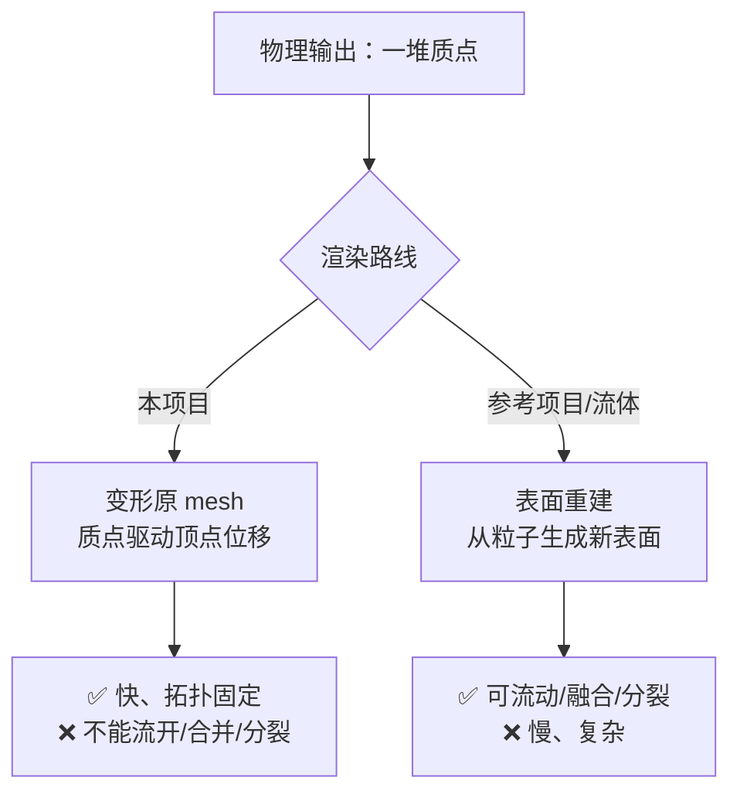
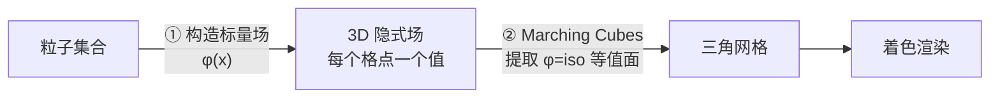
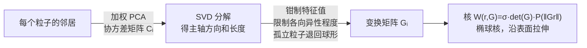
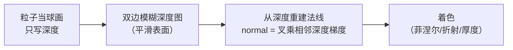
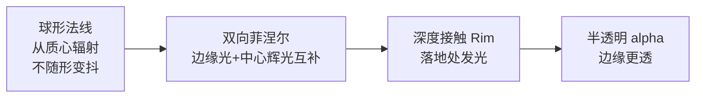

# 09 表面重建与渲染

> 专项篇。物理算出的是**质点**，但你要看到的是一张光滑的果冻膜。这一篇讲「粒子 → 表面」的两条路，以及本项目的半透明果冻 shader。
> 关注点：**变形原 mesh vs 表面重建** + **标量场 + Marching Cubes** + **屏幕空间流体** + **各向异性核** + **果冻 shader**。
> 返回 [[软体模拟知识地图]]。

---

## 一、两条渲染路线



选哪条取决于 [[00 什么是软体模拟]] 里的方法：**有固定拓扑的软体（本项目）直接变形原 mesh** 最简单；**无拓扑的流体粒子（Unity_Slime 的 PBF）** 只能重建表面。

---

## 二、本项目：质点驱动 mesh 变形

本项目质点和 mesh 顶点有绑定关系（[[02 弹簧约束：局部弹性]]），直接用质点位移驱动顶点，不需要重建：

```csharp
// SoftBodySimulation.cs — UpdateMesh()
for (int i = 0; i < _deformedVertices.Length; i++)
{
    SlimeVertexBinding binding = _lattice.VertexBindings[i];
    // 顶点位移 = 绑定的 4 个质点位移的加权和
    Vector3 worldPos = transform.TransformPoint(binding.RestPosition)
                     + binding.EvaluateDisplacement(_particlePositions, _lattice.RestPositions);
    _deformedVertices[i] = transform.InverseTransformPoint(worldPos);
}
_runtimeMesh.vertices = _deformedVertices;
_runtimeMesh.RecalculateNormals();
```

每个顶点绑定最近 4 个质点，用重心式权重插值位移（`EvaluateDisplacement` 见 [[02 弹簧约束：局部弹性]]）。质点稀疏、顶点密集，一个质点带动周围一片顶点，形变平滑。

> [!tip] 为什么本项目不用表面重建
> 史莱姆始终是一坨、不会泼开或分裂——拓扑固定。既然原 mesh 的拓扑一直有效，直接变形它最快、最省，还自带 UV 和法线。表面重建是为「拓扑会变」的流体准备的。

---

## 三、流体路线：标量场 + Marching Cubes

当粒子无固定拓扑（PBF 流体），要动态生成表面。经典管线两步（参考 [杨文超：粒子流体表面重建综述](https://yangwc.com/2019/11/10/reviewOfSR/)）：



### ① 标量场怎么构造（质量由低到高）

| 方法 | 思想 | 质量 / 代价 |
| --- | --- | --- |
| **Blinn 1982** | 密度超过阈值 T 即表面 | 简单，不光滑 |
| **Müller 2003** | 核加权邻居密度和 − 阈值 | 好些，仍有凸包 |
| **Zhu-Bridson 2005** | 用平均位置 x̄ 和平均半径 r̄ 构造 SDF | 光滑，但高曲率处质心被「弹出」产生瑕疵 |
| **Solenthaler 2007** | Zhu-Bridson + 修正因子 f（用雅可比最大特征值） | 修好了弹出问题 |
| **Yu-Turk 2013** | 各向异性核（见下） | 质量最好，代价最大 |

### ② Marching Cubes

把空间切成立方体格子，每个格子的 8 个角采样标量场，根据「哪些角在等值面内外」查表生成三角形。是「隐式场 → 显式网格」的标准算法。

> [!note] 效率优化：窄带（narrow-band）
> Marching Cubes 只需在表面附近算——远离表面的格子跳过。各种加速结构：Müller 窄带、Bridson 稀疏块网格、Akinci GPU 两阶段并行、Wu cuckoo-hash 网格。GPU 窄带最快但难完全并行。

---

## 四、各向异性核（Yu-Turk 2013）

朴素的球形核会让流体表面**疙疙瘩瘩**（每个粒子一个球包）。各向异性核让核**沿表面方向拉长、沿法线方向压扁**，表面更光滑平整。



- 先对每个粒子做**加权 PCA**（对邻居位置求协方差矩阵），得到局部形状。
- **SVD** 提取主轴，钳制特征值（限制拉伸比、让孤立粒子保持球形）。
- 构造变换矩阵 `Gᵢ` 把球形核变成贴合表面的椭球。
- 重建前先做 WPCA 位置平滑。

> [!note] Unity_Slime 用的就是这个
> 参考项目 [Unity_Slime](https://github.com/lamp-cap/Unity_Slime) 的表面重建用各向异性核 + Marching Cubes，得到光滑的流体表面。质量最好，但每粒子一次 SVD，代价高。

---

## 五、另一条路：屏幕空间流体渲染

不生成 mesh，全在**图像空间**做（view-dependent）：



- ✅ 实时、不生成几何、粒子数无关（只和屏幕分辨率有关）
- ❌ view-dependent（没有真实 mesh，做不了阴影投射、离屏效果）
- 适合实时游戏里的水/史莱姆表面。

> [!tip] 和你的图形背景衔接
> 屏幕空间流体渲染本质是**后处理管线**——你在 [[Unity 光线追踪实践]] 里做过的「深度图 → 处理 → 重建」那套。深度平滑、从深度重建法线，都是屏幕空间技巧。这条路对你最容易上手。

---

## 六、本项目的果冻质感 shader

本项目直接变形 mesh，所以渲染重点是**表面质感**——半透明果冻。核心技术：



- **球形法线**：用质心（[[04 体积保持：不塌不胀]] 算的 `_focusPoint`）替代几何法线，形变时光照稳定。
- **双向菲涅尔**：边缘光 `pow(1-facing, p)` + 中心辉光 `pow(facing, p)`，互补方向做层次。
- **深度接触 Rim**：采样深度图，接触场景处发光。

完整实现（含所有踩坑：双向菲涅尔互相污染、深度纹理天花板、材质序列化坑）见专文 → **[[Unity 半透明果冻 Shader]]**。

> [!note] 半透明凹形网格的固有难题
> 果冻是半透明凹形网格，同一 mesh 的三角面之间没有深度遮挡（`ZWrite Off`），单 pass 会露出「破碎面」。要用**双 pass（先 Cull Front 画背面、再 Cull Back 画正面）**约束混合顺序。这是透明渲染的固有难题，详见 [[Unity 半透明果冻 Shader]]。

---

## 七、下一步

表面有了质感，最后给史莱姆一张脸。[[10 程序化表情系统]] 讲为什么用独立 billboard 而非塞进主 shader、SDF 怎么程序化画眼睛。

## 速记

- 两条渲染路线：变形原 mesh（本项目，拓扑固定）vs 表面重建（流体，拓扑可变）。
- 本项目质点驱动 mesh 顶点（每顶点绑 4 质点加权），快且自带 UV/法线。
- 表面重建 = 标量场（Blinn→Müller→Zhu-Bridson→Solenthaler→各向异性核）+ Marching Cubes。
- 各向异性核（Yu-Turk）用 PCA+SVD 把球形核变椭球，表面最光滑但每粒子一次 SVD。
- 屏幕空间流体渲染 = 后处理（深度平滑+重建法线），实时但 view-dependent，最贴你的背景。
- 本项目果冻质感靠球形法线+双向菲涅尔+深度 Rim，详见 [[Unity 半透明果冻 Shader]]。

#Renderer #软体模拟
