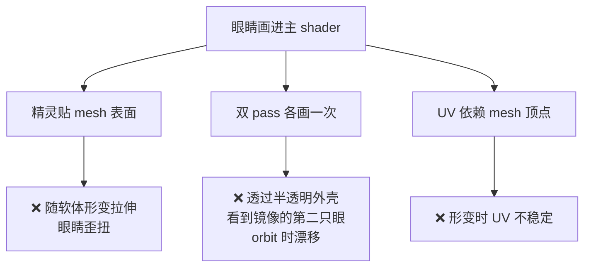
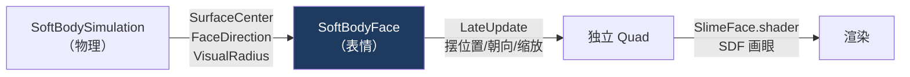
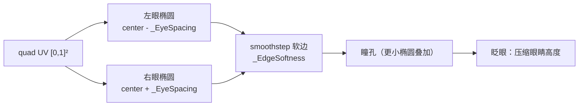
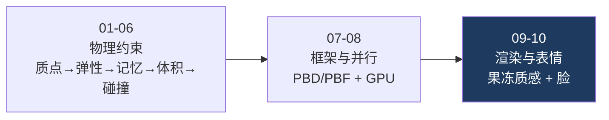

# 10 程序化表情系统

> 专项篇，收尾。物理、渲染都齐了，最后给史莱姆一张脸——让它会眨眼、会朝着自己走的方向看。做完这一篇，你从 00.1 的空工程一路搭起来的史莱姆就真正活了。
> 关注点：**为什么用独立 billboard 而非塞进主 shader** + **SDF 程序化画眼睛** + **帧率无关平滑**。
> 返回 [[软体模拟知识地图]]。

---

## 一、架构决策：独立组件 vs 塞进主 shader

一开始试过把眼睛画进史莱姆主 shader（[[09 表面重建与渲染]] 的果冻 shader），问题不断：



**最终改为独立 billboard 组件**：一个单独的 quad 朝相机，贴在质心表面外侧，用自己的 shader 程序化画眼睛。



> [!note] 核心教训
> 一个视觉元素若**不该跟随载体的局部形变**（脸就该整体稳定），把它做成**独立的、只吃载体整体状态（质心/朝向/尺度）的组件**，比嵌进载体自身的着色更稳、更好调。这和 [[03 形状匹配：整体记忆]] 的「脸吃整体状态不吃局部形变」是同一个思路。

收益：脸不受 mesh 形变影响（始终端正）、只画一次（无双 pass 镜像）、和物理/主渲染完全解耦。

---

## 二、脸怎么吃软体的整体状态

`SoftBodySimulation` 每帧从质点算出整体状态暴露给脸（不暴露单个质点）：

```csharp
// SoftBodySimulation.cs 暴露的接口
public Vector3 SurfaceCenter { get; }    // surface 质心（脸的锚点）
public Vector3 FaceDirection { get; }    // 运动方向在水平面的投影
public float   VisualRadius  { get; }    // 整体半径（脸的大小）
public float   FaceSurfaceRadius { get; }// 朝运动方向的贴附距离
public Vector3 VisualExtents { get; }    // AABB 半尺寸（脸的高度）
```

脸在 `LateUpdate` 用这些把 quad 摆到「质心 + 朝向 × 贴附距离」，朝外、缩放跟随整体尺寸：

```csharp
// SoftBodyFace.cs — LateUpdate()
faceTransform.SetPositionAndRotation(
    _simulation.SurfaceCenter + _smoothedDirection * (surfaceRadius * surfaceInset),
    Quaternion.LookRotation(_smoothedDirection, Vector3.up));
```

> [!tip] 为什么用 LateUpdate
> 物理在 `FixedUpdate` 跑、mesh 在其后更新。脸要贴在**更新后**的质心上，所以放 `LateUpdate`（本帧所有位移都结束后）——否则脸会滞后一帧、抖动。

---

## 三、帧率无关平滑

朝向和缩放直接跟质点会抖（质点每帧有微小波动）。用[[01 质点系统与时间积分]]见过的**帧率无关指数平滑** $1 - e^{-k \cdot \Delta t}$：

```csharp
// SoftBodyFace.cs — LateUpdate()
float t = 1f - Mathf.Exp(-turnResponsiveness * Time.deltaTime);
_smoothedDirection = Vector3.Slerp(_smoothedDirection, desiredDirection.normalized, t).normalized;

float ts = 1f - Mathf.Exp(-scaleResponsiveness * Time.deltaTime);
_smoothedScale = Vector3.Lerp(_smoothedScale, targetScale, ts);
```

| 参数 | 值 | 效果 |
| --- | --- | --- |
| `turnResponsiveness` | 8 | 转脸快速跟手 |
| `scaleResponsiveness` | 2 | 挤压拉伸时脸不剧烈抖缩 |

- 朝向用 **Slerp**（球面插值，方向不变短），缩放用 **Lerp**。
- 朝向响应快（转脸跟手），缩放响应慢（脸别跟着形变乱缩）。

> [!note] 同一个数学工具跨物理和渲染复用
> $1 - e^{-k \cdot \Delta t}$ 在 [[01 质点系统与时间积分]] 是位置投影比率、在 [[03 形状匹配：整体记忆]] 是形状恢复比率、在这里是表情平滑比率——**同一个「帧率无关指数趋近」公式，贯穿整个项目**。学透一次，处处能用。

---

## 四、SDF 程序化画眼睛

`SlimeFace.shader` 在 quad 的 UV 空间用 **SDF（有符号距离场）** 画两只椭圆眼 + 瞳孔，**不用任何贴图**：



**眨眼**：`_BlinkAmount`（0→1）把眼睛高度从 `_EyeHeight` 压到 `_ClosedEyeHeight`，闭眼是一条缝：

```hlsl
float eyeH = lerp(_EyeHeight, _ClosedEyeHeight, _BlinkAmount);
float mask = EllipseMask(uv, eyeCenter, float2(_EyeWidth, eyeH));
mask = smoothstep(0.5 - _EdgeSoftness, 0.5 + _EdgeSoftness, mask);
```

眨眼节奏在 C# 侧驱动，用 sin 曲线做 0→1→0 的平滑开合：

```csharp
// SoftBodyFace.cs — UpdateBlink()
if (Time.time >= _nextBlinkTime)          // 到间隔时间触发
{
    _blinkStartTime = Time.time;
    _nextBlinkTime  = Time.time + blinkInterval;
}
float elapsed = Time.time - _blinkStartTime;
if (elapsed >= 0f && elapsed < blinkDuration)
    blinkAmount = Mathf.Sin(Mathf.PI * elapsed / blinkDuration);  // 0→1→0
_faceMaterial.SetFloat(BlinkAmountPropertyId, blinkAmount);       // MaterialPropertyBlock 传参
```

> [!tip] SDF 画表情的优势
> 分辨率无关、完全参数化（眼距/大小/瞳孔/软边都是滑块）、眨眼只是改一个高度参数。无美术资源、可程序化调，适合这种简单卡通表情。你在 [[Unity 半透明果冻 Shader]] 里用过 SDF 描边，这里是它在 UI/表情上的应用。

---

## 五、工程细节

| 分类 | 做法 |
| --- | --- |
| 传参 | `MaterialPropertyBlock`，不实例化材质、无 GC（同 [[09 表面重建与渲染]] 传质心） |
| 属性 ID | `Shader.PropertyToID` 静态缓存，避免每帧字符串 hash |
| quad 曲率 | 生成时 z 方向微弯 `-0.22·(x²+y²)`，贴合球面 |
| 渲染队列 | `Transparent+20`，画在史莱姆本体之后 |
| 阴影 | 关闭投射/接收 |
| 清理 | `OnDestroy` 销毁动态创建的 quad/Mesh/Material |

---

## 六、系列完结

到这里，从「一堆点」到「会眨眼的果冻史莱姆」的完整路径走完了：



回 [[软体模拟知识地图]] 看全景，或从任一篇深入。

## 速记

- 脸做成**独立 billboard 组件**，只吃整体状态（质心/朝向/尺度），不跟局部形变——避免歪扭、双 pass 镜像。
- 在 `LateUpdate` 摆位（物理更新后），用 $1-e^{-k \cdot \Delta t}$ 平滑朝向（Slerp）和缩放（Lerp）。
- SDF 程序化画椭圆眼+瞳孔，眨眼靠压缩眼睛高度，节奏用 sin 曲线在 C# 侧驱动。
- 传参一律 `MaterialPropertyBlock`（无 GC），属性 ID 缓存。

#Renderer #软体模拟
