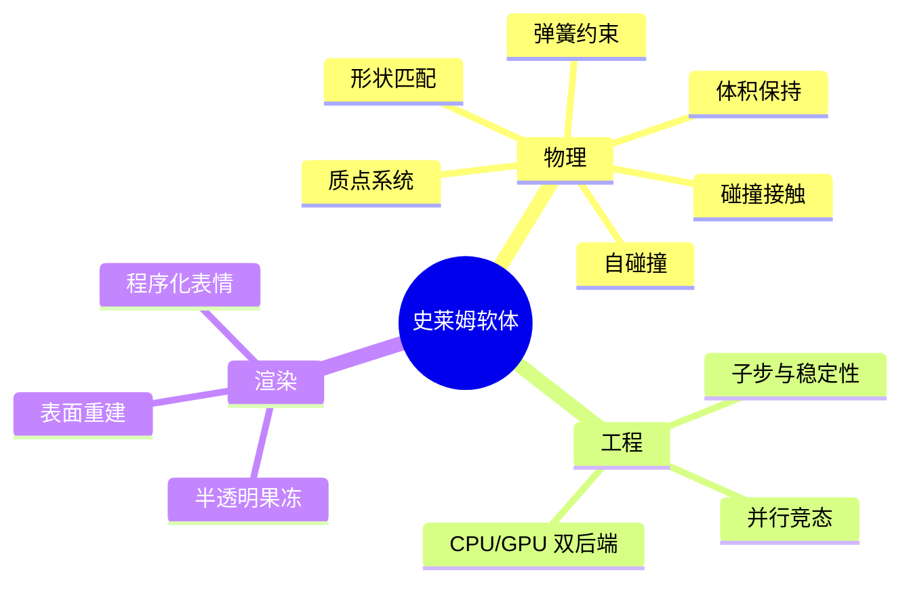
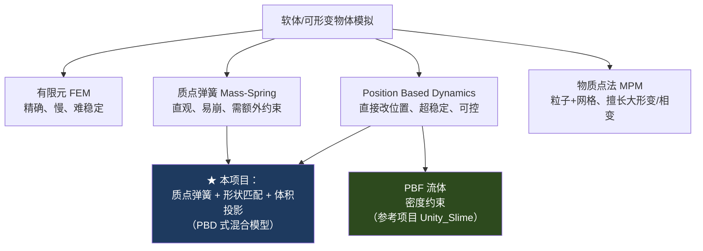

# 软体模拟知识地图

> 本知识库把「在 Unity 里做一个史莱姆软体」拆成一条**从物理直觉到工程落地**的学习路径。不是零散的踩坑记录，而是递进式的体系：每篇讲清一个概念的「是什么 / 为什么 / 怎么写 / 踩过什么坑」，层层叠加。
> 参照 [[前端知识地图]] 的分层思路：**入门（建立心智）→ 原理（一个约束一篇）→ 进阶（并行与工程）→ 专项（渲染与表情）**。
> **从 [[00 什么是软体模拟]] 开始。**

---

## 这个项目在做什么

一个史莱姆软体：落地能压扁摊开、有弹性回弹、可被推着走、表面是半透明果冻质感、还有一张会眨眼的脸。

- 本地工程：`/Users/vast/DccDev/Unity Project/Graphics Learning`
- 物理代码：`Assets/Scripts/SoftBody/`
- GPU 后端：`Assets/Resources/SoftBody/SlimeSolver.compute`
- 参考实现：[lamp-cap/Unity_Slime](https://github.com/lamp-cap/Unity_Slime)（用的是 PBF 流体方案，和本项目的质点弹簧路线互为对照，见 [[07 PBD 与 PBF]]）

---

## 学习路径

| 阶段 | 笔记 | 核心问题 |
| --- | --- | --- |
| 入门 | [[00 什么是软体模拟]] | 软体到底在模拟什么？方法有哪几派？我该选哪个 |
| 原理 | [[01 质点系统与时间积分]] | 一堆点怎么运动起来？为什么用半隐式欧拉 + 子步 |
| 原理 | [[02 弹簧约束：局部弹性]] | 点之间怎么连？胡克定律、阻尼、为什么会「布袋化」 |
| 原理 | [[03 形状匹配：整体记忆]] | 光靠弹簧不行，怎么让它「记得自己原来的形状」 |
| 原理 | [[04 体积保持：不塌不胀]] | 压扁时体积怎么守恒？签名四面体体积、净平移陷阱 |
| 原理 | [[05 碰撞与接触]] | 怎么落地停住？位置和速度为什么必须一起改 |
| 原理 | [[06 自碰撞与空间哈希]] | O(n²) 怎么优化成 O(n)？均匀网格邻居搜索 |
| 进阶 | [[07 PBD 与 PBF]] | 这些约束背后的统一框架；流体方案 PBF 怎么做史莱姆 |
| 进阶 | [[08 GPU 并行求解]] | 搬到 Compute Shader，gather/scatter、ping-pong、竞态 |
| 专项 | [[09 表面重建与渲染]] | 粒子怎么变成一张光滑的膜？半透明果冻 shader |
| 专项 | [[10 程序化表情系统]] | 独立 billboard、SDF 画眼睛、帧率无关平滑 |

> [!tip] 怎么用这个知识库
> - **想动手做**：01 → 06 顺着写，每篇的代码都能直接跑，最后拼成完整求解器。
> - **想搞懂原理**：先看 00 建立方法论全景，再看 07 理解 PBD/PBF 统一框架，回头看 01–06 会更透。
> - **只关心渲染**：09 → 10，前置只需 00 的心智模型。

---

## 方法全景（一张图看清流派）

详细对比与选型理由见 [[00 什么是软体模拟]]。

---

## 给有图形背景的你

你写过软光栅、URP 的 HLSL、跟过 Games101。软体模拟对你不是全新领域，很多东西能直接迁移：

| 你已经会的 | 在软体模拟里对应 |
| --- | --- |
| 顶点变换、矩阵 | 质点位置更新、shape matching 的旋转提取 |
| 数值积分（光追里的时间步进） | 半隐式欧拉、Verlet（[[01 质点系统与时间积分]]） |
| GPU 并行（compute 光追） | Compute Shader 求解、竞态处理（[[08 GPU 并行求解]]） |
| 后处理、屏幕空间效果 | 屏幕空间流体渲染（[[09 表面重建与渲染]]） |
| PBR / 菲涅尔 / 深度纹理 | 半透明果冻 shader（[[Unity 半透明果冻 Shader]]） |

真正需要新建立的直觉只有一个：**「约束求解」——不算力、直接改位置，反复迭代逼近满足所有约束的状态**。这是 PBD 的核心，[[07 PBD 与 PBF]] 会讲透。

---

## 参考文献

- [1] [PBD/软体模拟入门（知乎）](https://zhuanlan.zhihu.com/p/465256130)
- [2] [SPH/流体模拟（知乎）](https://zhuanlan.zhihu.com/p/174614017)
- [3] [杨文超：粒子流体表面重建综述](https://yangwc.com/2019/11/10/reviewOfSR/)
- [4] Macklin & Müller. *Position Based Fluids*. ACM TOG 32 (2013). — PBF 原始论文
- [5] Yu & Turk. *Reconstructing Surfaces of Particle-based Fluids Using Anisotropic Kernels*. ACM TOG 32 (2013). — 各向异性核表面重建
- [6] Hennequin et al. *A new Direct Connected Component Labeling for GPUs*. DASIP 2018. — GPU 连通域标记
- [7] Fang et al. *A Temporally Adaptive MPM with Regional Time Stepping*. CGF 37 (2018). — MPM 自适应时间步

#Renderer #软体模拟
